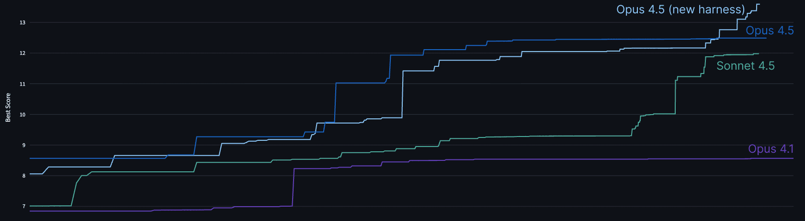

# 设计抗AI的技术评估

来源：https://www.anthropic.com/engineering/AI-resistant-technical-evaluations

---

_作者：Tristan Hume，Anthropic性能优化团队负责人。Tristan设计并重新设计了帮助Anthropic招聘了数十名性能工程师的居家测试题。_

随着AI能力的提升，技术候选人的评估变得越来越困难。如今能很好区分人类技能水平的居家测试题，明天可能被模型轻松解决——从而使其失去评估价值。

自2024年初以来，我们的性能工程团队一直使用一项居家测试，要求候选人为模拟加速器优化代码。已有超过1000名候选人完成了测试，其中数十人现已加入我们团队，包括搭建Trainium集群的工程师以及自Claude 3 Opus以来交付每个模型的团队成员。

但每个新版Claude模型都迫使我们重新设计测试。在相同时间限制下，Claude Opus 4的表现超过了大多数人类申请者。虽然我们仍能区分出最优秀的候选人——但随后Claude Opus 4.5甚至追平了这些顶尖人才。在无时间限制的情况下，人类仍能超越模型表现，但在居家测试的时间约束下，我们已无法区分顶尖候选人与最强模型的输出结果。

目前我已迭代了三个版本的居家测试，试图确保其仍具备鉴别力。每一次迭代都让我对“如何使评估能抵御AI辅助”有了新的认识。

本文描述了原始居家测试的设计思路、每个Claude模型如何攻克它，以及我不得不采取的日益特殊的策略来确保测试始终领先于我们最强模型的能力。尽管我们的工作已随模型发展而演变，我们仍需要更多优秀工程师——只是寻找他们的方式需要越来越具创造性。

为此，我们将原始居家测试作为公开挑战发布，因为在无时间限制的情况下，人类的最佳表现仍能超越Claude的能力上限。如果您能超越Opus 4.5的表现，我们期待您的来信——文末附有详细信息。

## 居家测试的起源

2023年11月，我们正准备训练并推出Claude Opus 3。我们已部署了新的TPU和GPU集群，大型Trainium集群也即将到位，在加速器上的投入远超以往，但面对新的规模，我们缺乏足够的性能工程师。我[在推特上发帖](https://x.com/trishume/status/1730386529997238605?s=20)邀请人们通过邮件联系我们，这带来了大量有潜力的候选人，远超我们标准面试流程能评估的数量——而这一流程对员工和候选人都意味着巨大的时间消耗。

我们需要一种更高效评估候选人的方法。因此，我花了两周时间设计了一项家庭测试，既能充分体现岗位要求，又能筛选出能力最突出的申请者。

### 设计目标

家庭测试常受诟病。通常这类测试充斥着工程师觉得乏味的通用问题，筛选效果欠佳。我的目标则不同：创造一个真正引人入胜的测试，让候选人乐于参与，并让我们能高精度地捕捉他们的技术能力。

对于评估性能工程技能，这种形式相比现场面试还具有独特优势：

**更长的时间窗口：** 工程师很少面临一小时内完成编码的 deadline。4小时（后缩短为2小时）的测试窗口更贴近实际工作场景。虽然仍短于多数真实任务，但我们需要在真实性与测试负担间取得平衡。

**真实的工作环境：** 没有监考或要求实时解说。候选人可在自己的编辑器中专注工作，不受干扰。

**充分的理解与工具准备时间：** 性能优化需要理解现有系统，有时还需构建调试工具。这两点在常规50分钟面试中都难以真实评估。

**兼容AI辅助：** Anthropic的[候选人AI使用指南](https://www.anthropic.com/candidate-ai-guidance)通常要求家庭测试不得使用AI，除非另有说明。本次测试我们明确允许使用AI。

长期性问题对AI来说更难完全解决，因此候选人可以使用AI工具（正如他们在工作中会做的那样），同时仍需展示自身技能。

除了这些针对特定形式的目标，我在设计任何面试时都遵循相同原则来构建这份带回家任务：

**反映真实工作：** 问题应让候选人体验实际工作内容。

**高信息量：** 任务应避免依赖单一解题思路的问题，确保候选人有多重机会全面展示能力——尽可能减少偶然性。它还应具备宽泛的评分分布，并保证足够深度，即使优秀候选人也无法完成所有内容。

**无需特定领域知识：** 具备扎实基础的人可以在工作中学习具体细节。要求狭窄的专业知识会不必要地限制候选人范围。

**趣味性：** 快速开发循环、有深度的有趣问题，以及发挥创造力的空间。

### 模拟机器

我构建了一个Python模拟器，用于模拟具有类似TPU特性的虚构加速器。候选人需要优化在这台机器上运行的代码，通过支持热重载的[Perfetto](https://perfetto.dev/)追踪工具查看每条指令，类似于[我们在Trainium芯片上使用的工具](https://awsdocs-neuron.readthedocs-hosted.com/en/latest/tools/neuron-explorer/overview-device-profiles.html)。

该机器包含使加速器优化变得有趣的功能：手动管理的暂存内存（与CPU不同，加速器通常需要显式内存管理）、超长指令字（多个执行单元每周期并行运行，需要高效指令打包）、单指令多数据流（单条指令处理多元素向量运算）以及多核架构（跨核心分配任务）。

这项任务是一个并行树遍历问题，特意没有采用深度学习风格，因为当时大多数性能工程师尚未接触过深度学习，可以在工作中学习领域知识。该问题的灵感来源于无分支SIMD决策树推理——一个向过去致敬的经典机器学习优化挑战，此前仅有少数候选人遇到过。

候选人从完全串行实现开始，逐步挖掘机器的并行潜力。热身阶段是多核并行，随后候选人可选择攻克SIMD向量化或VLIW指令打包。原始版本还包含一个需要优先调试的缺陷，以此锻炼候选人构建工具的能力。

##
早期成效

初期采用的带回家测试效果显著。推特招聘批次中有一人得分远超其他所有候选人。他于二月初入职，比我们通过标准渠道招聘的首批员工晚两周。测试结果具有预测性：他立即开始优化核心算法，并找到了编译器因张量索引数学运算溢出32位而导致启动阻塞的变通方案。

在随后一年半时间里，约1000名候选人完成了这项带回家测试，帮助我们组建了当前大部分性能工程团队。这对履历经验有限的候选人尤其有价值：我们数位绩效最高的工程师直接来自本科毕业，但他们在测试中展现的技能足以让我们放心聘用。

反馈普遍积极。许多候选人因沉浸其中而超时工作超过4小时限制。最出色的无时限提交作品包含完整的优化微型编译器，以及若干我未曾预料到的巧妙优化方案。

### 随后Claude Opus 4攻克了测试

截至2025年5月，Claude 3.7 Sonnet的表现已提升到这种程度：超过50%的候选人若将任务完全委托给Claude Code反而能获得更好结果。我随后用带回家测试的预发布版Claude Opus 4进行验证。它在4小时限时内给出的优化方案，甚至超越了几乎所有人类候选人的成果。

这已不是我第一次在面试中被Claude模型击败。早在2023年，我就专门设计过一道现场面试题——当时我们使用的题目大多基于常见任务，早期Claude模型对这些任务拥有丰富知识储备，能轻松解答。我试图设计一道更侧重解决问题能力而非知识储备的题目，题目原型仍来自我工作中解决过的真实（但小众）问题。结果Claude 3 Opus攻克了该题的第一部分；Claude 3.5 Sonnet则突破了第二部分。我们至今仍在使用这道题，因为其他现场题目同样无法抵御AI的挑战。

对于带回家完成的测试题，我们找到了直接的改进方案。原题设计的深度远超任何人四小时内能探索的极限，于是我利用Claude Opus 4来定位其开始出现解题困难的临界点，并将该节点设为第二版题目的新起点。我重写了更清晰的基础代码，增加新机器特性以拓展深度，同时删除了多核处理部分（这部分Claude早已攻克，且只会拖慢开发迭代速度而无法提供有效评估信号）。

我还将时间限制从4小时压缩至2小时。最初设定4小时是基于候选人反馈——他们希望即使被某个漏洞或困惑暂时困住，也不至于因时间不足而前功尽弃。但这样的安排导致招聘流程出现数周延迟。两小时时限则更容易让候选人在周末安排完成。

第二版题目强调巧妙的优化洞察力，而非调试能力或代码量。这个版本为我们效力了数月之久。

### 随后Claude Opus 4.5再度破局

当我测试预发布的Claude Opus 4.5版本时，观察了Claude Code两小时内逐步完善解题方案的过程。它突破了初始瓶颈，实现了所有常见的微观优化，并在不到一小时内达到了我们的通过阈值。

随后它停了下来，确信自己遇到了无法逾越的内存带宽瓶颈。大多数人类也会得出相同的结论。但有一些巧妙的技巧可以利用问题结构来绕过这个瓶颈。当我告诉Claude可能达到的循环次数时，它思考了一会儿，找到了诀窍。接着它进行调试、调整，并实施了进一步的优化。在两小时时限内，它的得分已与人类最佳表现持平——而那位人类选手大量使用了Claude 4并进行了全程引导。

为了更严谨地验证，我们在内部测试计算框架中进行了尝试，确认它既能在两小时内超越人类，又能随着时间推移持续提升表现。发布后，我们甚至以通用方式改进了测试框架，从而获得了更高的分数。

我遇到了一个难题。我们即将发布一个模型，而在我们的带回家测试中，最佳策略竟然是委托给Claude Code来完成。

##
权衡各种选择

一些同事建议禁止使用AI辅助。我并不想这样做。除了执行上的挑战外，我隐约觉得，既然人类在我们的工作中仍然扮演着关键角色，我应该能找到某种方式，让他们在_有AI的环境下_——就像他们在工作中会遇到的那样——脱颖而出。我还不想轻易接受那种[观点](https://metr.org/blog/2025-03-19-measuring-ai-ability-to-complete-long-tasks/)，即人类仅在耗时数小时以上的任务中具有优势。

另一些人建议将标准提高到"显著超越Claude Code独立完成的表现"。这里的担忧在于Claude工作速度极快。人类通常需要花费两小时中的一半时间来阅读和理解问题，然后才开始优化。试图引导Claude的人类很可能一直处于被动状态，只能在事后理解Claude的所作所为。最终的主导策略可能变成袖手旁观。

如今，Anthropic的性能工程师们依然任务繁重，但工作内容更偏向于棘手的调试、系统设计、性能分析、探索如何验证系统正确性，以及研究如何让Claude的代码更简洁优雅。遗憾的是，这些工作很难在缺乏大量时间或共同背景的情况下进行客观测试。设计出能真实反映工作内容的面试题向来不易，而如今更是难上加难。

但我也有顾虑：若我投入精力设计新的家庭作业，要么Claude Opus 4.5也能轻松破解，要么题目会变得过于复杂，导致人类无法在两小时内完成。

### 尝试一：另辟蹊径的优化难题

我意识到Claude能快速实现我设计的任何方案，这促使我尝试开发更复杂的家庭作业。我选择了一个基于在Anthropic做过的高难度内核优化问题：在避免存储体冲突的前提下，对二维TPU寄存器进行高效数据转置。我将它简化为模拟机器上的基础问题，并让Claude在一天内完成了方案实现。

Claude Opus 4.5发现了一个我未曾想到的绝妙优化方案。通过细致分析，它意识到可以直接转置整个计算过程而非纠结于数据转置，并据此重写了全部程序。

在实际场景中这个方案并不适用，因此我修改了题目以排除这种取巧路径。随后Claude虽取得进展，却未能找到最优解。正当我以为终于设计出新考题，只待候选人快速解答时，隐约的不安让我用Claude Code的"深度思考"功能进行了复核——在延长思考时间后，它竟完美解决了问题，甚至掌握了规避存储体冲突的诀窍。

事后看来，这并非一个合适的测试方向。许多平台的工程师都曾为数据转置和存储体冲突问题所困扰，因此Claude拥有大量可借鉴的训练数据。尽管我是从基本原理出发找到了解决方案，但Claude却能调用更丰富的经验工具箱。

### 尝试二：走向更奇特的领域

我需要一个能让人类推理战胜Claude庞大数据经验的问题：一个足够偏离常规分布的场景。遗憾的是，这与我希望测试内容保持职业相关性的目标产生了矛盾。

我回顾了自己曾热衷的最奇特优化问题，最终聚焦于[Zachtronics游戏](https://www.zachtronics.com/)。这类编程解谜游戏采用非常规、高度受限的指令集，迫使玩家以非传统方式编程。例如在[《深圳I/O》](https://www.zachtronics.com/shenzhen-io/)中，程序被拆分到多个需要相互通信的芯片上，每个芯片仅能容纳约10条指令和一两个状态寄存器。精妙的优化往往需要将状态编码到指令指针或分支标志中。

我设计了一套采用微型强约束指令集的新测试题，要求通过解谜实现指令数最小化的优化方案。我实现了一个中等难度的谜题并在Claude Opus 4.5上测试——它失败了。随后我完善了更多谜题，并让同事验证了即使不熟悉该领域的人也能超越Claude的表现。

与Zachtronics游戏不同，我刻意不提供可视化或调试工具。初始代码仅验证解决方案的正确性。构建调试工具本身就是测试环节的一部分：应试者既可以精心设计打印语句，也可以让编程模型在几分钟内生成交互式调试器。如何合理投入工具开发的判断力正是需要考察的信号。

我对这套新测试题相当满意。由于包含更多独立子问题，它可能比原版测试的方差更低。初步结果令人鼓舞：测试成绩与候选人过往工作质量呈现良好相关性，而我最有能力的同事取得的分数目前仍高于所有候选人。

我依然为放弃了原版那种真实感和丰富的层次而感到遗憾。但真实性或许已成为我们无法再享有的奢侈。原版之所以有效，是因为它模仿了真实的工作。而替代方案之所以有效，是因为它模拟了新颖的工作。

##
一项公开挑战

我们现发布原始版本的家庭作业，供任何人无时间限制尝试。在足够长的时间跨度内，人类专家[仍保持优势](https://metr.org/blog/2025-03-19-measuring-ai-ability-to-complete-long-tasks/)于当前模型。史上提交最快的人类解决方案，即使克劳德投入大量测试时间计算资源，其表现仍大幅超越。

发布的版本从零开始（类似版本1），但采用版本2的指令集和单核设计，因此周期计数可与版本2进行比较。

性能基准（以模拟机器的时钟周期数衡量）：

  * **2164周期**：克劳德Opus 4在测试时间计算框架中运行数小时后
  * **1790周期**：克劳德Opus 4.5在轻松的克劳德代码会话中，约等于人类在2小时内的最佳表现
  * **1579周期**：克劳德Opus 4.5在我们的测试时间计算框架中运行2小时后
  * **1548周期**：克劳德Sonnet 4.5在超过2小时的测试时间计算后
  * **1487周期**：克劳德Opus 4.5在框架中运行11.5小时后
  * **1363周期**：克劳德Opus 4.5在改进的测试时间计算框架中运行数小时后

[在GitHub上下载](https://github.com/anthropics/original_performance_takehome)。若您优化至低于1487周期（即超越克劳德发布时的最佳表现），请将代码和简历发送至[performance-recruiting@anthropic.com](mailto:performance-recruiting@anthropic.com)。

您也可[通过我们的常规流程申请](https://www.anthropic.com/careers/jobs)，该流程使用我们（当前）能抵抗克劳德的家庭作业。我们很好奇它能维持多久不被超越。
