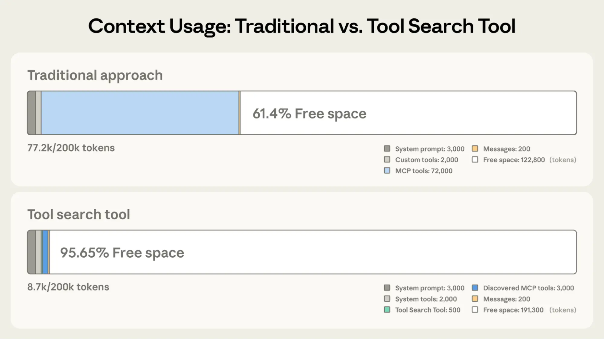
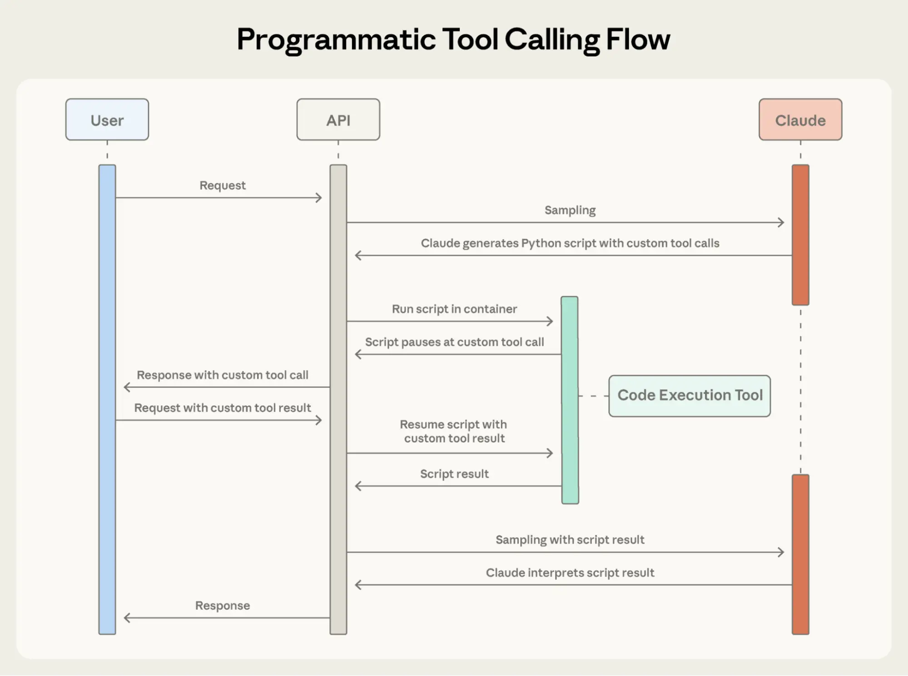

# 在Claude开发者平台推出高级工具使用功能

来源：https://www.anthropic.com/engineering/advanced-tool-use

---

AI智能体的未来，是模型能够无缝协同操作数百甚至数千种工具。比如集成Git操作、文件管理、包管理器、测试框架和部署流程的IDE助手；或是同时连接Slack、GitHub、Google Drive、Jira、公司数据库及数十个MCP服务器的运维协调器。

要[构建高效智能体](https://www.anthropic.com/research/building-effective-agents)，它们需要能够使用无限的工具库，而不是将所有定义一次性塞入上下文。我们关于[通过MCP执行代码](https://www.anthropic.com/engineering/code-execution-with-mcp)的博客文章曾讨论过，工具结果和定义有时会消耗超过5万个令牌，然后智能体才能读取请求。智能体应当按需发现和加载工具，仅保留当前任务相关的部分。

智能体还需要具备通过代码调用工具的能力。使用自然语言工具调用时，每次调用都需要完整的推理过程，且无论是否有用，中间结果都会堆积在上下文中。代码天然适合编排逻辑，例如循环、条件判断和数据转换。智能体需要根据任务灵活选择代码执行或推理。

智能体还需要通过示例学习正确的工具使用方法，而不仅仅是模式定义。JSON模式定义了结构有效性，但无法表达使用模式：何时包含可选参数、哪些组合有意义，或API期望的约定规范。

今天，我们发布三项实现这一愿景的功能：

* **工具搜索工具**：让Claude能够使用搜索工具访问数千种工具，同时不占用其上下文窗口
* **编程式工具调用**：允许Claude在代码执行环境中调用工具，减少对模型上下文窗口的影响
* **工具使用示例**：提供通用标准，展示如何高效使用特定工具

在内部测试中，我们发现这些功能帮助我们构建了传统工具使用模式无法实现的应用。例如，**[Claude for Excel](https://www.claude.com/claude-for-excel)** 利用程序化工具调用功能，能够读取和修改包含数千行数据的电子表格，而不会超出模型的上下文窗口限制。

根据我们的实践经验，这些功能为您利用Claude构建应用开辟了新的可能性。

## 工具搜索工具

### 面临的挑战

MCP工具定义提供了重要的上下文信息，但随着连接的服务端数量增加，这些令牌消耗会快速累积。以一个五服务端配置为例：

* GitHub：35个工具（约26K令牌）
* Slack：11个工具（约21K令牌）
* Sentry：5个工具（约3K令牌）
* Grafana：5个工具（约3K令牌）
* Splunk：2个工具（约2K令牌）

这意味着在对话开始前，58个工具就已消耗约55K令牌。若增加更多服务端如Jira（仅其自身就消耗约17K令牌），令牌开销将迅速突破100K大关。在Anthropic的实际案例中，我们曾观察到工具定义在优化前消耗了134K令牌。

但令牌成本并非唯一问题。最常见的故障是错误选择工具和参数设置不当，尤其是当工具名称相似时（例如`notification-send-user`与`notification-send-channel`的混淆）。

### 我们的解决方案

工具搜索工具采用按需发现机制替代预先加载所有工具定义的模式。Claude仅会获取当前任务实际需要的工具。

_与传统方法相比，工具搜索工具将可用上下文从122,800令牌提升至191,300令牌。_

传统方法：
* 预先加载所有工具定义（50+个MCP工具约消耗72K令牌）
* 对话历史与系统提示需竞争剩余空间
* 实际工作开始前总上下文消耗：约77K令牌

采用工具搜索工具：
* 仅预先加载工具搜索工具（约500令牌）
* 按需发现相关工具（通常3-5个工具，约3K令牌）
* 总上下文消耗：约8.7K令牌，保留95%的上下文窗口容量

这实现了在保持完整工具库访问的同时，将令牌使用量减少85%。内部测试显示，在处理大型工具库时，MCP评估的准确率显著提升：启用工具搜索工具后，Opus 4从49%提升至74%，Opus 4.5从79.5%提升至88.1%。

### 工具搜索工具的工作原理

工具搜索工具让Claude能够动态发现工具，而非预先加载所有定义。您将所有工具定义提供给API，但通过标记`defer_loading: true`使工具可按需发现。延迟加载的工具最初不会载入Claude的上下文，Claude仅能看到工具搜索工具本身及标记为`defer_loading: false`的工具（即最关键、最常用的工具）。

当Claude需要特定功能时，它会搜索相关工具。工具搜索工具将返回匹配工具的引用，这些引用随后会在Claude上下文中扩展为完整定义。

例如，若Claude需要与GitHub交互，它会搜索"github"，此时仅加载`github.createPullRequest`和`github.listIssues`——而不会加载来自Slack、Jira和Google Drive的其他50多个工具。

通过这种方式，Claude既能访问完整工具库，又只需为实际使用的工具支付令牌成本。

**提示缓存说明：** 工具搜索工具不会破坏提示缓存，因为延迟加载的工具完全不会包含在初始提示中。它们仅在Claude搜索后才被添加上下文，因此您的系统提示和核心工具定义仍可缓存。

**实现方式：**

    {
      "tools": [
        // 包含工具搜索工具（正则表达式、BM25或自定义）
        {"type": "tool_search_tool_regex_20251119", "name": "tool_search_tool_regex"},

        // 标记工具用于按需发现
        {
          "name": "github.createPullRequest",
          "description": "创建拉取请求",
          "input_schema": {...},
          "defer_loading": true
        }
        // ... 数百个延迟加载工具（defer_loading: true）
      ]
    }

对于MCP服务器，您可以延迟加载整个服务器，同时保持特定高频使用工具处于加载状态：

{
  "type": "mcp_toolset",
  "mcp_server_name": "google-drive",
  "default_config": {"defer_loading": true}, # 延迟加载整个服务器
  "configs": {
    "search_files": {
      "defer_loading": false
    }  // 保持最常用工具处于加载状态
  }
}

Claude开发者平台内置了基于正则表达式和BM25的搜索工具，同时您也可以使用嵌入向量或其他策略来实现自定义搜索工具。

### 何时使用工具搜索工具

与任何架构决策类似，启用工具搜索工具需要权衡利弊。该功能会在工具调用前增加一个搜索步骤，因此当节省上下文空间和提升准确性的收益超过额外延迟时，其投资回报率最高。

**适用场景：**

* 工具定义消耗超过10K令牌
* 遇到工具选择准确性问题
* 构建集成多个服务器的MCP驱动系统
* 可用工具数量超过10个

**效益较低的场景：**

* 工具库规模较小（少于10个工具）
* 所有工具在每个会话中都频繁使用
* 工具定义非常简洁

## 程序化工具调用

### 面临的挑战

随着工作流程日益复杂，传统工具调用会引发两个根本性问题：

* **中间结果造成的上下文污染**：当Claude分析10MB的日志文件以查找错误模式时，整个文件都会进入其上下文窗口，即使Claude只需要错误频率的摘要。在跨多个表获取客户数据时，每条记录无论相关与否都会在上下文中累积。这些中间结果消耗大量令牌配额，并可能将重要信息完全挤出上下文窗口。
* **推理开销与人工合成负担**：每次工具调用都需要完整的模型推理过程。收到结果后，Claude必须通过自然语言处理来"人工审视"数据、提取相关信息、推理各部分如何关联，并决定后续操作。一个包含五个工具的工作流程意味着五次推理过程，加上Claude解析每个结果、比对数值并综合结论。这种方式既低效又容易出错。

### 我们的解决方案

程序化工具调用使Claude能够通过代码而非单个API往返来协调工具。不同于Claude每次请求一个工具并将每个结果返回至其上下文，Claude通过编写代码来调用多个工具、处理其输出，并控制实际进入其上下文窗口的信息。

Claude擅长编写代码，通过让其用Python表达协调逻辑而非通过自然语言工具调用，您能获得更可靠、更精确的控制流程。循环、条件判断、数据转换和错误处理都明确体现在代码中，而非隐含在Claude的推理过程中。

#### 示例：预算合规检查

考虑一个常见的业务任务："哪些团队成员超出了第三季度的差旅预算？"

您可使用三个工具：

* `get_team_members(department)` - 返回包含ID和职级的团队成员列表
* `get_expenses(user_id, quarter)` - 返回用户的费用明细项
* `get_budget_by_level(level)` - 返回对应职级的预算限额

**传统方法**：

* 获取团队成员 → 20人
* 为每人获取其第三季度费用 → 20次工具调用，每次返回50-100个明细项（航班、酒店、餐饮、票据）
* 按职级获取预算限额
* 所有数据进入Claude上下文：2000多个费用明细项（50KB以上）
* Claude手动汇总每人费用，查询其预算，比较费用与预算限额
* 需要更多次模型交互，消耗大量上下文空间

**采用程序化工具调用**：

Claude编写一个Python脚本来协调整个工作流程，而非让每个工具结果返回给Claude。该脚本在代码执行工具（沙盒环境）中运行，仅在需要工具结果时暂停。当您通过API返回工具结果时，它们由脚本处理而非被模型消耗。脚本继续执行，Claude仅看到最终输出。

程序化工具调用使Claude能够通过代码编排工具，而非通过单独的API往返调用，从而实现并行工具执行。

以下是Claude为预算合规任务编排的代码示例：

    team = await get_team_members("engineering")

    # 获取每个唯一职级的预算
    levels = list(set(m["level"] for m in team))
    budget_results = await asyncio.gather(*[
        get_budget_by_level(level) for level in levels
    ])

    # 创建查询字典：{"初级": 预算1, "高级": 预算2, ...}
    budgets = {level: budget for level, budget in zip(levels, budget_results)}

    # 并行获取所有支出记录
    expenses = await asyncio.gather(*[
        get_expenses(m["id"], "Q3") for m in team
    ])

    # 找出超出差旅预算的员工
    exceeded = []
    for member, exp in zip(team, expenses):
        budget = budgets[member["level"]]
        total = sum(e["amount"] for e in exp)
        if total > budget["travel_limit"]:
            exceeded.append({
                "name": member["name"],
                "spent": total,
                "limit": budget["travel_limit"]
            })

    print(json.dumps(exceeded))

复制

Claude的上下文仅接收最终结果：两到三名超出预算的人员。超过2000行的条目数据、中间汇总结果和预算查询过程均不影响Claude的上下文，从而将原始支出数据从200KB的消耗减少至仅1KB的结果数据。

效率提升效果显著：

*   **节省令牌**：通过将中间结果移出Claude的上下文，程序化工具调用显著降低了令牌消耗。在复杂研究任务中，平均使用量从43,588个令牌降至27,297个令牌，降幅达37%。
*   **降低延迟**：每次API往返都需要模型推理（数百毫秒至数秒）。当Claude在单个代码块中编排20多个工具调用时，可消除19次以上的推理过程。API会在不每次返回模型的情况下处理工具执行。
*   **提升准确率**：通过编写明确的编排逻辑，Claude比用自然语言处理多个工具结果时出错更少。内部知识检索准确率从25.6%提升至28.5%；[GIA基准测试](https://arxiv.org/abs/2311.12983)得分从46.5%提升至51.2%。

生产工作流涉及杂乱数据、条件逻辑和需要扩展的操作。程序化工具调用让Claude能以编程方式处理这种复杂性，同时保持对可操作结果的专注，而非原始数据处理。

### 程序化工具调用工作原理

#### 1. 标记可从代码调用的工具

为工具添加代码执行功能，并通过设置`allowed_callers`选择加入程序化执行：

    {
      "tools": [
        {
          "type": "code_execution_20250825",
          "name": "code_execution"
        },
        {
          "name": "get_team_members",
          "description": "获取部门所有成员...",
          "input_schema": {...},
          "allowed_callers": ["code_execution_20250825"] # 选择加入程序化工具调用
        },
        {
          "name": "get_expenses",
     	...
        },
        {
          "name": "get_budget_by_level",
    	...
        }
      ]
    }

复制

API会将这些工具定义转换为Claude可调用的Python函数。

#### 2. Claude编写编排代码

Claude不再逐个请求工具，而是生成Python代码：

    {
      "type": "server_tool_use",
      "id": "srvtoolu_abc",
      "name": "code_execution",
      "input": {
        "code": "team = get_team_members('engineering')\n..." # 上述代码示例
      }
    }

复制

#### 3. 工具执行不占用Claude上下文

当代码调用get_expenses()时，您会收到一个包含调用者字段的工具请求：

    {
      "type": "tool_use",
      "id": "toolu_xyz",
      "name": "get_expenses",
      "input": {"user_id": "emp_123", "quarter": "Q3"},
      "caller": {
        "type": "code_execution_20250825",
        "tool_id": "srvtoolu_abc"
      }
    }

复制

您提供的结果会在代码执行环境中处理，而非Claude的上下文。代码中的每个工具调用都会重复此请求-响应循环。

#### 4. 仅最终输出进入上下文

代码运行结束后，只有代码执行结果返回给Claude：

    {
      "type": "code_execution_tool_result",
      "tool_use_id": "srvtoolu_abc",
      "content": {
        "stdout": "[{\"name\": \"Alice\", \"spent\": 12500, \"limit\": 10000}...]"
      }
    }

复制

Claude仅能看到这些内容，而无法看到处理过程中涉及的2000多条费用明细。

### 何时使用编程式工具调用

编程式工具调用在您的工作流程中增加了代码执行步骤。当节省的令牌数、延迟改善和准确性提升效果显著时，这种额外开销是值得的。

**在以下场景中最具价值：**

* 处理大型数据集且仅需聚合结果或摘要时
* 运行包含三个及以上依赖工具调用的多步骤工作流时
* 在Claude查看前对工具结果进行筛选、排序或转换时
* 处理不应让中间数据影响Claude推理的任务时
* 跨多个项目执行并行操作时（例如检查50个端点）

**在以下场景中价值较低：**

* 进行简单的单工具调用时
* 处理需要Claude查看并推理所有中间结果的任务时
* 运行响应数据量较小的快速查询时

## 工具使用示例

### 面临的挑战

JSON Schema擅长定义结构——类型、必填字段、允许的枚举值——但无法表达使用模式：何时包含可选参数、哪些组合具有实际意义，或您的API期望遵循何种约定。

以支持工单API为例：

{
      "name": "create_ticket",
      "input_schema": {
        "properties": {
          "title": {"type": "string"},
          "priority": {"enum": ["low", "medium", "high", "critical"]},
          "labels": {"type": "array", "items": {"type": "string"}},
          "reporter": {
            "type": "object",
            "properties": {
              "id": {"type": "string"},
              "name": {"type": "string"},
              "contact": {
                "type": "object",
                "properties": {
                  "email": {"type": "string"},
                  "phone": {"type": "string"}
                }
              }
            }
          },
          "due_date": {"type": "string"},
          "escalation": {
            "type": "object",
            "properties": {
              "level": {"type": "integer"},
              "notify_manager": {"type": "boolean"},
              "sla_hours": {"type": "integer"}
            }
          }
        },
        "required": ["title"]
      }
    }

该模式定义了有效内容，但未解答关键问题：

  * **格式模糊性：** `due_date` 应使用 "2024-11-06"、"Nov 6, 2024" 还是 "2024-11-06T00:00:00Z"？
  * **ID 规范：** `reporter.id` 是 UUID、"USR-12345" 还是仅 "12345"？
  * **嵌套结构使用：** 何时应由 Claude 填充 `reporter.contact`？
  * **参数关联性：** `escalation.level` 和 `escalation.sla_hours` 如何与优先级关联？

这些模糊性可能导致工具调用格式错误和参数使用不一致。

### 我们的解决方案

工具使用示例允许您直接在工具定义中提供示例工具调用。通过展示具体使用模式，不再仅依赖模式定义：

{
        "name": "create_ticket",
        "input_schema": { /* 同上文模式 */ },
        "input_examples": [
          {
            "title": "登录页面返回500错误",
            "priority": "critical",
            "labels": ["bug", "authentication", "production"],
            "reporter": {
              "id": "USR-12345",
              "name": "Jane Smith",
              "contact": {
                "email": "jane@acme.com",
                "phone": "+1-555-0123"
              }
            },
            "due_date": "2024-11-06",
            "escalation": {
              "level": 2,
              "notify_manager": true,
              "sla_hours": 4
            }
          },
          {
            "title": "添加深色模式支持",
            "labels": ["feature-request", "ui"],
            "reporter": {
              "id": "USR-67890",
              "name": "Alex Chen"
            }
          },
          {
            "title": "更新API文档"
          }
        ]
      }

从这三个示例中，Claude学习到：

  * **格式规范**：日期使用YYYY-MM-DD格式，用户ID遵循USR-XXXXX格式，标签采用短横线命名法
  * **嵌套结构模式**：如何构建包含嵌套联系信息对象的报告者对象
  * **可选参数关联规则**：严重错误需包含完整联系信息及紧急升级流程（SLA时限严格）；功能请求需报告者信息但无需联系信息/升级流程；内部任务仅需标题

在我们内部测试中，工具使用示例将复杂参数处理的准确率从72%提升至90%。

### 何时使用工具使用示例

工具使用示例会增加工具定义所需的令牌量，因此当准确性提升的价值超过额外成本时最为适用。

**最适用场景：**

  * 复杂嵌套结构场景（有效JSON不代表正确用法）
  * 含大量可选参数且参数包含模式具有重要意义的工具
  * 存在模式定义无法涵盖的领域特定规范的API
  * 相似工具需要通过示例区分使用场景（如`create_ticket`与`create_incident`）

**效益较低场景：**

*   简单单参数工具，使用方式一目了然
*   标准格式（如URL或电子邮件），Claude已能理解
*   更适合通过JSON Schema约束处理的验证问题

## 最佳实践

构建能够执行现实世界操作的智能体，意味着需要同时处理规模、复杂性和精确性。以下三大特性协同工作，旨在解决工具使用工作流中的不同瓶颈。以下是如何有效结合它们的指南。

### 战略性分层应用特性

并非每个智能体处理特定任务时都需要使用全部三个特性。请从最突出的瓶颈入手：

*   工具定义导致上下文膨胀 → 使用**工具搜索工具**
*   大型中间结果污染上下文 → 使用**程序化工具调用**
*   参数错误和调用格式错误 → 使用**工具使用示例**

这种聚焦式方法让你能够解决限制智能体性能的具体约束，而不是一开始就增加复杂性。

然后，根据需要分层添加其他特性。它们是互补的：工具搜索工具确保找到正确的工具，程序化工具调用确保高效执行，而工具使用示例确保正确调用。

### 设置工具搜索工具以优化发现

工具搜索会匹配名称和描述，因此清晰、描述性的定义能提高发现的准确性。

    // 良好示例
    {
        "name": "search_customer_orders",
        "description": "按日期范围、状态或总金额搜索客户订单。返回包含商品、配送和支付信息的订单详情。"
    }

    // 不良示例
    {
        "name": "query_db_orders",
        "description": "执行订单查询"
    }

复制

添加系统提示指导，让Claude了解可用的工具：

    您可以访问用于Slack消息发送、Google Drive文件管理、
    Jira工单跟踪和GitHub仓库操作的工具。请使用工具搜索
    来查找特定功能。

复制

将最常用的三到五个工具始终保持加载状态，其余工具按需加载。这样既保证了常用操作的即时访问，又实现了其他所有工具的按需发现。

### 设置程序化工具调用以确保正确执行

由于Claude会编写代码来解析工具输出，请清晰记录返回格式。这有助于Claude编写正确的解析逻辑：

    {
        "name": "get_orders",
        "description": "获取客户订单。
    返回：
        订单对象列表，每个对象包含：
        - id (字符串)：订单标识符
        - total (浮点数)：订单总金额（美元）
        - status (字符串)：状态为'pending'（待处理）、'shipped'（已发货）、'delivered'（已送达）之一
        - items (列表)：{sku, quantity, price}结构数组
        - created_at (字符串)：ISO 8601时间戳"
    }

以下适用于可通过程序化编排获得优化的工具：

  * 可并行运行的工具（独立操作）
  * 支持安全重试的操作（幂等性）

### 设置工具使用示例以确保参数准确性

为行为清晰性设计示例：

  * 使用真实数据（真实城市名称、合理价格，而非"字符串"或"数值"占位符）
  * 通过最小化、部分及完整规范模式展示多样性
  * 保持简洁：每个工具1-5个示例
  * 聚焦模糊场景（仅需在正确用法无法从架构中明确推断时添加示例）

## 快速开始

这些功能目前处于测试阶段。启用时请添加测试版请求头并包含所需工具：

    client.beta.messages.create(
        betas=["advanced-tool-use-2025-11-20"],
        model="claude-sonnet-4-5-20250929",
        max_tokens=4096,
        tools=[
            {"type": "tool_search_tool_regex_20251119", "name": "tool_search_tool_regex"},
            {"type": "code_execution_20250825", "name": "code_execution"},
            # 您的工具需包含defer_loading、allowed_callers及input_examples参数
        ]
    )

详细API文档和SDK示例请参阅：

*   [工具搜索工具](https://platform.claude.com/docs/en/agents-and-tools/tool-use/tool-search-tool)的[文档](https://platform.claude.com/docs/en/agents-and-tools/tool-use/tool-search-tool)与[示例库](https://github.com/anthropics/claude-cookbooks/blob/main/tool_use/tool_search_with_embeddings.ipynb)
*   [编程式工具调用](https://platform.claude.com/docs/en/agents-and-tools/tool-use/programmatic-tool-calling)的[文档](https://platform.claude.com/docs/en/agents-and-tools/tool-use/programmatic-tool-calling)与[示例库](https://github.com/anthropics/claude-cookbooks/blob/main/tool_use/programmatic_tool_calling_ptc.ipynb)
*   [工具使用示例](https://platform.claude.com/docs/en/agents-and-tools/tool-use/implement-tool-use#providing-tool-use-examples)的[文档](https://platform.claude.com/docs/en/agents-and-tools/tool-use/implement-tool-use#providing-tool-use-examples)

这些功能将工具使用从简单的函数调用推向智能编排。随着智能体处理跨越数十种工具和大型数据集的更复杂工作流，动态发现、高效执行和可靠调用变得至关重要。

我们期待看到您的创造。

## 致谢

本文由 Bin Wu 撰写，Adam Jones、Artur Renault、Henry Tay、Jake Noble、Noah Picard、Sam Jiang 以及 Claude 开发者平台团队亦有贡献。此项工作建立在 Chris Gorgolewski、Daniel Jiang、Jeremy Fox 和 Mike Lambert 的基础研究之上。我们也从整个 AI 生态系统中汲取灵感，包括 [Joel Pobar 的 LLMVM](https://github.com/9600dev/llmvm)、[Cloudflare 的代码模式](https://blog.cloudflare.com/code-mode/) 以及 [作为 MCP 的代码执行](https://www.anthropic.com/engineering/code-execution-with-mcp)。特别感谢 Andy Schumeister、Hamish Kerr、Keir Bradwell、Matt Bleifer 和 Molly Vorwerck 的支持。
