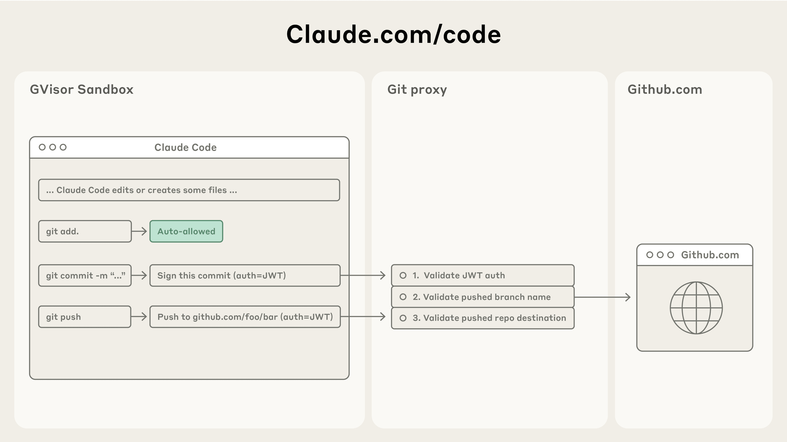

# 超越权限提示：让Claude Code更安全、更自主

来源：https://www.anthropic.com/engineering/claude-code-sandboxing

---

在[Claude Code](https://www.claude.com/product/claude-code)中，Claude能够与您并肩编写、测试和调试代码，浏览您的代码库，编辑多个文件，并运行命令来验证其工作成果。赋予Claude如此广泛的代码库和文件访问权限可能带来风险，尤其是在面临提示注入攻击的情况下。

为解决这一问题，我们在Claude Code中引入了两项基于沙盒技术的新功能，旨在为开发者提供一个更安全的工作环境，同时让Claude能够更自主地运行，减少权限提示的干扰。在我们的内部使用中，我们发现沙盒技术能安全地将权限提示减少84%。通过定义Claude可以自由工作的明确边界，这些功能既提升了安全性，也增强了自主性。

### 保障用户在Claude Code上的安全

Claude Code采用基于权限的模型：默认情况下，它处于只读模式，这意味着在进行任何修改或运行命令之前，它都会请求许可。但也有一些例外：我们会自动允许安全的命令，如`echo`或`cat`，但大多数操作仍需明确批准。

频繁点击“批准”会拖慢开发周期，并可能导致“批准疲劳”，即用户可能不会仔细关注他们批准的内容，从而降低开发过程的安全性。

为解决这一问题，我们为Claude Code推出了沙盒功能。

## 沙盒技术：一种更安全、更自主的方法

沙盒技术创建了预定义的边界，让Claude能够在此范围内更自由地工作，而无需为每个操作请求许可。启用沙盒后，您将大幅减少权限提示，同时安全性得到提升。

我们的沙盒方法基于操作系统级功能构建，实现了两种边界：

1. **文件系统隔离**，确保Claude只能访问或修改特定目录。这对于防止被提示注入的Claude修改敏感系统文件尤为重要。
2. **网络隔离**，确保Claude只能连接到经批准的服务器。这可以防止被提示注入的Claude泄露敏感信息或下载恶意软件。

值得注意的是，有效的沙箱环境需要**同时具备**文件系统和网络隔离。没有网络隔离，被入侵的代理可能泄露SSH密钥等敏感文件；没有文件系统隔离，被入侵的代理可能轻易逃脱沙箱并获取网络访问权限。正是通过结合使用这两种技术，我们才能为Claude Code用户提供更安全、更高效的代理体验。

### Claude Code中的两项新沙箱功能

#### *沙箱化bash工具：无需权限提示的安全bash执行

我们推出了[全新的沙箱运行时环境](https://docs.claude.com/en/docs/claude-code/sandboxing)（作为研究预览版提供测试），允许您精确定义代理可访问的目录和网络主机，无需承担启动和管理容器的开销。该运行时可用于沙箱化任意进程、代理和MCP服务器，并已作为[开源研究预览版](https://github.com/anthropic-experimental/sandbox-runtime)发布。

在Claude Code中，我们利用该运行时对bash工具进行沙箱化处理，使Claude能够在您设定的限制范围内执行命令。在安全的沙箱环境中，Claude可以更自主地运行命令，且无需频繁请求操作权限。如果Claude试图访问沙箱**外部**资源，系统将立即通知您，并由您决定是否允许该操作。

该功能基于操作系统级原语构建，例如[Linux bubblewrap](https://github.com/containers/bubblewrap)和MacOS seatbelt，在操作系统层面强制执行这些限制。这些限制不仅涵盖Claude Code的直接交互，还包括命令执行过程中产生的任何脚本、程序或子进程。如上所述，该沙箱同时实现了双重隔离机制：

  1. **文件系统隔离**，允许对当前工作目录进行读写访问，但阻止修改其外的任何文件。
  2. **网络隔离**，仅允许通过连接到沙箱外运行的代理服务器的Unix域套接字访问互联网。该代理服务器强制执行进程可连接域名的限制，并处理用户对新请求域名的确认。如果您希望进一步提高安全性，我们还支持自定义此代理，以对出站流量实施任意规则。

这两个组件均可配置：您可以轻松选择允许或禁止特定的文件路径或域名。
Claude Code的沙箱架构通过文件系统和网络控制来隔离代码执行，自动允许安全操作、阻止恶意行为，仅在需要时请求权限。

沙箱化确保即使发生提示注入攻击，也能完全隔离，不会影响用户的整体安全。这样，即使Claude Code被攻破，也无法窃取您的SSH密钥或回连到攻击者的服务器。

要开始使用此功能，请在Claude Code中运行/sandbox命令，并查看关于我们安全模型的[更多技术细节](https://docs.claude.com/en/docs/claude-code/sandboxing)。

为了让其他团队更容易构建更安全的智能体，我们已将此功能[开源](https://github.com/anthropic-experimental/sandbox-runtime)。我们认为，其他团队应考虑采用此技术来增强其智能体的安全态势。

#### *Claude Code网页版：在云端安全运行Claude Code*

今天，我们同时发布了[网页版Claude Code](https://docs.claude.com/en/docs/claude-code/claude-code-on-the-web)，让用户能够在云端隔离沙箱中运行Claude Code。网页版Claude Code会在独立沙箱中执行每个会话，以安全可靠的方式完全访问其服务器。我们设计的沙箱确保敏感凭证（如Git凭证或签名密钥）绝不会与Claude Code共存于沙箱内。这样即使沙箱中运行的代码被攻破，用户也能免受进一步侵害。

网页版Claude Code采用定制代理服务，透明处理所有Git交互。在沙箱内部，Git客户端通过定制化的范围限定凭证向该服务进行身份验证。代理会验证该凭证及Git交互内容（例如确保仅推送至预设分支），随后附加正确的身份验证令牌再将请求发送至GitHub。

Claude Code的Git集成功能通过安全代理路由命令，该代理会验证身份验证令牌、分支名称和代码库目标地址——在保障安全版本控制工作流的同时，防止未经授权的推送操作。

## 快速开始

我们全新的沙箱化bash工具与网页版Claude Code为使用Claude进行工程开发的开发者带来了安全性与生产力的双重提升。

开始使用这些工具：

  1. 在Claude中运行`/sandbox`命令，并查阅[我们的文档](https://docs.claude.com/en/docs/claude-code/sandboxing)了解如何配置此沙箱。
  2. 访问[claude.com/code](http://claude.ai/redirect/website.v1.61d21a70-85b5-41ce-a78b-eb83c01d7f04/code)试用网页版Claude Code。

若您正在构建自主智能体，可查看我们[开源的沙箱化代码](https://github.com/anthropic-experimental/sandbox-runtime)，考虑将其集成至您的工作中。我们期待见证您的创造。

要了解更多关于网页版Claude Code的信息，请查阅我们的[发布博客文章](https://www.anthropic.com/news/claude-code-on-the-web)。

## 致谢

本文由David Dworken和Oliver Weller-Davies撰写，Meaghan Choi、Catherine Wu、Molly Vorwerck、Alex Isken、Kier Bradwell和Kevin Garcia亦有贡献。
