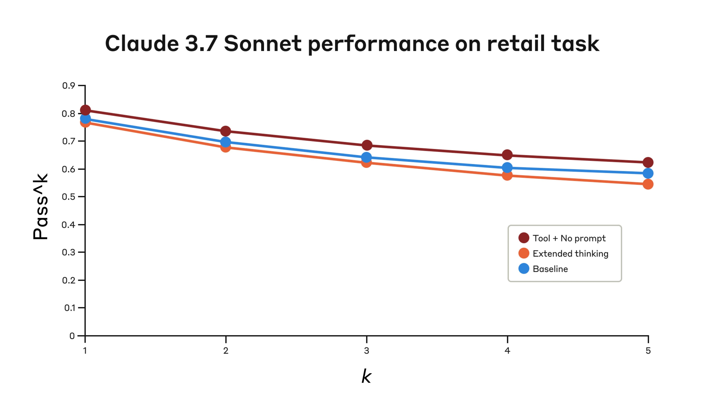

# "思考"工具：让Claude在复杂工具使用场景中暂停思考

来源：https://www.anthropic.com/engineering/claude-think-tool

---

* 扩展思考功能更新

2025年12月15日

自首次发布以来，扩展思考功能已得到显著改进，因此在大多数情况下，我们建议使用该功能而非专门的思考工具。扩展思考提供了相似的优势——为Claude提供推理复杂问题的空间——同时具备更好的集成性和性能表现。具体实现细节请参阅我们的扩展思考文档。

在持续增强Claude复杂问题解决能力的过程中，我们发现了一种特别有效的方法：通过"思考"工具在复杂任务中创建专门用于结构化思考的空间。

这种简单而强大的技术——正如我们下文将说明的，它不同于Claude新推出的"[扩展思考](https://www.anthropic.com/research/visible-extended-thinking)"功能（[扩展思考实现细节](https://platform.claude.com/docs/en/build-with-claude/extended-thinking)请见此）——显著提升了Claude在代理式工具使用方面的能力。这包括遵循策略、保持决策一致性以及处理多步骤问题，且仅需极少的实现开销。

本文将探讨如何在不同应用中实现"思考"工具，并基于已验证的基准测试结果，为开发者提供实用指导。

### 什么是"思考"工具？

通过"思考"工具，我们赋予Claude在得出最终答案前增加额外思考步骤的能力——这个步骤拥有专门设计的思考空间。

虽然听起来与扩展思维相似，但这是两个不同的概念。扩展思维关注的是Claude在开始生成回复之前所做的全部工作。通过扩展思维，Claude会在采取行动前深入思考并反复推敲其计划。而"think"工具的作用是：当Claude开始生成回复后，可以暂停并思考是否已掌握继续推进所需的全部信息。这在执行长链工具调用或与用户进行多步骤长对话时尤其有用。

这使得"think"工具更适用于以下情况：Claude无法仅凭用户查询就获得制定回复所需的全部信息，且需要处理外部信息（例如工具调用结果中的信息）。通过"think"工具进行的推理不如扩展思维那样全面，更侧重于模型发现的_新_信息。

对于较简单的工具使用场景，如非顺序性工具调用或直接指令执行，我们建议使用扩展思维。扩展思维也适用于无需Claude调用工具的用例，例如编程、数学和物理领域。而"think"工具更适合以下场景：Claude需要调用复杂工具、在长链工具调用中仔细分析工具输出、在政策密集且指南详细的环境中导航，或进行顺序决策（其中每一步都建立在前一步基础上且错误代价高昂）。

以下是一个使用标准工具规范格式的示例实现，该格式源自[τ-Bench](https://arxiv.org/abs/2406.12045)：

    {
      "name": "think",
      "description": "使用此工具进行思考。它不会获取新信息或改变数据库，仅将思考内容追加到日志中。当需要复杂推理或某些缓存记忆时使用。",
      "input_schema": {
        "type": "object",
        "properties": {
          "thought": {
            "type": "string",
            "description": "需要思考的内容。"
          }
        },
        "required": ["thought"]
      }
    }

复制

### 在 τ-Bench 上的性能表现

我们使用 τ-bench（tau-bench）对“思考”工具进行了评估。该基准测试旨在全面检验模型在真实客户服务场景中运用工具的能力，其中“思考”工具是评估标准环境的一部分。

τ-bench 主要评估 Claude 在以下方面的能力：

  * 与模拟用户进行真实对话的导航能力
  * 始终遵循复杂的客户服务代理政策指南
  * 使用多种工具访问和操作环境数据库

τ-bench 采用的核心评估指标是 pass^_k_，该指标衡量的是对于给定任务，所有 _k_ 次独立任务试验均成功的概率，并在所有任务中进行平均。与其他常见的大语言模型评估指标 pass@_k_（衡量 _k_ 次试验中至少有一次成功）不同，pass^_k_ 评估的是模型的一致性和可靠性——这对于客户服务应用至关重要，因为在这些应用中，始终如一地遵守政策是基本要求。

#### 性能分析

我们的评估比较了以下几种不同配置：

  1. 基线（无“思考”工具，无扩展思考模式）
  2. 仅使用扩展思考模式
  3. 仅使用“思考”工具
  4. 使用“思考”工具并配合优化提示（针对航空领域）

结果显示，当 Claude 3.7 在基准测试的“航空”和“零售”客户服务领域中有效使用“思考”工具时，性能得到了显著提升：

  * **航空领域**：使用优化提示的“思考”工具在 pass^1 指标上达到了 0.570，而基线仅为 0.370——相对提升了 54%；
  * **零售领域**：仅使用“思考”工具就达到了 0.812，而基线为 0.783。
Claude 3.7 Sonnet 在四种不同配置下，于 Tau-Bench 评估“航空”领域的性能表现。

Claude 3.7 Sonnet 在 Tau-Bench 评估“航空”领域的性能表现

配置项|  _k_ =1|  _k_ =2|  _k_ =3|  _k_ =4|  _k_ =5
---|---|---|---|---|---
"思考" + 提示词| 0.584| 0.444| 0.384| 0.356| 0.340
"思考"| 0.404| 0.254| 0.186| 0.140| 0.100
扩展思考| 0.412| 0.290| 0.232| 0.192| 0.160
基线方法| 0.332| 0.206| 0.148| 0.116| 0.100

四种不同配置下的评估结果。数值为比例得分。

在航空领域的最佳表现是通过将“思考”工具与优化提示词结合实现的，该提示词提供了分析客户请求时应采用的推理方法示例。以下是优化提示词的示例：

    ## 使用思考工具

    在收到工具结果后采取任何行动或回复用户之前，请使用思考工具作为草稿纸来：
    - 列出适用于当前请求的具体规则
    - 检查是否已收集所有必需信息
    - 验证计划行动是否符合所有政策要求
    - 对工具结果的正确性进行迭代核查

    以下是在思考工具内进行迭代核查的示例：
    <思考工具示例_1>
    用户希望取消航班ABC123
    - 需验证：用户ID、预订ID、取消原因
    - 检查取消规则：
      * 是否在预订后24小时内？
      * 如否，检查机票舱位与保险条款
    - 确认无航段已使用或已过期
    - 计划：收集缺失信息、验证规则、获取确认
    </思考工具示例_1>

<think_tool_example_2>
用户想要预订3张前往纽约市的机票，每人托运2件行李
- 需要用户ID以检查：
  * 会员等级对应的行李额度
  * 用户档案中存在的支付方式
- 行李费用计算：
  * 经济舱 × 3位乘客
  * 若为普通会员：每人1件免费行李 → 3件额外行李 = 150美元
  * 若为银卡会员：每人2件免费行李 → 0件额外行李 = 0美元
  * 若为金卡会员：每人3件免费行李 → 0件额外行李 = 0美元
- 需核实的支付规则：
  * 最多使用1张旅行券、1张信用卡、3张礼品卡
  * 所有支付方式必须存在于用户档案中
  * 旅行券剩余金额将作废
- 执行计划：
1. 获取用户ID
2. 根据会员等级核实行李费用
3. 检查用户档案中的支付方式及其组合是否符合规定
4. 计算总额：机票价格 + 行李费用
5. 获取明确的预订确认
</think_tool_example_2>

特别有趣的是不同方法之间的对比效果。使用优化提示的“思考”工具相比扩展思考模式（其表现与未提示的“思考”工具相似）取得了显著更好的结果。单独使用“思考”工具（无提示）相比基线有所改进，但仍未达到优化方法的水平。

“思考”工具与优化提示的结合以显著优势实现了最强性能，这很可能归因于基准测试中[航空公司政策](https://github.com/sierra-research/tau-bench/blob/main/tau_bench/envs/airline/wiki.md)部分的高度复杂性——模型通过获得“如何思考”的示例从中获益最大。

在零售领域，我们还测试了多种配置以理解每种方法的具体影响

Claude 3.7 Sonnet在Tau-Bench评估“零售”领域中三种不同配置下的表现。

Claude 3.7 Sonnet在Tau-Bench评估“零售”领域中的表现

配置|  _k_ =1|  _k_ =2|  _k_ =3|  _k_ =4|  _k_ =5
---|---|---|---|---|---
"思考"工具 + 无提示| 0.812| 0.735| 0.685| 0.650| 0.626
扩展思考| 0.770| 0.681| 0.623| 0.581| 0.548
基线| 0.783| 0.695| 0.643| 0.607| 0.583

三种不同配置下的评估结果。分数为比例值。

即使在没有额外提示的情况下，"思考"工具也取得了最高的通过^1分数0.812。相比航空领域，[零售政策](https://github.com/sierra-research/tau-bench/blob/main/tau_bench/envs/retail/wiki.md)明显更容易处理，Claude仅通过拥有思考空间而无需进一步指导就实现了提升。

#### τ-Bench分析的关键洞察

我们的详细分析揭示了若干模式，可帮助您有效实施"思考"工具：

  1. **提示对困难领域影响显著**。仅提供"思考"工具可能在一定程度上提升性能，但将其与优化提示结合使用能在困难领域带来显著更好的结果。然而，较简单的领域可能仅通过使用"思考"工具就能受益。
  2. **跨试验的一致性得到改善**。使用"思考"工具带来的改进在通过^k（直至k=5）中均得以保持，表明该工具有助于Claude更有效地处理边缘情况和异常场景。

### 在SWE-Bench上的表现

在评估Claude 3.7 Sonnet时，我们在SWE-bench设置中添加了类似的"思考"工具，这为其取得0.623的最先进分数做出了贡献。调整后的"思考"工具定义如下：

{
  "name": "思考",
  "description": "使用此工具对某个问题进行思考。它不会获取新信息或对代码库进行任何更改，仅用于记录思考过程。适用于需要复杂推理或头脑风暴的场景。例如，在探索代码库并发现某个错误的根源后，可调用此工具来构思几种独特的修复方案，并评估哪些改动可能最简单且最有效。或者，在收到某些测试结果时，调用此工具来探讨修复失败测试的方法。",
  "input_schema": {
    "type": "object",
    "properties": {
      "thought": {
        "type": "string",
        "description": "你的思考内容"
      }
    },
    "required": ["thought"]
  }
}

我们的实验（使用“思考”工具的样本数 _n_ =30，未使用的样本数 _n_ =144）表明，引入该工具带来的独立效果平均提升了1.6%的性能（韦尔奇 _t_ 检验：_t_(38.89) = 6.71，_p_ < .001，_d_ = 1.47）。

### 何时使用“思考”工具

基于这些评估结果，我们明确了Claude最能受益于“思考”工具的具体场景：

  1. **工具输出分析**：当Claude需要仔细处理先前工具调用的输出结果后再采取行动，且可能需要调整策略时；
  2. **强策略性环境**：当Claude需要遵循详细指南并验证合规性时；
  3. **序列化决策制定**：当每个行动都基于前序步骤且错误代价高昂时（常见于多步骤领域）。

## 最佳实践实施方案

根据我们在τ-bench实验中的经验，为充分发挥Claude“思考”工具的效能，我们推荐以下实施方法：

#### 1. 结合领域示例的策略性提示

最有效的方法是提供关于何时及如何使用“思考”工具的清晰说明，例如τ-bench航空领域采用的提示方式。提供针对具体用例的定制化示例，能显著提升模型使用“思考”工具的效果：

*   推理过程中所需的细节程度；
*   如何将复杂指令拆解为可执行的步骤；
*   处理常见场景的决策树；以及
*   如何检查是否已收集所有必要信息。

#### 2. 将复杂指导置于系统提示中

我们发现，当指令较长和/或较复杂时，将关于“思考”工具的说明放在系统提示中，比放在工具描述本身更为有效。这种方法提供了更广泛的上下文，有助于模型更好地将思考过程整合到其整体行为中。

### 何时*不*使用“思考”工具

尽管“思考”工具能带来显著改进，但它并不适用于所有工具使用场景，并且会增加提示长度和输出令牌的成本。具体而言，我们发现“思考”工具在以下使用场景中未能带来任何改进：

  1. **非顺序性工具调用**。如果Claude只需进行单个工具调用或多个并行调用即可完成任务，添加“思考”步骤不太可能带来改进。
  2. **简单指令遵循**。当Claude需要遵守的约束条件不多，且其默认行为已足够好时，额外的“思考”步骤不太可能带来增益。

### 开始使用

“思考”工具是Claude实现中的一个简单补充，只需几个步骤即可带来显著改进：

  1. **在智能体工具使用场景中测试**。从具有挑战性的用例开始——即Claude目前在长工具调用链中难以满足策略合规性或复杂推理要求的场景。
  2. **添加工具定义**。实现一个针对您领域定制的“思考”工具。它只需少量代码，但能实现更结构化的推理。同时考虑在系统提示中加入关于何时及如何使用该工具的说明，并附上与您领域相关的示例。
  3. **监控与优化**。观察Claude在实际中如何使用该工具，并调整您的提示以鼓励更有效的思考模式。

最棒的是，添加这个工具在性能结果方面几乎没有负面影响。除非Claude决定使用它，否则不会改变外部行为，也不会干扰您现有的工具或工作流程。

### 结论

我们的研究表明，“思考”工具能显著提升Claude 3.7 Sonnet在需要遵循策略和进行长链工具调用推理的复杂任务中的表现¹。“思考”并非万能解决方案，但在合适的应用场景中能带来显著效益，且实现复杂度极低。

我们期待看到您如何运用“思考”工具，与Claude共同构建更强大、更可靠、更透明的人工智能系统。

¹ 虽然我们的τ-Bench测试结果主要展示了Claude 3.7 Sonnet配合“思考”工具的改进效果，但实验表明Claude 3.5 Sonnet（新版）采用与3.7 Sonnet相同的配置也能实现性能提升，这意味着该改进同样适用于其他Claude模型。
