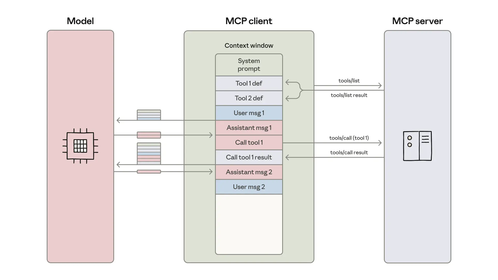

# 通过MCP执行代码：构建更高效的智能体

来源：https://www.anthropic.com/engineering/code-execution-with-mcp

---

[模型上下文协议（MCP）](https://modelcontextprotocol.io/)是一个连接AI智能体与外部系统的开放标准。传统上，将智能体连接到工具和数据需要为每个配对进行定制集成，这导致了碎片化和重复劳动，使得难以扩展真正互联的系统。MCP提供了一个通用协议——开发者只需在其智能体中实现一次MCP，即可解锁整个集成生态系统。

自2024年11月推出MCP以来，其采用速度迅猛：社区已构建了数千个[MCP服务器](https://github.com/modelcontextprotocol/servers)，所有主流编程语言都提供了[SDK](https://modelcontextprotocol.io/docs/sdk)，行业已将MCP作为连接智能体与工具和数据的实际标准。

如今，开发者通常构建能够访问数十个MCP服务器中数百甚至数千个工具的智能体。然而，随着连接工具数量的增加，预先加载所有工具定义并通过上下文窗口传递中间结果会降低智能体速度并增加成本。

在本博客中，我们将探讨代码执行如何使智能体更高效地与MCP服务器交互，在使用更少令牌的同时处理更多工具。

## 工具导致的过度令牌消耗降低了智能体效率

随着MCP使用规模的扩大，有两种常见模式会增加智能体成本和延迟：

  1. 工具定义过载上下文窗口；
  2. 中间工具结果消耗额外令牌。

### 1\. 工具定义过载上下文窗口

大多数MCP客户端会预先将所有工具定义直接加载到上下文中，使用直接工具调用语法将其暴露给模型。这些工具定义可能如下所示：

gdrive.getDocument
     描述：从Google Drive检索文档
     参数：
            documentId（必需，字符串）：要检索的文档ID
            fields（可选，字符串）：要返回的特定字段
     返回：包含标题、正文内容、元数据、权限等的文档对象

Copy

salesforce.updateRecord
    描述：更新Salesforce中的记录
    参数：
           objectType（必需，字符串）：Salesforce对象类型（潜在客户、联系人、账户等）
           recordId（必需，字符串）：要更新的记录ID
           data（必需，对象）：要更新的字段及其新值
    返回：包含确认信息的更新后记录对象

Copy

工具描述会占用更多上下文窗口空间，增加响应时间和成本。当代理连接到数千个工具时，它们需要在读取请求前处理数十万个令牌。

### 2\. 中间工具结果消耗额外令牌

大多数MCP客户端允许模型直接调用MCP工具。例如，您可能会要求您的代理：“从Google Drive下载我的会议记录，并将其附加到Salesforce的潜在客户中。”

模型将进行如下调用：

    TOOL CALL: gdrive.getDocument(documentId: "abc123")
            → 返回“讨论了第四季度目标...\n[完整记录文本]”
               （加载到模型上下文中）

    TOOL CALL: salesforce.updateRecord(
    			objectType: "SalesMeeting",
    			recordId: "00Q5f000001abcXYZ",
      			data: { "Notes": "讨论了第四季度目标...\n[完整记录文本被重新写入]" }
    		)
    		（模型需要将整个记录文本再次写入上下文）

Copy

每个中间结果都必须通过模型传递。在此示例中，完整的通话记录文本流经了两次。对于一个2小时的销售会议，这可能意味着需要额外处理50,000个令牌。更大的文档甚至可能超出上下文窗口限制，导致工作流中断。

对于大型文档或复杂的数据结构，模型在工具调用之间复制数据时更容易出错。

MCP客户端将工具定义加载到模型的上下文窗口中，并编排一个消息循环，其中每个工具调用和结果都会在操作之间通过模型传递。

## 通过MCP执行代码提升上下文效率

随着代码执行环境在智能体中的应用日益普遍，一种解决方案是将MCP服务器呈现为代码API而非直接工具调用。这样，智能体可以编写代码与MCP服务器交互。此方法同时解决了两个挑战：智能体可以仅加载所需工具，并在执行环境中处理数据后再将结果传回模型。

实现此目标有多种方式。一种方法是生成来自已连接MCP服务器的所有可用工具的文件树。以下是一个使用TypeScript的实现示例：

    servers
    ├── google-drive
    │   ├── getDocument.ts
    │   ├── ... (其他工具)
    │   └── index.ts
    ├── salesforce
    │   ├── updateRecord.ts
    │   ├── ... (其他工具)
    │   └── index.ts
    └── ... (其他服务器)

复制

然后每个工具对应一个文件，例如：

    // ./servers/google-drive/getDocument.ts
    import { callMCPTool } from "../../../client.js";

    interface GetDocumentInput {
      documentId: string;
    }

    interface GetDocumentResponse {
      content: string;
    }

    /* 从Google Drive读取文档 */
    export async function getDocument(input: GetDocumentInput): Promise<GetDocumentResponse> {
      return callMCPTool<GetDocumentResponse>('google_drive__get_document', input);
    }

复制

我们之前提到的Google Drive到Salesforce的示例就变成了如下代码：

    // 从Google Docs读取转录内容并添加到Salesforce潜在客户记录
    import * as gdrive from './servers/google-drive';
    import * as salesforce from './servers/salesforce';

    const transcript = (await gdrive.getDocument({ documentId: 'abc123' })).content;
    await salesforce.updateRecord({
      objectType: 'SalesMeeting',
      recordId: '00Q5f000001abcXYZ',
      data: { Notes: transcript }
    });

复制

代理通过探索文件系统来发现工具：首先列出`./servers/`目录以查找可用服务器（如`google-drive`和`salesforce`），然后读取所需的特定工具文件（如`getDocument.ts`和`updateRecord.ts`）以理解每个工具的接口。这使得代理能够仅加载当前任务所需的定义，从而将令牌使用量从150,000个减少到2,000个——节省了98.7%的时间和成本。

Cloudflare[发布了类似的研究结果](https://blog.cloudflare.com/code-mode/)，将MCP的代码执行称为“代码模式”。核心观点相同：LLM擅长编写代码，开发者应利用这一优势来构建能与MCP服务器更高效交互的代理。

## MCP代码执行的优势

通过MCP执行代码使代理能够更高效地利用上下文，按需加载工具、在数据到达模型前进行过滤，并在单一步骤中执行复杂逻辑。这种方法还具有安全和状态管理方面的优势。

### 渐进式披露

模型非常擅长导航文件系统。将工具以代码形式呈现在文件系统中，允许模型按需读取工具定义，而不是一次性全部读取。

或者，可以在服务器中添加一个`search_tools`工具来查找相关定义。例如，在使用上述假设的Salesforce服务器时，代理会搜索“salesforce”并仅加载当前任务所需的工具。在`search_tools`工具中包含一个详细级别参数，允许代理选择所需的详细程度（如仅名称、名称和描述，或包含模式的完整定义），也有助于代理节省上下文并高效查找工具。

### 上下文高效的工具结果

在处理大型数据集时，代理可以在返回结果前通过代码进行过滤和转换。以获取一个10,000行的电子表格为例：

    // 无代码执行时 - 所有行都流经上下文
    工具调用：gdrive.getSheet(sheetId: 'abc123')
            → 返回10,000行数据到上下文中，需手动过滤

// 通过代码执行 - 在运行环境中进行筛选
const allRows = await gdrive.getSheet({ sheetId: 'abc123' });
const pendingOrders = allRows.filter(row =>
  row["Status"] === 'pending'
);
console.log(`找到 ${pendingOrders.length} 条待处理订单`);
console.log(pendingOrders.slice(0, 5)); // 仅记录前5条供查阅

智能体看到的是5行数据而非10,000行。类似的模式适用于跨多数据源的聚合、关联操作或提取特定字段——所有这些都不会膨胀上下文窗口。

#### *更强大且节省上下文的控制流

循环、条件判断和错误处理可以通过熟悉的代码模式实现，而无需串联多个独立工具调用。例如，若需要在Slack中获取部署通知，智能体可编写：

    let found = false;
    while (!found) {
      const messages = await slack.getChannelHistory({ channel: 'C123456' });
      found = messages.some(m => m.text.includes('部署完成'));
      if (!found) await new Promise(r => setTimeout(r, 5000));
    }
    console.log('已收到部署通知');

这种方式比通过智能体循环交替调用MCP工具和休眠命令更为高效。

此外，编写可直接执行的条件分支结构还能节省"首次令牌生成"的延迟时间：无需等待模型评估if语句，智能体可直接让代码执行环境处理判断逻辑。

### 隐私保护操作

当智能体结合MCP使用代码执行时，中间结果默认保留在执行环境中。这意味着智能体仅能看到显式记录或返回的数据，工作流中不希望与模型共享的数据永远不会进入模型上下文。

对于更敏感的工作负载，智能体框架可自动对敏感数据进行脱敏处理。例如，假设您需要将客户联系信息从电子表格导入Salesforce，智能体会编写：

const sheet = await gdrive.getSheet({ sheetId: 'abc123' });
for (const row of sheet.rows) {
  await salesforce.updateRecord({
    objectType: 'Lead',
    recordId: row.salesforceId,
    data: {
      Email: row.email,
      Phone: row.phone,
      Name: row.name
    }
  });
}
console.log(`已更新 ${sheet.rows.length} 条潜在客户记录`);

MCP客户端会在数据到达模型之前拦截数据，并对PII（个人身份信息）进行标记化处理：

    // 如果代理程序记录sheet.rows，它将看到的内容如下：
    [
      { salesforceId: '00Q...', email: '[EMAIL_1]', phone: '[PHONE_1]', name: '[NAME_1]' },
      { salesforceId: '00Q...', email: '[EMAIL_2]', phone: '[PHONE_2]', name: '[NAME_2]' },
      ...
    ]

随后，当数据在另一个MCP工具调用中被共享时，MCP客户端会通过查找表进行去标记化还原。真实的电子邮件地址、电话号码和姓名从Google表格流向Salesforce，但从未经过模型处理。这防止了代理程序意外记录或处理敏感数据。您还可以利用此机制定义确定性的安全规则，选择数据允许流动的源和目的地。

### 状态持久化与技能

具备文件系统访问权限的代码执行功能使代理程序能够在跨操作中保持状态。代理程序可以将中间结果写入文件，从而能够恢复工作并跟踪进度：

    const leads = await salesforce.query({
      query: 'SELECT Id, Email FROM Lead LIMIT 1000'
    });
    const csvData = leads.map(l => `${l.Id},${l.Email}`).join('\n');
    await fs.writeFile('./workspace/leads.csv', csvData);

    // 后续执行可从断点处继续
    const saved = await fs.readFile('./workspace/leads.csv', 'utf-8');

代理程序还可以将自身代码持久化为可复用函数。一旦代理程序为某项任务开发出可运行的代码，即可保存该实现供未来使用：

    // 在 ./skills/save-sheet-as-csv.ts 文件中
    import * as gdrive from './servers/google-drive';
    export async function saveSheetAsCsv(sheetId: string) {
      const data = await gdrive.getSheet({ sheetId });
      const csv = data.map(row => row.join(',')).join('\n');
      await fs.writeFile(`./workspace/sheet-${sheetId}.csv`, csv);
      return `./workspace/sheet-${sheetId}.csv`;
    }

    // 后续，在任何智能体执行中：
    import { saveSheetAsCsv } from './skills/save-sheet-as-csv';
    const csvPath = await saveSheetAsCsv('abc123');

这与[技能](https://docs.claude.com/en/docs/agents-and-tools/agent-skills/overview)的概念紧密相关——技能是为提升模型在特定任务上的表现而设计的可复用指令、脚本和资源的文件夹集合。为这些保存的函数添加SKILL.md文件即可创建结构化技能，供模型参考和使用。随着时间的推移，这将使您的智能体能够构建一个高层次能力的工具箱，逐步完善其高效工作所需的基础架构。

需要注意的是，代码执行本身会带来复杂性。运行智能体生成的代码需要一个具备适当[沙箱隔离](https://www.anthropic.com/engineering/claude-code-sandboxing)、资源限制和监控机制的安全执行环境。这些基础设施要求会带来额外的运维负担和安全考量，而直接工具调用则可避免这些问题。代码执行的优势——包括降低令牌消耗、减少延迟以及提升工具组合能力——需要与这些实施成本进行权衡。

## 总结

MCP为智能体连接多种工具和系统提供了基础协议。然而，当连接的服务器过多时，工具定义和结果可能消耗过多令牌，从而降低智能体的运行效率。

尽管这里的许多问题——如上下文管理、工具组合、状态持久化——都显得新颖，但它们在软件工程领域已有成熟的解决方案。代码执行将这些既定模式应用于智能体，使其能够利用熟悉的编程结构更高效地与MCP服务器交互。如果您采用这种方法，我们鼓励您将发现分享给[MCP社区](https://modelcontextprotocol.io/community/communication)。

### 致谢

_本文由Adam Jones和Conor Kelly撰写。感谢Jeremy Fox、Jerome Swannack、Stuart Ritchie、Molly Vorwerck、Matt Samuels和Maggie Vo对本文草稿提出的反馈意见。_
