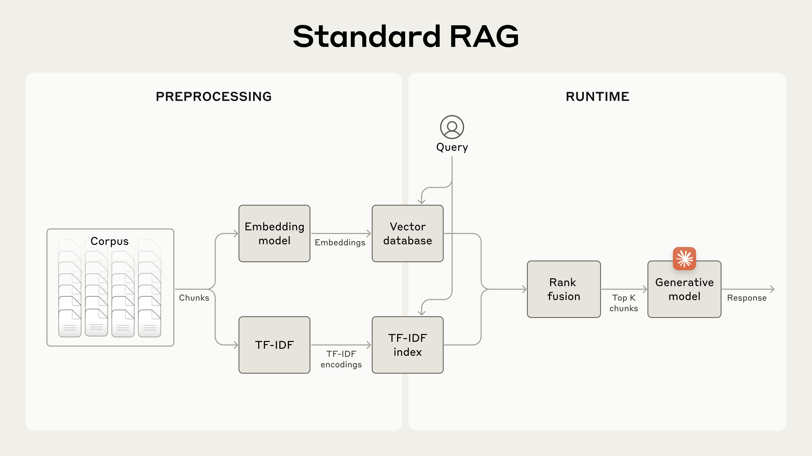
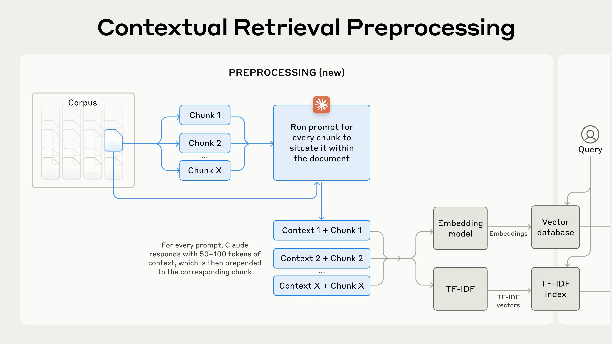
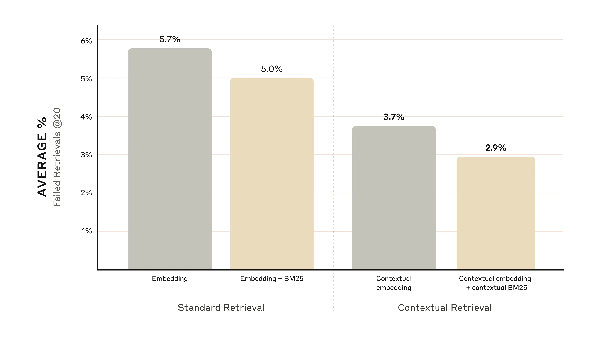
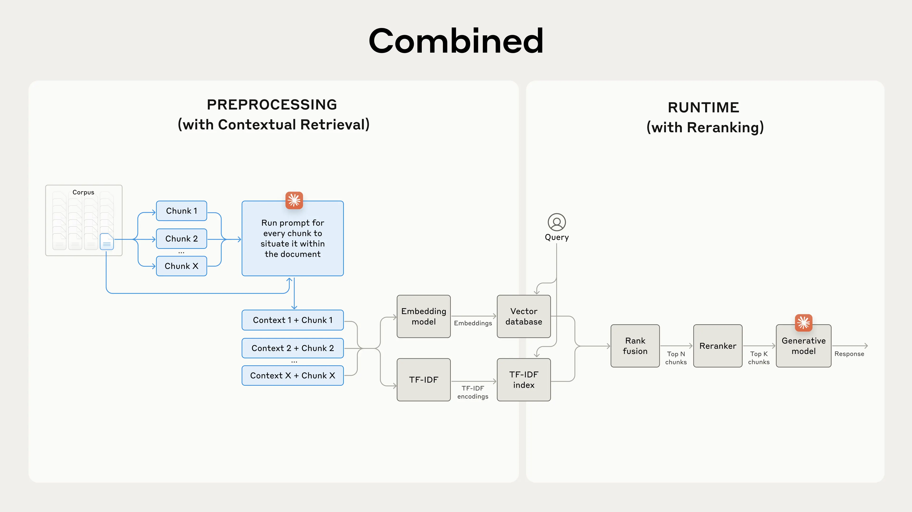
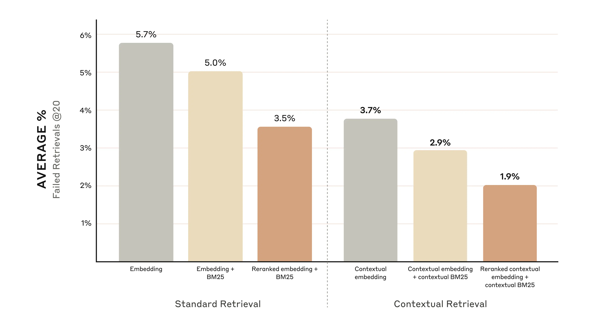
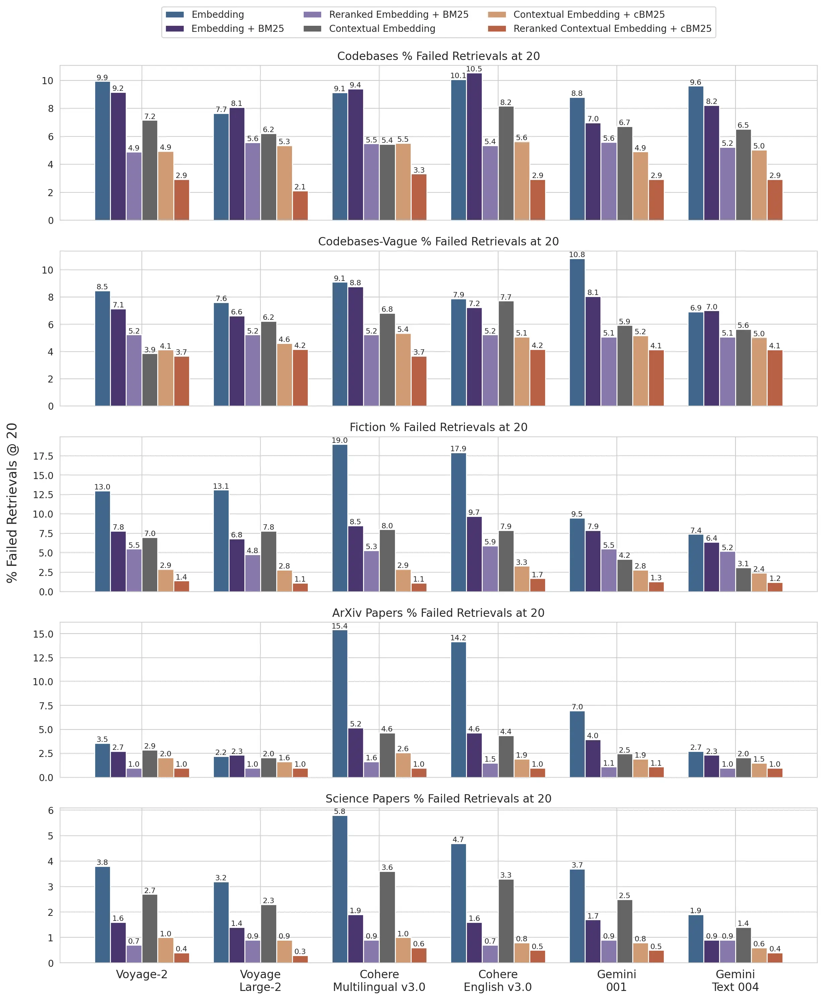

# 引入上下文检索

来源：https://www.anthropic.com/engineering/contextual-retrieval

---

要使AI模型在特定场景中有用，通常需要其具备背景知识。例如，客户支持聊天机器人需要了解其所服务的具体业务知识，法律分析机器人则需要掌握大量过往案例信息。

开发者通常采用检索增强生成（RAG）技术来扩展AI模型的知识库。RAG通过从知识库中检索相关信息并附加到用户提示中，从而显著提升模型的响应质量。但传统RAG方案在编码信息时会剥离上下文，这往往导致系统无法从知识库中准确检索到相关信息。

本文我们将介绍一种能大幅改进RAG检索环节的方法——"上下文检索"。该方法运用两项子技术：上下文嵌入与上下文BM25。实验表明，该方法可将检索失败率降低49%，若结合重排序技术，失败率降幅可达67%。这些改进显著提升了检索准确率，直接转化为下游任务性能的优化。

您可以通过[我们的操作指南](https://platform.claude.com/cookbook/capabilities-contextual-embeddings-guide)，轻松部署基于Claude的上下文检索解决方案。

### 关于直接使用长提示的说明

有时最简单的解决方案就是最佳方案。如果您的知识库规模小于20万token（约500页材料），您可以直接将整个知识库内容包含在给模型的提示中，无需采用RAG或类似方法。

几周前，我们为Claude发布了[提示缓存功能](https://docs.anthropic.com/en/docs/build-with-claude/prompt-caching)，使这种方法在速度和成本效益上得到显著提升。开发者现在可以在API调用间缓存常用提示，将延迟降低2倍以上，成本最高可减少90%（具体实现可参阅我们的[提示缓存操作指南](https://platform.claude.com/cookbook/misc-prompt-caching)）。

然而，随着知识库的扩展，您将需要一个更具可扩展性的解决方案。这正是情境检索发挥作用的地方。

## RAG入门：扩展至大规模知识库

对于无法完全放入上下文窗口的大型知识库，RAG是典型的解决方案。RAG通过以下步骤对知识库进行预处理：

  1. 将知识库（文档“语料库”）拆分为较小的文本块，通常不超过几百个词元；
  2. 使用嵌入模型将这些文本块转换为能编码语义的向量嵌入；
  3. 将这些嵌入存储在支持语义相似性搜索的向量数据库中。

在运行时，当用户向模型输入查询时，系统会利用向量数据库根据与查询的语义相似性查找最相关的文本块。随后，这些最相关的文本块会被添加到发送给生成模型的提示中。

虽然嵌入模型擅长捕捉语义关系，但它们可能遗漏关键的字面匹配。幸运的是，有一种更早的技术可以在这种情况下提供帮助。BM25（最佳匹配25）是一种利用词汇匹配来查找精确单词或短语匹配的排序函数。它特别适用于包含唯一标识符或技术术语的查询。

BM25基于TF-IDF（词频-逆文档频率）概念构建。TF-IDF衡量一个单词在文档集合中对某篇文档的重要性。BM25通过考虑文档长度并对词频应用饱和函数来改进这一方法，这有助于防止常见词汇主导搜索结果。

以下是BM25能在语义嵌入失效时取得成功的原因：假设用户在技术支持数据库中查询“错误代码TS-999”。嵌入模型可能会找到关于错误代码的通用内容，但可能遗漏精确的“TS-999”匹配。而BM25会直接查找这一特定文本字符串来识别相关文档。

RAG解决方案可以通过结合嵌入技术和BM25技术，按以下步骤更准确地检索最适用的文本块：

1. 将知识库（文档“语料库”）拆分为较小的文本块，通常不超过几百个词元；
2. 为这些文本块创建TF-IDF编码和语义嵌入；
3. 使用BM25基于精确匹配查找最相关的文本块；
4. 使用嵌入向量基于语义相似性查找最相关的文本块；
5. 通过排序融合技术合并并去重步骤（3）和（4）的结果；
6. 将排名前K的文本块加入提示词中以生成回答。

通过同时利用BM25和嵌入模型，传统RAG系统能够提供更全面、更准确的结果，在精确术语匹配与更广泛的语义理解之间取得平衡。

一个标准的检索增强生成（RAG）系统，同时使用嵌入向量和最佳匹配25（BM25）进行信息检索。TF-IDF（词频-逆文档频率）用于衡量词语重要性，并构成BM25的基础。

这种方法使您能够以经济高效的方式扩展到庞大的知识库，远超单个提示词所能容纳的范围。但这些传统RAG系统存在一个显著局限：它们常常破坏上下文信息。

### 传统RAG中的上下文困境

在传统RAG中，文档通常被分割成较小的块以实现高效检索。虽然这种方法在许多应用中表现良好，但当单个文本块缺乏足够上下文时，可能会导致问题。

例如，假设您的知识库中嵌入了金融信息（如美国SEC申报文件），并收到以下问题：“ACME公司2023年第二季度的营收增长是多少？”

一个相关文本块可能包含这样的文字：“公司营收较上一季度增长3%。”然而，仅凭这个文本块本身并未指明所指的公司或相关时间段，这使得检索正确信息或有效利用信息变得困难。

## 引入上下文检索

上下文检索通过在每个文本块嵌入前（“上下文嵌入”）和创建BM25索引时（“上下文BM25”），为每个文本块添加特定的解释性上下文前缀，从而解决了这一问题。

让我们回到SEC文件收集的例子。以下是一个文本块如何被转换的示例：

    original_chunk = "公司收入较上一季度增长了3%。"

    contextualized_chunk = "此文本块来自ACME公司2023年第二季度业绩的SEC文件；上一季度收入为3.14亿美元。公司收入较上一季度增长了3%。"

值得注意的是，过去已有其他利用上下文改进检索的方法被提出。其他方案包括：[为文本块添加通用文档摘要](https://aclanthology.org/W02-0405.pdf)（我们实验后发现增益非常有限）、[假设性文档嵌入](https://arxiv.org/abs/2212.10496)，以及[基于摘要的索引](https://www.llamaindex.ai/blog/a-new-document-summary-index-for-llm-powered-qa-systems-9a32ece2f9ec)（我们评估后认为性能较低）。这些方法与本篇文章提出的方案有所不同。

### 实施上下文检索

当然，手动标注知识库中成千上万甚至数百万个文本块工作量过大。为实现上下文检索，我们借助Claude模型。我们编写了一个提示词，指导模型基于文档整体上下文，为每个文本块生成简洁、针对性的解释语境。我们使用以下Claude 3 Haiku提示词为每个文本块生成上下文：

    <document>
    {{完整文档}}
    </document>
    以下是需要置于整个文档语境中的文本块
    <chunk>
    {{文本块内容}}
    </chunk>
    请提供简短精要的上下文说明，将此文本块置于整体文档语境中，以提升该文本块的搜索检索效果。仅输出精要上下文，无需其他内容。

生成的上下文文本通常为50-100个词元，在嵌入文本块和创建BM25索引之前，会将其添加至文本块前端。

以下是实际预处理流程示意图：

_上下文检索是一种提升检索准确率的预处理技术。_

如果您对使用上下文检索感兴趣，可以通过[我们的操作指南](https://platform.claude.com/cookbook/capabilities-contextual-embeddings-guide)开始体验。

### 利用提示缓存降低上下文检索成本

借助前文提到的特殊提示缓存功能，Claude能够以极低成本实现独特的上下文检索。通过提示缓存技术，您无需为每个文本块重复传入参考文档——只需将文档一次性载入缓存，后续即可直接引用已缓存内容。假设采用800词元的文本块、8千词元的文档、50词元的上下文指令，以及每个文本块100词元的上下文量，**生成上下文化文本块的单次成本为每百万文档词元1.02美元**。

#### 实验方法

我们在多个知识领域（代码库、小说、ArXiv论文、科学论文）、嵌入模型、检索策略和评估指标上进行了系统性实验。[附录II](https://assets.anthropic.com/m/1632cded0a125333/original/Contextual-Retrieval-Appendix-2.pdf)收录了各领域测试使用的问答示例。

下方图表展示了采用最优嵌入配置（Gemini Text 004）并检索前20个文本块时，所有知识领域的平均性能表现。我们使用"1减去召回率@20"作为评估指标，该指标衡量的是前20个文本块中未能检索到的相关文档比例。完整结果详见附录——在我们评估的所有嵌入源组合中，上下文化处理均带来了性能提升。

#### 性能提升效果

实验数据表明：

* **上下文嵌入将前20文本块检索失败率降低35%**（5.7%→3.7%）
* **上下文嵌入与上下文BM25结合使用将前20文本块检索失败率降低49%**（5.7%→2.9%）

_上下文嵌入与上下文BM25结合使用使前20文本块检索失败率降低49%_

#### 实施注意事项

实施上下文检索时需注意以下要点：

1. **分块边界：** 考虑如何将文档分割成块。分块大小、分块边界和分块重叠的选择会影响检索性能。
2. **嵌入模型：** 虽然上下文检索在我们测试的所有嵌入模型中都提升了性能，但某些模型可能受益更大。我们发现[Gemini](https://ai.google.dev/gemini-api/docs/embeddings)和[Voyage](https://www.voyageai.com/)的嵌入效果尤为突出。
3. **自定义上下文化提示：** 我们提供的通用提示效果良好，但针对特定领域或使用场景定制提示（例如，包含仅在知识库其他文档中定义的关键术语词汇表）可能带来更佳效果。
4. **分块数量：** 在上下文窗口中增加分块数量能提高包含相关信息的机会。然而，过多信息可能干扰模型效果，因此存在合理上限。我们尝试了5、10和20个分块，发现使用20个分块时性能最优（对比数据详见附录），但建议根据实际使用场景进行实验验证。

**始终进行评估：** 通过向模型传递上下文化分块并明确区分上下文与原始分块内容，可以提升回答生成质量。

## 通过重排序进一步提升性能

最后，我们可以将上下文检索与另一项技术结合，实现更显著的性能提升。在传统RAG系统中，人工智能会搜索知识库以查找潜在相关信息块。面对大型知识库时，初始检索常会返回大量相关性和重要性各异的分块——有时可达数百个。

重排序是一种常用的过滤技术，用于确保仅将最相关的分块传递给模型。该技术能通过减少模型处理的信息量，在提供更精准回答的同时降低计算成本与延迟。关键步骤包括：

1. 执行初步检索，获取潜在相关的文本块（我们选取了前150个）；
2. 将前N个文本块与用户查询一同输入重排序模型；
3. 通过重排序模型，根据每个文本块与提示的相关性和重要性进行评分，随后选取前K个文本块（我们选取了前20个）；
4. 将前K个文本块作为上下文输入模型，生成最终结果。

_结合上下文检索与重排序技术，最大化检索准确率。_

### 性能提升

市场上有多种重排序模型可供选择。我们使用[Cohere重排序器](https://cohere.com/rerank)进行了测试。Voyage[也提供了重排序功能](https://docs.voyageai.com/docs/rerank)，但我们未及测试。实验表明，在不同领域场景中，增加重排序步骤能进一步优化检索效果。

具体而言，我们发现经过重排序的上下文嵌入与上下文BM25技术，将前20个文本块的检索失败率降低了67%（从5.7%降至1.9%）。

_经重排序的上下文嵌入与上下文BM25技术使前20文本块检索失败率下降67%。_

#### 成本与延迟考量

使用重排序技术时需重点关注其对延迟和成本的影响，特别是在处理大量文本块时。虽然重排序器能并行处理所有文本块评分，但运行时增加的额外步骤仍会不可避免地带来轻微延迟。这里存在固有权衡：重排序更多文本块可提升性能，而减少处理量则有利于降低延迟和成本。建议根据具体使用场景测试不同配置，以找到最佳平衡点。

## 结论

我们进行了大量测试，比较了上述所有技术（嵌入模型、BM25应用、上下文检索、重排序器使用及检索的前K结果数量）的不同组合方案，覆盖多种数据集类型。以下是我们发现的核心结论：

1. 嵌入向量+BM25的组合效果优于单独使用嵌入向量；
2. 在我们测试的模型中，Voyage和Gemini的嵌入向量表现最佳；
3. 向模型传递前20个文本块比仅传递前10个或前5个更有效；
4. 为文本块添加上下文信息能显著提升检索准确率；
5. 重排序策略优于无重排序方案；
6. **这些优势具有叠加效应**：为最大化性能提升，我们可以将（来自Voyage或Gemini的）上下文感知嵌入向量与上下文增强的BM25相结合，加入重排序步骤，并在提示词中整合20个文本块。

我们鼓励所有从事知识库开发的工程师使用[我们的实践指南](https://platform.claude.com/cookbook/capabilities-contextual-embeddings-guide)来尝试这些方法，以解锁更高层次的性能表现。

## 附录一

以下是对不同数据集、嵌入向量提供商、嵌入向量与BM25的联合使用、上下文检索应用以及重排序策略在"检索@20"指标下的详细结果分析。

关于"检索@10"和"检索@5"的详细分析以及各数据集的问答示例，请参阅[附录二](https://assets.anthropic.com/m/1632cded0a125333/original/Contextual-Retrieval-Appendix-2.pdf)。

_各数据集与嵌入向量提供商在"1减去召回率@20"指标下的表现结果。_

## 致谢

本项研究及文章撰写由Daniel Ford完成。感谢Orowa Sikder、Gautam Mittal和Kenneth Lien的重要反馈，Samuel Flamini负责实践指南的代码实现，Lauren Polansky负责项目协调，以及Alex Albert、Susan Payne、Stuart Ritchie和Brad Abrams对本篇博客文章的内容指导。
