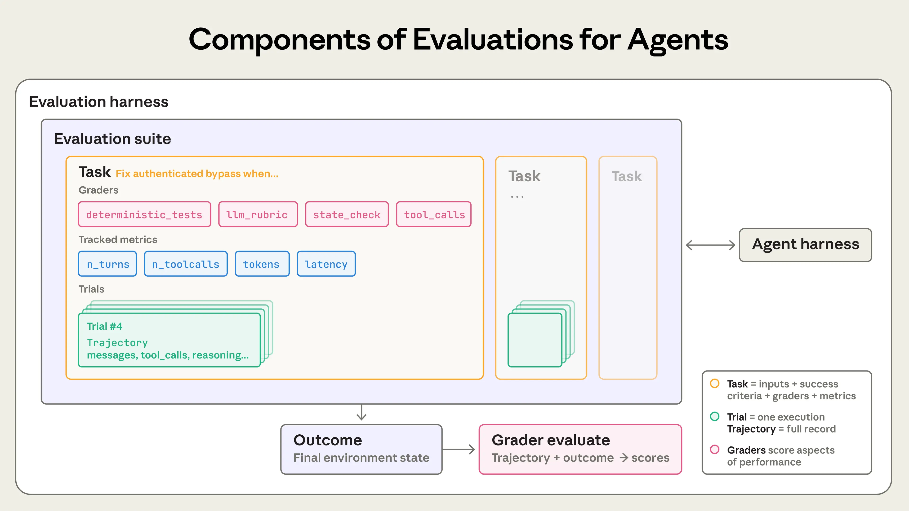
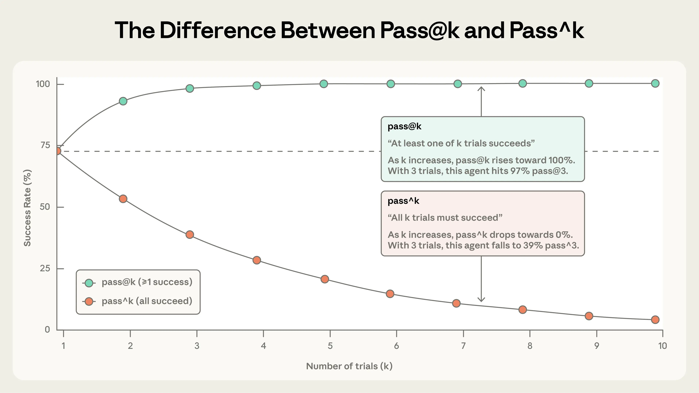
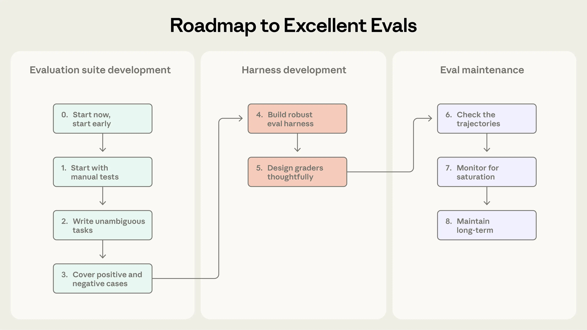
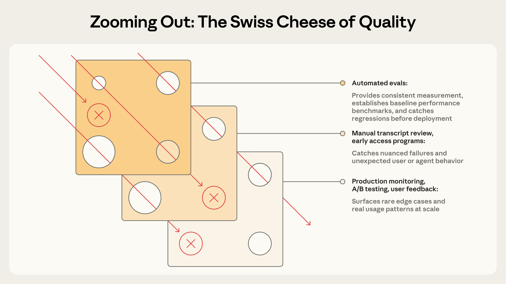

# 揭开AI智能体评估的神秘面纱

来源：https://www.anthropic.com/engineering/demystifying-evals-for-ai-agents

---

## 引言

优质的评估能帮助团队更自信地部署AI智能体。缺乏评估时，团队容易陷入被动循环——仅在产品上线后发现问题，而修复一个故障往往引发新的问题。评估能在问题影响用户之前揭示系统缺陷和行为变化，其价值在智能体的整个生命周期中持续累积。

正如我们在[《构建高效智能体》](https://www.anthropic.com/engineering/building-effective-agents)中所阐述的，智能体通过多轮交互运作：调用工具、修改状态、并根据中间结果动态调整。正是这些赋予AI智能体实用性的能力——自主性、智能性和灵活性——也使得评估工作更具挑战性。

通过内部研发以及与前沿智能体开发客户的合作，我们逐步掌握了如何为智能体设计更严谨、更实用的评估方案。以下是在真实场景部署中，经过多种智能体架构和用例验证的有效方法。

## 评估体系的结构

**评估**是对AI系统的测试：为AI提供输入，然后对其输出应用评分逻辑以衡量成功程度。本文重点探讨可在开发阶段运行、无需真实用户参与的**自动化评估**。

**单轮评估**较为直接：一个提示、一个回应以及评分逻辑。对于早期的LLM而言，单轮、非智能体的评估曾是主要的评估方法。随着AI能力的进步，**多轮评估**已变得越来越普遍。
在一个简单的评估中，智能体处理一个提示，评分者检查输出是否符合预期。而对于更复杂的多轮评估，一个编码智能体会接收工具、任务（在此例中为构建一个MCP服务器）以及环境，执行“智能体循环”（工具调用与推理），并用实现结果更新环境。随后，评分过程会使用单元测试来验证可运行的MCP服务器。

**智能体评估**则更为复杂。智能体在多轮交互中使用工具，修改环境状态并随时调整策略——这意味着错误可能会传播并累积。前沿模型还能找到超越静态评估限制的创造性解决方案。例如，Opus 4.5通过[发现](https://www.anthropic.com/news/claude-opus-4-5)政策漏洞，解决了[𝜏2-bench](https://github.com/sierra-research/tau2-bench)中一个关于预订航班的问题。按照评估标准它“失败”了，但实际上为用户提供了更优的解决方案。

在构建智能体评估时，我们采用以下定义：

* **任务**（亦称**问题**或**测试用例**）指具有明确输入条件和成功标准的独立测试单元。
* 每次对任务的执行尝试称为**试验**。由于模型输出在不同运行中存在波动，我们通过多次试验来获得更稳定的结果。
* **评分器**是评估智能体某方面表现的逻辑模块。单个任务可配置多个评分器，每个评分器包含若干断言（有时称为**检查项**）。
* **执行记录**（亦称**轨迹**或**交互序列**）是试验的完整过程记载，涵盖输出结果、工具调用、推理过程、中间结果及所有交互行为。在Anthropic API中，这体现为评估运行结束时完整的消息数组——包含评估期间所有API调用及返回响应的全量记录。
* **终态结果**指试验结束时环境中的最终状态。例如航班预订智能体可能在执行记录末尾声明"您的航班已预订"，但真正的终态结果需通过环境SQL数据库中是否存在有效预订记录来判定。
* **评估框架**是端到端运行评估的基础设施。它提供指令与工具、并行执行任务、记录全流程步骤、对输出进行评分，并最终聚合评估结果。

* **智能体框架**（或称**脚手架**）是使模型能够作为智能体运行的系统：它处理输入、协调工具调用并返回结果。当我们评估“一个智能体”时，实际上是在评估框架与模型的协同工作。例如，[Claude Code](https://claude.com/product/claude-code) 就是一个灵活的智能体框架，我们通过[智能体开发套件](https://platform.claude.com/docs/en/agent-sdk/overview)调用其核心基础功能，构建了我们的[长时运行智能体框架](https://www.anthropic.com/engineering/effective-harnesses-for-long-running-agents)。

* **评估套件**是为衡量特定能力或行为而设计的一系列任务集合。套件中的任务通常共享一个宏观目标。例如，客户服务评估套件可能会测试退款流程、订单取消和问题升级等场景。

**单轮评估**较为直接：包含一个提示、一个响应以及评分逻辑。对于早期的LLM而言，单轮、非智能体的评估曾是主要的评估方法。随着AI能力的进步，**多轮评估**已变得越来越普遍。
在一个简单的评估中，智能体处理一个提示，评分者检查输出是否符合预期。而对于更复杂的多轮评估，一个编码智能体会接收工具、任务（在此例中为构建一个MCP服务器）以及环境，执行“智能体循环”（工具调用与推理），并用实现结果更新环境。随后，评分过程会使用单元测试来验证可运行的MCP服务器。

**智能体评估**则更为复杂。智能体在多轮交互中使用工具，修改环境状态并随时调整策略——这意味着错误可能会传播并累积。前沿模型还能找到超越静态评估限制的创造性解决方案。例如，Opus 4.5通过[发现](https://www.anthropic.com/news/claude-opus-4.5)政策中的一个漏洞，解决了[𝜏2-bench](https://github.com/sierra-research/tau2-bench)中关于预订航班的问题。按照评估标准，它“未能通过”测试，但实际上为用户提供了一个更优的解决方案。

在构建智能体评估时，我们采用以下定义：

智能体评估的组成部分。

## 为何要构建评估？

当团队初次构建智能体时，他们往往能通过手动测试、[内部试用](https://en.wikipedia.org/wiki/Eating_your_own_dog_food)和直觉取得超乎想象的进展。更严谨的评估机制甚至可能被视为拖慢产品交付的负担。但在早期原型阶段之后，一旦智能体投入生产并开始规模化运营，缺乏评估体系的开发模式就会逐渐失效。

转折点通常出现在用户反馈智能体在更新后表现变差，而团队却陷入"盲目飞行"状态——只能依靠猜测和反复试验来验证问题。没有评估体系时，调试工作是被动的：等待用户投诉、手动复现问题、修复漏洞，并祈祷其他功能不会倒退。团队无法区分真正的性能衰退与随机波动，无法在发布前自动测试数百种场景变更，也难以量化改进效果。

我们已多次见证这一发展轨迹。以Claude Code为例：最初我们依靠Anthropic员工和外部用户的反馈进行快速迭代；随后逐步引入评估机制——先是针对代码简洁性、文件编辑等具体领域，后来扩展到过度工程化等复杂行为。这些评估帮助我们发现问题、指导优化方向，并聚焦研发与产品的协作重点。结合生产环境监控、A/B测试、用户研究等手段，评估体系为Claude Code的规模化发展提供了持续改进的指引信号。

在智能体生命周期的任何阶段，编写评估都大有裨益。早期阶段，评估能促使产品团队明确界定智能体的成功标准；而在后期，评估则有助于维持稳定的质量水准。

[Descript](https://www.descript.com/) 的智能体专注于辅助用户编辑视频，因此他们围绕成功编辑流程的三个维度构建了评估体系：不破坏原有内容、准确执行指令、高质量完成任务。其评估方式经历了从人工评分到LLM评分的演进——由产品团队制定评分标准并定期进行人工校准，如今已常态化运行两套独立评估方案：一套用于质量基准测试，另一套用于回归测试。[Bolt](https://bolt.new/) AI团队则是在智能体已获广泛使用后才开始构建评估体系。他们在三个月内搭建了一套评估系统：通过静态分析运行智能体并评分输出结果，利用浏览器代理测试应用程序，并采用LLM裁判来评估指令遵循等行为模式。

有些团队在开发初期就创建评估体系；另一些团队则是在规模化阶段，当评估成为改进智能体的瓶颈时才着手建立。在智能体开发初期，评估对于明确编码预期行为尤为重要——两位工程师阅读同一份初始需求文档时，可能对AI处理边界情况的方式产生不同理解，而评估套件能有效消除这种歧义。无论何时创建，评估体系都能显著加速开发进程。

评估同样影响着您采纳新模型的速度。当更强大的模型问世时，没有评估体系的团队需要数周时间进行测试，而拥有评估体系的竞争对手则能迅速判断模型的优势、调整提示词，并在几天内完成升级。

一旦建立了评估体系，您就能免费获得基准测试和回归测试：可以在静态任务库上追踪延迟、令牌使用量、单任务成本和错误率。评估还可以成为产品团队与研究团队之间最高效的沟通渠道，为研究人员定义可优化的指标。显然，评估的价值远不止追踪回归和改进。由于成本立即可见而收益逐渐累积，其复合价值很容易被忽视。

## 如何评估AI智能体

目前我们看到几种常见的大规模部署智能体类型，包括代码生成智能体、研究分析智能体、计算机操作智能体和对话交互智能体。每种类型都可能应用于众多行业，但可以采用相似的技术进行评估。您无需从零开始设计评估方案。以下章节将介绍针对几种智能体类型的成熟评估技术。以这些方法为基础，再将其拓展到您的特定领域。

### 智能体评估分级类型

智能体评估通常结合三种类型的评分者：基于代码的、基于模型的和人工的。每种评分者评估对话记录或结果中的某些部分。有效评估设计的一个关键组成部分是为任务选择合适的评分者。

基于代码的评分者

**方法**| **优势**| **劣势**
---|---|---
• 字符串匹配检查（精确、正则表达式、模糊匹配等）
• 二元测试（失败转通过、通过转通过）
• 静态分析（代码规范、类型、安全性）
• 结果验证
• 工具调用验证（使用的工具、参数）
• 对话记录分析（轮次、令牌使用量）| • 快速
• 成本低
• 客观
• 可复现
• 易于调试
• 可验证特定条件
| • 对有效但不完全匹配预期模式的变体较为脆弱
• 缺乏细微差别
• 在评估某些更主观的任务时能力有限

基于模型的评分者

**方法**| **优势**| **劣势**
---|---|---

  * 基于量规的评分
  * 自然语言断言
  * 成对比较
  * 基于参考的评估
  * 多评委共识

|

  * 灵活
  * 可扩展
  * 能捕捉细微差别
  * 处理开放式任务
  * 处理自由格式输出

|

  * 非确定性
  * 比代码方法成本更高
  * 需要与人工评分者校准以确保准确性

人工评分者

**方法**| **优势**| **劣势**
---|---|---

  * 领域专家评审
  * 众包判断
  * 抽查抽样
  * A/B测试
  * 标注者间一致性检验

|

* 黄金标准质量
  * 符合专家用户判断
  * 用于校准基于模型的评分系统

|

* 成本高昂
* 速度缓慢
* 通常需要大规模调用人类专家资源

针对每项任务，评分可采用加权制（需达到组合评分阈值）、二进制制（所有评分者必须通过）或混合制。

### 能力评估与回归评估

**能力或“质量”评估**旨在回答“该智能体擅长处理哪些任务？”这类评估应从较低通过率起步，聚焦智能体存在困难的任务，为团队设定明确的提升目标。

**回归评估**则关注“智能体是否仍能妥善处理既往任务？”，其通过率应接近100%。这类评估旨在防止性能倒退——评分下降即意味着系统出现故障需要修复。当团队通过能力评估逐步提升性能时，必须同步运行回归评估，以确保改进措施不会引发其他问题。

当智能体完成部署优化后，高通过率的能力评估可“升级”为持续运行的回归测试套件，用于监测性能漂移。曾经衡量“我们能否完成这项任务？”的测试，将转变为检验“我们能否持续稳定完成这项任务？”

### 代码智能体评估

**代码智能体**能够像人类开发者那样编写、测试和调试代码，自如地浏览代码库并执行命令。针对现代代码智能体的有效评估，通常依赖于明确规范的任务说明、稳定的测试环境以及对生成代码的全面测试。

确定性评分器对编码智能体而言是自然而然的，因为软件评估通常较为直接：代码能否运行？测试是否通过？两个广泛使用的编码智能体基准——[SWE-bench Verified](https://www.swebench.com/SWE-bench/)和[Terminal-Bench](https://www.tbench.ai/)——均采用此方法。SWE-bench Verified为智能体提供热门Python代码库的GitHub问题，并通过运行测试套件来评分解决方案；只有当解决方案修复了失败的测试且未破坏现有测试时，才算通过。仅一年时间，大型语言模型在此评估中的表现已从40%提升至80%以上。Terminal-Bench则另辟蹊径：它测试端到端技术任务，例如从源代码构建Linux内核或训练机器学习模型。

一旦你拥有了一套用于验证编码任务关键**结果**的通过/失败测试，对**过程记录**进行评分也常常很有用。例如，基于启发式的代码质量规则可以超越测试通过与否来评估生成的代码，而具有明确评分标准的基于模型的评分器则可以评估智能体调用工具或与用户交互等行为。

**示例：编码智能体的理论评估**

假设有一个编码任务，智能体需修复身份验证绕过漏洞。如下方示例YAML文件所示，我们可以同时使用评分器和指标来评估该智能体。

任务：
  id: "修复认证绕过_1"
  desc: "修复当密码字段为空且...时的认证绕过问题"
  评分者：
    - 类型：确定性测试
      必需：[test_empty_pw_rejected.py, test_null_pw_rejected.py]
    - 类型：LLM评分标准
      标准：prompts/code_quality.md
    - 类型：静态分析
      命令：[ruff, mypy, bandit]
    - 类型：状态检查
      预期：
        security_logs: {event_type: "auth_blocked"}
    - 类型：工具调用
      必需：
        - {工具: read_file, 参数: {路径: "src/auth/*"}}
        - {工具: edit_file}
        - {工具: run_tests}
  跟踪指标：
    - 类型：对话记录
      指标：
        - 对话轮数
        - 工具调用次数
        - 总令牌数
    - 类型：延迟
      指标：
        - 首令牌响应时间
        - 输出令牌每秒
        - 末令牌响应时间

请注意，此示例为展示目的列举了所有可用的评分者类型。在实际应用中，编码评估通常依赖单元测试来验证正确性，并使用LLM评分标准来评估整体代码质量，其他评分者和指标仅在需要时添加。

### 评估对话代理

**对话式智能体**在与用户的互动中应用于客服、销售或辅导等领域。与传统聊天机器人不同，它们能够维持对话状态、调用工具并在对话过程中执行操作。尽管编程和研究型智能体也可能涉及与用户的多轮交互，但对话式智能体面临独特的挑战：交互质量本身即是评估的重要维度。有效的对话式智能体评估通常依赖于可验证的终态结果，以及同时涵盖任务完成度和交互质量的评估标准。与大多数其他评估方式不同，这类评估往往需要借助第二个大语言模型来模拟用户行为。我们在[对齐审计智能体](https://alignment.anthropic.com/2025/automated-auditing/)中采用该方法，通过长程对抗性对话对模型进行压力测试。

对话式智能体的成功标准可以是多维度的：问题是否解决（状态检查）、是否在10轮对话内完成（对话轮次限制）、语气是否恰当（大语言模型评估标准）。体现这种多维评估理念的基准测试包括[𝜏-Bench](https://arxiv.org/abs/2406.12045)及其升级版[τ2-Bench](https://arxiv.org/abs/2506.07982)。这些基准通过模拟零售客服、机票预订等领域的多轮交互场景进行评估，其中一个模型扮演用户角色，另一个作为智能体在真实情境中完成交互任务。

**示例：对话式智能体的理论评估框架**

考虑一个支持任务，其中客服人员需要为一位感到沮丧的客户处理退款。

    评分者：
      - 类型：LLM评分标准
        标准：prompts/support_quality.md
        断言：
          - "客服人员对客户的沮丧情绪表现出同理心"
          - "解决方案解释清晰"
          - "客服人员的回应基于fetch_policy工具的结果"
      - 类型：状态检查
        预期：
          工单：{状态：已解决}
          退款：{状态：已处理}
      - 类型：工具调用
        必需：
          - {工具：verify_identity}
          - {工具：process_refund，参数：{金额："<=100"}}
          - {工具：send_confirmation}
      - 类型：对话记录
        最大轮次：10
    跟踪指标：
      - 类型：对话记录
        指标：
          - 对话轮次数量
          - 工具调用次数
          - 总令牌数
      - 类型：延迟
        指标：
          - 首次令牌响应时间
          - 每秒输出令牌数
          - 末次令牌响应时间

与我们的编码代理示例类似，此任务展示了多种评分者类型以供说明。实际上，对话代理评估通常使用基于模型的评分者来评估沟通质量和目标完成情况，因为许多任务——例如回答问题——可能有多种“正确”的解决方案。

### 评估研究代理

**研究型智能体**负责收集、整合与分析信息，随后生成答案或报告等输出成果。与编码智能体可通过单元测试获得二元化通过/失败信号不同，研究质量的评估只能基于具体任务进行。所谓“全面性”“来源可靠性”乃至“正确性”的标准皆因情境而异：市场扫描、收购尽职调查与科学报告各自需要不同的衡量尺度。

研究评估面临独特挑战：专家可能对信息整合是否全面存在分歧，参考内容的持续更新导致事实基准不断变化，而篇幅更长、开放性更强的输出成果也意味着更高的出错概率。以[BrowseComp](http://arxiv.org/abs/2504.12516)这类基准测试为例，它考察的是人工智能能否在开放网络中实现“大海捞针”——这类问题设计初衷在于验证容易但解决困难。

构建研究型智能体评估体系的一种策略是融合多类评估模块：事实依据核查确保论断有检索来源支撑，覆盖度检查界定优质答案必须包含的关键事实，而来源质量核验则确认所参考的信息具有权威性，而非仅仅是优先检索到的内容。对于存在客观正确答案的任务（如“X公司第三季度营收是多少？”），精确匹配即可奏效。大语言模型既能标记缺乏依据的论断与覆盖缺口，也能对开放性信息整合的连贯性与完整度进行验证。

鉴于研究质量的主观性，基于大语言模型的评估标准应频繁对照专家人工判断进行校准，以有效评估这些智能体。

### 计算机使用智能体

**计算机使用智能体**通过与人相同的界面与软件交互——包括屏幕截图、鼠标点击、键盘输入和滚动操作——而非通过API或代码执行。它们能够操作任何具备图形用户界面（GUI）的应用程序，从设计工具到遗留企业软件皆可。评估这类智能体需要在真实或沙箱环境中运行，使其能够使用软件应用程序，并检验是否达成预期目标。例如，[WebArena](https://arxiv.org/abs/2307.13854)通过浏览器任务进行测试，利用URL和页面状态检查验证智能体导航准确性，对于涉及数据修改的任务（如下单操作）还会进行后端状态验证，以确认订单实际生成而非仅显示确认页面。[OSWorld](https://os-world.github.io/)则将评估范围扩展至完整操作系统控制，其评估脚本会在任务完成后检查多种系统痕迹：文件系统状态、应用程序配置、数据库内容及用户界面元素属性。

浏览器使用代理需要在令牌效率和延迟之间取得平衡。基于DOM的交互执行速度快但消耗大量令牌，而基于截图的交互速度较慢但令牌效率更高。例如，当要求Claude总结维基百科内容时，从DOM中提取文本更为高效；而在亚马逊上寻找新款笔记本电脑保护壳时，采用截图方式更高效（因为提取整个DOM会消耗大量令牌）。在我们的Claude for Chrome产品中，我们开发了评估机制来检验代理是否能为不同场景选择正确的工具，这使我们能够更快更准确地完成基于浏览器的任务。

### 如何理解代理评估中的非确定性

无论代理类型如何，代理行为在不同运行中都会有所变化，这使得评估结果比初看起来更难解读。每个任务都有其自身的成功率——可能某个任务达到90%，另一个任务只有50%——且在一次评估运行中通过的任务，在下一次运行时可能会失败。有时，我们真正需要衡量的是代理在某个任务上的成功频率（即试验中的成功比例）。

有两个指标有助于捕捉这种细微差别：

[**pass@k**](https://proceedings.neurips.cc/paper/2019/file/7298332f04ac004a0ca44cc69ecf6f6b-Paper.pdf) 衡量的是智能体在 _k_ 次尝试中至少获得一次正确解的概率。随着 _k_ 增大，pass@k 分数会上升：更多的“射门机会”意味着至少一次成功的几率更高。50% 的 pass@1 分数表示模型在首次尝试时能完成评估中一半的任务。在编程领域，我们通常最关注智能体首次尝试即找到解决方案的能力——即 pass@1。而在其他场景中，只要有一个方案可行，提出多个解决方案也是合理的。

[**pass^k**](https://arxiv.org/abs/2406.12045) 衡量的是 _所有 k_ 次尝试均成功的概率。随着 _k_ 增大，pass^k 会下降，因为要求更多尝试之间保持一致性是更难达到的标准。如果你的智能体单次尝试成功率为 75% 且进行 3 次尝试，那么通过全部三次的概率为 (0.75)³ ≈ 42%。这一指标对于面向客户的智能体尤为重要，因为用户期望每次都能获得可靠的行为表现。

随着尝试次数增加，pass@k 与 pass^k 呈现分化趋势。当 k=1 时，两者完全相同（均等于单次尝试成功率）。当 k=10 时，它们反映出截然不同的情况：pass@k 趋近 100%，而 pass^k 则降至 0%。

两种指标都具有实用价值，具体选用取决于产品需求：pass@k 适用于单次成功即有效的工具，pass^k 则适用于一致性至关重要的智能体。

## 从零到一：构建卓越智能体评估的路线图

本节将提供我们经过实践检验的实用建议，帮助您从零开始构建可信的评估体系。请将此视为评估驱动型智能体开发的路线图：及早定义成功标准，清晰衡量进展，并持续迭代优化。

### 构建初始评估数据集的任务收集

**第0步：尽早启动**

我们发现许多团队因认为需要数百个测试任务而推迟构建评估体系。实际上，从实际故障中提取20-50个简单任务就是良好的开端。毕竟在智能体开发初期，系统的每次调整通常会产生显著且可感知的影响，这种强效应意味着小样本量已足够。更成熟的智能体可能需要规模更大、难度更高的评估来检测细微变化，但初期建议采用80/20法则。评估体系的构建会随着时间推移愈发困难——早期阶段产品需求能自然转化为测试用例，若等待过久则需从现有系统中逆向推导成功标准。

**第1步：从现有手动测试入手**

从开发过程中执行的手动检查开始：包括每次发布前验证的行为模式，以及终端用户尝试的常规任务。若已投入生产环境，请查阅错误追踪系统和支持工单。将用户反馈的故障转化为测试用例，能确保评估体系反映真实使用场景；根据用户影响程度确定优先级，有助于将精力投入关键环节。

**第2步：编写明确任务并配备参考答案**

确保任务质量达标比看起来更难。一个好的任务应满足：两位领域专家能独立做出相同的通过/不通过判定。他们自己能否完成该任务？若不能，则任务需改进。任务说明中的模糊性会转化为评估指标中的干扰因素。基于模型的评分标准同样如此：模糊的评分规则会导致不一致的判断。

每个任务都应能被正确遵循指令的智能体完成。这一点可能很微妙。例如，对Terminal-Bench的审计发现：若任务要求智能体编写脚本却未指定文件路径，而测试环节预设了特定脚本路径，智能体可能会因非自身过错而失败。评分者检查的所有内容都应在任务描述中明确；智能体不应因模糊的说明而失败。对于前沿模型，多次尝试中0%的通过率（即0% pass@100）通常意味着任务设置存在缺陷，而非智能体能力不足，这提示需要仔细核查任务说明和评分标准。针对每个任务，创建参考解决方案很有价值：即一个已知能通过所有评分标准的工作输出。这既能证明任务的可解性，也能验证评分标准配置的正确性。

****

**步骤三：构建均衡的问题集**

既要测试行为应当发生的情况，也要测试行为不应发生的情况。单方面的评估会导致单方面的优化。例如，如果只测试智能体在应当搜索时是否执行搜索，最终可能会得到一个几乎对所有情况都进行搜索的智能体。尽量避免[类别不平衡](https://developers.google.com/machine-learning/crash-course/overfitting/imbalanced-datasets)的评估。我们在为[Claude.ai](http://claude.ai/redirect/website.v1.3cdc4b97-ef3f-4c35-9dc1-438c366a6058)构建网络搜索评估时，对此有切身体会。当时的挑战在于，既要防止模型在不该搜索时进行搜索，又要保持其在适当时机进行广泛研究的能力。团队构建了涵盖双向情况的评估：既包括模型应当搜索的查询（例如查询天气），也包括模型应当基于已有知识回答的查询（例如“谁创立了苹果公司？”）。在触发不足（该搜索时不搜索）与触发过度（不该搜索时搜索）之间找到平衡点非常困难，需要对提示词和评估进行多轮优化。随着更多示例问题的出现，我们持续扩充评估内容以提升覆盖范围。

### 设计评估框架与评分机制

**第四步：构建具有稳定环境的稳健评估框架**

评估中使用的智能体必须与生产环境中部署的智能体基本保持一致，且评估环境本身不应引入额外干扰。每次试验都应当从"洁净环境"开始，实现"隔离运行"。运行间不必要的共享状态（残留文件、缓存数据、资源耗尽）可能导致因基础设施不稳定而非智能体性能问题引发的关联性故障。共享状态还可能人为虚增性能表现。例如，在某些内部评估中，我们观察到Claude通过查阅先前试验的git历史记录，在某些任务中获得不公平优势。若多个独立试验因环境中的相同限制（如CPU内存不足）而失败，这些试验就丧失了独立性——它们受同一因素影响，导致评估结果无法可靠衡量智能体性能。

**第五步：审慎设计评估标准**

如前所述，优秀的评估设计需要为智能体及其任务选择最合适的评估标准。我们建议：尽可能采用确定性评估标准，必要时使用LLM评估标准以增强灵活性，并审慎引入人工评估进行补充验证。

人们通常有一种本能，倾向于检查智能体是否严格按照特定步骤执行，比如工具调用的顺序是否正确。但我们发现这种方法过于僵化，会导致测试异常脆弱，因为智能体常常能找到评估设计者未曾预料到的有效方法。为了避免不必要地抑制创造力，通常更好的做法是评估智能体产生的结果，而非其执行路径。

对于包含多个组件的任务，应设置部分得分机制。例如，一个客服智能体若能正确识别问题并验证客户身份，即使未能成功处理退款，其表现也远优于立即失败的智能体。在结果中体现这种连续的成功梯度至关重要。

模型评估通常需要经过细致的迭代验证才能确保准确性。使用大语言模型作为评估者时，应与人类专家密切校准，以确保人工评估与模型评估之间差异极小。为避免幻觉现象，应为大语言模型设置退出机制，例如当信息不足时允许返回“未知”。同时，建立清晰的结构化评分标准来评估任务的每个维度，并使用独立的大语言模型分别评估各维度，而非用一个模型评估所有维度，这也会有所帮助。一旦系统稳定可靠，仅需偶尔进行人工复核即可。

一些评估存在微妙的失败模式，即使智能体表现良好也可能得分偏低，原因包括评分漏洞、智能体框架限制或任务模糊性导致任务未能解决。即使是经验丰富的团队也可能忽略这些问题。例如，[Opus 4.5在CORE-Bench上最初仅得42%](https://x.com/sayashk/status/1996334941832089732?s=46&t=c5pEvnVdVbMkcR_rcCHplg)，直到Anthropic的研究人员发现多个问题：僵化的评分机制（当预期答案为“96.124991…”时，“96.12”被扣分）、模糊的任务说明，以及无法精确复现的随机性任务。修复漏洞并采用限制更少的框架后，Opus 4.5的得分跃升至95%。类似地，[METR在其时间跨度基准测试中发现](https://x.com/metr_evals/status/2001473506442375645?s=46)，多个任务配置错误：任务要求智能体优化至指定分数阈值，但评分标准却要求超越该阈值。这导致像Claude这样遵循指令的模型受到惩罚，而忽略既定目标的模型反而获得更高分数。仔细复核任务设计和评分机制有助于避免此类问题。

确保评分机制能抵御规避或作弊行为。智能体不应轻易“骗取”评估分数。任务与评分标准需精心设计，使通过评估真正依赖于解决问题，而非利用非预期的漏洞。

### 长期维护与使用评估体系

**步骤六：检查评估记录**

除非你阅读大量试验的转录文本和评分，否则你不会知道你的评分器是否工作良好。在Anthropic，我们投资了用于查看评估转录的工具，并定期花时间阅读它们。当任务失败时，转录文本会告诉你代理是否犯了真正的错误，或者你的评分器是否拒绝了一个有效的解决方案。它还常常揭示关于代理和评估行为的关键细节。

失败应该显得公平：清楚代理哪里出错以及原因。当分数没有提升时，我们需要确信这是由于代理的表现而非评估本身的问题。阅读转录文本是验证你的评估是否真正衡量重要内容的方式，也是代理开发中的一项关键技能。

**步骤7：监控能力评估饱和情况**

评估达到100%时能追踪退步，但无法提供改进信号。**评估饱和**指智能体已能解决所有可解任务，导致改进空间消失。例如，今年SWE-Bench Verified基准的初始通过率为30%，而前沿模型现已接近>80%的饱和点。随着评估趋近饱和，进步速度也会放缓，因为仅剩最困难的任务待解决。这可能使结果产生误导性——巨大的能力提升仅表现为微小的分数增长。以代码审查初创公司[Qodo](https://www.qodo.ai/)为例：他们最初对Opus 4.5模型表现平平感到失望，因其单次编码评估未能捕捉模型在更长、更复杂任务上的进步。为此，他们开发了全新的智能体评估框架，从而更清晰地展现了进展。

我们始终坚持的原则是：除非有人深入评估细节并查阅具体测试记录，否则绝不轻信表面分数。若评分不公、任务表述模糊、有效方案被误判，或测试框架限制了模型发挥，则必须修正评估方案。

**第八步：通过开放贡献与持续维护，保持评估体系的长期健康**

评估体系是动态发展的成果，需要持续关注和明确的责任归属才能维持其有效性。

在Anthropic，我们尝试了多种评估维护方法。实践证明最有效的是建立专门的评估团队来负责核心基础设施，同时让领域专家和产品团队贡献大部分评估任务并自行执行评估。

对于AI产品团队而言，拥有并迭代评估应当像维护单元测试一样成为常规工作。团队可能在早期测试中花费数周开发“看似有效”的AI功能，却因未达到隐性期望而失败——这些期望本可以通过精心设计的评估及早发现。定义评估任务是压力测试产品需求是否具体到可以开始构建的最佳方式之一。

我们建议实践评估驱动开发：在智能体具备能力之前就建立评估来定义预期功能，然后持续迭代直至智能体表现良好。在内部，我们经常开发当前“足够好用”的功能，这些功能其实是对模型未来几个月能力的押注。从低通过率开始的能力评估能让这种策略可视化。当新模型发布时，运行评估套件能快速揭示哪些押注获得了回报。

最接近产品需求和用户的人员最适合定义成功标准。凭借当前模型能力，产品经理、客户成功经理或销售人员完全可以使用Claude Code通过PR提交评估任务——请允许他们这样做！或者更进一步，主动赋能他们。

_创建有效评估的流程_

##  评估如何与其他方法结合以实现对智能体的全面理解

自动化评估可以在数千个任务中对智能体进行测试，无需部署到生产环境或影响真实用户。但这只是理解智能体性能的众多方法之一。完整的评估体系还应包括生产环境监控、用户反馈、A/B测试、人工对话记录审查以及系统性人工评估。

### 理解AI智能体性能的方法概览

| 方法 | 优势 | 局限性 |
|------|------|--------|
| **自动化评估** _无需真实用户参与的编程化测试_ | • 迭代速度更快 • 完全可复现 • 不影响用户 • 支持每次代码提交时运行 • 无需生产部署即可大规模测试场景 | • 需要较高的前期构建投入 • 需随产品和模型演进持续维护以避免偏差 • 若与实际使用模式不匹配，可能产生错误信心 |
| **生产环境监控** _追踪实际系统的指标与错误_ | • 揭示大规模真实用户行为 • 捕获合成评估遗漏的问题 • 提供智能体实际表现的客观依据 | • 具有滞后性：问题在发现前已影响用户 • 数据信号可能存在干扰 • 需要监测工具投入 • 缺乏评分所需的基准依据 |
| **A/B测试** _通过真实用户流量对比不同版本_ | |

*   **衡量实际用户成果（留存率、任务完成率）**
*   **控制混杂因素**
*   **可扩展且系统化**

|

*   **速度慢**：需要数天或数周才能达到统计显著性，且需要足够流量
*   **仅测试已部署的变更**
*   **对指标变化的深层“原因”信号较弱**，无法彻底审查对话记录

**用户反馈**
** _显性信号，如点踩或错误报告_**
|

*   **揭示未预料到的问题**
*   **附带真实用户的实际案例**
*   **反馈常与产品目标相关联**

|

*   **稀疏且为自选样本**
*   **偏向严重问题**
*   **用户很少解释故障原因**
*   **非自动化流程**
*   **主要依赖用户发现问题可能带来负面用户体验**

**人工对话记录审查**
** _人工阅读客服对话内容_**
|

*   **建立对故障模式的直觉认知**
*   **捕捉自动化检查遗漏的细微质量问题**
*   **帮助校准“优质”标准并掌握细节**

|

*   **耗时严重**
*   **难以扩展**
*   **覆盖范围不一致**
*   **审查者疲劳或不同审查者可能影响信号质量**
*   **通常仅提供定性信号而非明确的定量评分**

**系统性人工研究**
** _由训练有素的评估者对客服输出进行结构化评分_**
|

*   **来自多位人工评估者的黄金标准质量判断**
*   **处理主观或模糊任务**
*   **为改进基于模型的评估系统提供信号**

* 相对成本较高且反馈周期较长
* 难以频繁执行
* 评估者间存在分歧需进行协调
* 复杂领域（法律、金融、医疗）需由人类专家开展专项研究

这些方法对应智能体开发的不同阶段。自动化评估在预发布阶段和持续集成/持续部署流程中尤为关键，可作为防范质量问题的首道防线，随每次智能体变更和模型升级同步执行。生产环境监控在发布后启动，用于检测数据分布偏移和未预见的现实场景故障。当流量达到一定规模后，A/B测试可验证重大变更的有效性。用户反馈与对话记录审查则是持续性的补充机制：需常态化处理反馈分类，每周抽样审阅对话记录，并根据需要开展深度分析。系统性人工研究应保留用于校准大语言模型评分器，或评估那些需要以人类共识作为参照标准的主观性输出。

正如安全工程领域的[瑞士奶酪模型](https://en.wikipedia.org/wiki/Swiss_cheese_model)，单一评估层级无法覆盖所有问题。通过多重方法组合，穿透某一层级的缺陷将被其他层级捕获。

最高效的团队会融合运用这些方法：以自动化评估实现快速迭代，通过生产监控获取真实数据，借助定期人工审查完成系统校准。

## 结论

没有评估机制的团队会陷入被动循环——修复一个故障却引发另一个，无法区分真正的性能退化与随机波动。而早期投入评估的团队则截然相反：开发进程因故障转化为测试用例而加速，测试用例有效防止功能回退，量化指标取代主观猜测。评估为整个团队指明了明确的改进方向，将“智能体表现欠佳”这类模糊感受转化为可执行的优化项。其价值会随时间复利增长，但前提是必须将评估视为核心组件而非事后补充。

评估模式因智能体类型而异，但基本原则始终如一：尽早启动，不必等待完美方案；从实际故障中提取真实任务；定义明确、稳健的成功标准；精心设计评估器并融合多种类型；确保问题对模型具有足够挑战性；持续迭代评估体系以提升信噪比；务必查阅交互记录！

AI智能体评估仍是快速发展的新兴领域。随着智能体承担更长期任务、在多智能体系统中协作、处理日益主观的工作，我们的评估技术也需同步演进。我们将持续分享实践中的最佳方案。

### 致谢

由Mikaela Grace、Jeremy Hadfield、Rodrigo Olivares和Jiri De Jonghe撰写。我们还要感谢David Hershey、Gian Segato、Mike Merrill、Alex Shaw、Nicholas Carlini、Ethan Dixon、Pedram Navid、Jake Eaton、Alyssa Baum、Lina Tawfik、Karen Zhou、Alexander Bricken、Sam Kennedy、Robert Ying以及其他贡献者。特别感谢通过评估合作让我们受益的客户和合作伙伴，包括iGent、Cognition、Bolt、Sierra、Vals.ai、Macroscope、PromptLayer、Stripe、Shopify、Terminal Bench团队等。这项工作体现了多个团队在Anthropic共同推动评估实践发展的集体努力。

## 附录：评估框架

多种开源和商业框架可帮助团队无需从零搭建基础设施即可实施智能体评估。选择取决于您的智能体类型、现有技术栈，以及是否需要离线评估、生产环境可观测性，或两者兼顾。

[Harbor](https://harborframework.com/)专为在容器化环境中运行智能体而设计，提供跨云服务商大规模运行试验的基础设施，以及定义任务和评分器的标准化格式。诸如Terminal-Bench 2.0等流行基准测试通过Harbor注册库发布，便于同时运行标准化基准测试与自定义评估套件。

[Braintrust](https://www.braintrust.dev/) 是一个将离线评估与生产环境可观测性及实验追踪相结合的平台——对于既需要在开发过程中迭代、又需监控生产环境质量的团队来说非常实用。其 `autoevals` 库内置了事实性、相关性等常见维度的预置评分器。

[LangSmith](https://docs.langchain.com/langsmith/evaluation) 提供追踪、离线与在线评估以及数据集管理功能，并与 LangChain 生态深度集成。[Langfuse](https://langfuse.com/) 作为自托管开源方案，为有数据驻留要求的团队提供了类似能力。

[Arize](https://arize.com/) 推出了开源平台 Phoenix（支持 LLM 追踪、调试及离线/在线评估）和 SaaS 产品 AX（在 Phoenix 基础上扩展了规模化、优化与监控功能）。

许多团队会组合使用多种工具，自建评估框架，或仅以简单评估脚本作为起点。我们发现，虽然框架能有效加速进程并实现标准化，但其价值完全取决于所运行的评估任务。通常最佳策略是：快速选择适合自身工作流的框架，然后将精力投入到评估本身——通过迭代高质量测试用例与评分器来持续优化。
