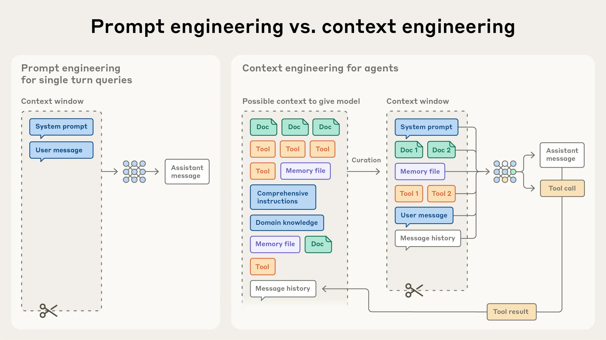
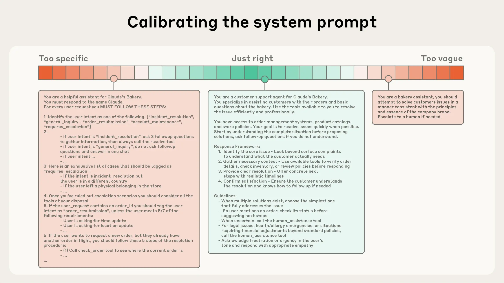

# 面向AI智能体的高效上下文工程

来源：https://www.anthropic.com/engineering/effective-context-engineering-for-ai-agents

---

在提示工程成为应用人工智能领域焦点数年之后，一个新兴术语正逐渐崭露头角：**上下文工程**。基于语言模型的开发正逐渐从寻找提示词的最佳表述，转向回答一个更宏观的问题：“怎样的上下文配置最有可能引导模型产生我们期望的行为？”

**上下文**指的是从大语言模型采样时包含的令牌集合。而**工程**要解决的核心问题，是在大语言模型固有约束条件下优化这些令牌的效用，以持续达成预期目标。要有效驾驭大语言模型，往往需要具备**上下文思维**——即全面考量模型在任意时刻可获取的整体状态，以及该状态可能催生的潜在行为模式。

本文将探讨这一新兴的上下文工程技术，并提供一个精炼的思维模型，助力构建可控且高效的人工智能体。

## 上下文工程与提示工程的差异

在Anthropic看来，上下文工程是提示工程的自然演进。提示工程专注于通过优化指令撰写与组织来获得最佳输出（参见[我们的文档](https://docs.anthropic.com/en/docs/build-with-claude/prompt-engineering/overview)了解概述及实用策略）。而**上下文工程**则涵盖在大语言模型推理过程中，对最优令牌集合（信息）进行策划与维护的全套策略，这包括提示词之外所有可能进入上下文的其他信息。

在LLM工程应用的早期阶段，提示设计是人工智能工程工作中最重要的组成部分，因为除了日常聊天交互之外的大多数用例都需要针对单次分类或文本生成任务进行优化的提示。顾名思义，提示工程的主要关注点是如何编写有效的提示，尤其是系统提示。然而，随着我们朝着构建更强大的智能体迈进，这些智能体需要在多轮推理和更长的时间跨度上运行，我们需要管理整个上下文状态的策略（包括系统指令、工具、[模型上下文协议](https://modelcontextprotocol.io/docs/getting-started/intro)（MCP）、外部数据、消息历史等）。

在循环中运行的智能体会生成越来越多的数据，这些数据*可能*与下一轮推理相关，而这些信息必须被循环优化。上下文工程是一门[艺术与科学](https://x.com/karpathy/status/1937902205765607626?lang=en)，它负责从不断演变的可能信息宇宙中，精心筛选出哪些内容应进入有限的上下文窗口。

_与编写提示的离散任务不同，上下文工程是迭代的，每次我们决定向模型传递什么内容时，都会进行筛选阶段。_

## 为什么上下文工程对构建强大智能体至关重要

尽管LLM速度越来越快，处理数据的能力也越来越强，但我们观察到，它们和人类一样，在某个时刻会失去焦点或感到困惑。关于“大海捞针”式基准测试的研究揭示了[上下文衰减](https://research.trychroma.com/context-rot)的概念：随着上下文窗口中令牌数量的增加，模型准确回忆该上下文中信息的能力会下降。

虽然某些模型表现出比其他模型更平缓的性能衰减，但这一特性在所有模型中普遍存在。因此，必须将上下文视为一种边际收益递减的有限资源。如同人类拥有[有限的工作记忆容量](https://journals.sagepub.com/doi/abs/10.1177/0963721409359277)，大语言模型也存在一个"注意力预算"，在处理大量上下文时会消耗这一预算。每个新增的标记都会在一定程度上消耗该预算，这增加了精心筛选可供大语言模型使用的标记的必要性。

这种注意力稀缺性源于大语言模型的架构限制。大语言模型基于[Transformer架构](https://arxiv.org/abs/1706.03762)，该架构允许每个标记能够[关注上下文中的任意其他标记](https://huggingface.co/blog/Esmail-AGumaan/attention-is-all-you-need)。对于n个标记，这会产生n²个配对关系。

随着上下文长度增加，模型捕捉这些配对关系的能力会被稀释，从而在上下文规模与注意力聚焦之间形成天然的张力。此外，模型的注意力模式是从训练数据分布中习得的，而训练数据中短序列通常比长序列更常见。这意味着模型对跨上下文的依赖关系经验较少，且专门处理这类关系的参数也更少。

诸如[位置编码插值](https://arxiv.org/pdf/2306.15595)等技术通过将长序列适配到原始训练所用的较短上下文窗口，使模型能够处理更长序列，尽管这会导致对标记位置理解的某种程度衰减。这些因素共同形成了性能梯度而非断崖式下跌：模型在较长上下文中仍保持强大能力，但与短上下文表现相比，在信息检索和长程推理方面可能显示出精度下降。

这些现实意味着，要构建强大的智能体，精心的上下文工程至关重要。

## 高效上下文的构成要素

鉴于大型语言模型（LLM）受限于有限的注意力资源，**优质**的上下文工程意味着找到**尽可能小**的高信息量词元集合，以最大化实现特定预期结果的可能性。实践这一原则远比口头描述更为困难，但接下来我们将阐述这一指导原则在上下文各组成部分中的具体应用。

**系统提示词**应极其清晰，并使用简洁直接的语言，以**恰当抽象层级**向智能体传达信息。恰当的抽象层级是介于两种常见失败模式之间的理想平衡点。一种极端情况是工程师在提示词中硬编码复杂且脆弱的逻辑，以精确引导智能体行为。这种方法会引入脆弱性，并随时间推移增加维护复杂度。另一种极端则是工程师有时提供模糊、高层次的指导，未能为LLM提供明确的输出信号，或错误假设了共享上下文。最优的抽象层级需取得平衡：既要足够具体以有效引导行为，又要足够灵活，为模型提供指导行为的强启发式规则。

_在频谱的一端是脆性的硬编码if-else式提示词，另一端则是过于笼统或错误假设共享上下文的提示词。_

我们建议将提示词组织为独立模块（例如`<背景信息>`、`<指令>`、`## 工具引导`、`## 输出描述`等），并采用XML标签或Markdown标题等技术划分这些模块。尽管随着模型能力提升，提示词的具体格式可能逐渐变得不那么重要，但结构化组织仍具有显著价值。

无论你如何决定构建系统提示，都应致力于寻找能够完整描述预期行为的最小信息集。（请注意，最小化并不一定意味着简短；你仍需预先为智能体提供足够信息，以确保其遵循期望的行为模式。）最佳实践是先用现有最佳模型测试最小化提示，观察其在任务中的表现，然后根据初始测试发现的失败模式，添加清晰的指令和示例来提升性能。

**工具**使智能体能够与环境交互，并在工作过程中获取新的额外上下文信息。由于工具定义了智能体与其信息/行动空间之间的契约，因此工具必须提升效率——既要返回具有令牌效率的信息，也要促进智能体的高效行为模式。

在[《为AI智能体编写工具——与AI智能体协作》](https://www.anthropic.com/engineering/writing-tools-for-agents)一文中，我们探讨了如何构建能被大语言模型充分理解且功能重叠最小的工具。类似于设计良好的代码库函数，工具应具备自包含性、错误鲁棒性，并在预期用途方面极其清晰明确。输入参数同样需要具备描述性、无歧义性，并能充分发挥模型的内在优势。

我们最常见的失败模式之一是工具集过于臃肿——要么覆盖过多功能，要么导致选择使用哪个工具时出现模糊决策点。如果人类工程师都无法在特定情境下明确判断该使用哪个工具，就更不能指望AI智能体能做得更好。正如后续将讨论的，为智能体精心设计最小可行工具集，还能在长期交互中实现更可靠的上下文维护与精简。

提供示例，也就是我们常说的少样本提示，是一项广为人知的最佳实践，我们依然强烈建议采用。然而，团队常常会将一系列边缘情况塞进提示中，试图阐明大语言模型在特定任务中应遵循的所有可能规则。我们不建议这样做。相反，我们建议努力筛选出一组多样化、具有代表性的示例，以有效展现智能体的预期行为。对大语言模型而言，示例就是“一图胜千言”的生动体现。

我们在上下文的不同组成部分（系统提示、工具、示例、消息历史等）上的总体指导是：要深思熟虑，保持上下文信息丰富且紧凑。现在，让我们深入探讨在运行时动态检索上下文。

## 上下文检索与智能体搜索

在[《构建有效的AI智能体》](https://www.anthropic.com/research/building-effective-agents)一文中，我们强调了大语言模型工作流与智能体之间的区别。自那篇文章发布以来，我们逐渐倾向于一个[简单的定义](https://simonwillison.net/2025/Sep/18/agents/)：智能体即大语言模型在循环中自主使用工具。

在与客户合作的过程中，我们看到该领域正朝着这一简单范式汇聚。随着底层模型能力不断增强，智能体的自主性水平也能相应提升：更智能的模型使智能体能够独立应对复杂问题空间并从错误中恢复。

如今，我们注意到工程师在设计智能体上下文时的思维方式正在发生转变。目前，许多AI原生应用采用某种基于嵌入的推理前检索形式，为智能体提供重要的上下文以进行推理。随着该领域向更智能体的方法过渡，我们越来越多地看到团队通过“即时”上下文策略来增强这些检索系统。

与预先处理所有相关数据不同，采用"即时"方法构建的智能体维护轻量级标识符（文件路径、存储的查询、网页链接等），并利用这些引用在运行时通过工具动态加载数据到上下文中。Anthropic的智能编码解决方案[Claude Code](https://www.anthropic.com/claude-code)就采用这种方法对大型数据库执行复杂数据分析。该模型能够编写针对性查询、存储结果，并利用head和tail等Bash命令分析海量数据，而无需将完整数据对象加载到上下文中。这种方法模拟了人类认知模式：我们通常不会记忆全部信息库，而是通过文件系统、收件箱、书签等外部组织和索引系统，按需检索相关信息。

除了存储效率，这些引用的元数据还提供了优化行为的机制——无论是显式提供还是直觉感知。对于在文件系统中运行的智能体，位于`tests`文件夹内名为`test_utils.py`的文件，与位于`src/core_logic/`目录下同名文件的用途截然不同。文件夹层级结构、命名规范和时间戳都提供了重要信号，帮助人类和智能体理解如何及何时利用信息。

让智能体自主导航和检索数据还能实现渐进式揭示——换言之，允许智能体通过探索逐步发现相关上下文。每次交互产生的上下文都会为下一次决策提供依据：文件大小暗示复杂程度；命名规范提示功能用途；时间戳可作为相关性的参照指标。智能体能够逐层构建认知，仅在工作记忆中保留必要内容，并运用笔记策略实现额外持久化。这种自我管理的上下文窗口使智能体始终聚焦于相关子集，而非淹没在全面但可能无关的信息海洋中。

当然，这需要权衡取舍：运行时探索比检索预计算数据更慢。不仅如此，还需要经过深思熟虑的工程化设计，确保LLM具备合适的工具和启发式方法，以有效导航其信息环境。若缺乏适当引导，智能体可能因误用工具、陷入死胡同或未能识别关键信息而浪费上下文资源。

在某些场景中，最高效的智能体可能采用混合策略：预先检索部分数据以保证速度，同时根据自主判断进行深入探索。确定"恰当"自主程度的分界线取决于具体任务。Claude Code正是采用这种混合模式的智能体：[CLAUDE.md](http://claude.md)文件会被直接预载入上下文，而glob和grep等基础工具则使其能够实时导航环境并检索文件，从而有效规避索引过时和复杂语法树带来的问题。

混合策略可能更适合内容动态性较低的领域，例如法律或金融工作。随着模型能力持续提升，智能体设计将趋向于让智能模型自主发挥智能，人类干预将逐步减少。鉴于该领域的快速发展速度，"采用最简单有效的方案"很可能仍是团队基于Claude构建智能体的最佳建议。

### 面向长周期任务的上下文工程

长周期任务要求智能体在行动序列中保持连贯性、上下文一致性及目标导向行为，这些场景往往超出LLM的上下文窗口承载范围。对于持续数十分钟至数小时的连续工作（如大型代码库迁移或综合研究项目），智能体需要采用专门技术来突破上下文窗口的容量限制。

等待更大的上下文窗口看似是一种显而易见的策略。但在可预见的未来，各种规模的上下文窗口很可能仍会受到上下文污染和信息相关性问题的困扰——至少在需要最强智能体性能的场景下如此。为了让智能体能够在更长的时间跨度内高效工作，我们开发了几种直接应对这些上下文污染限制的技术：压缩、结构化笔记记录和多智能体架构。

**压缩**

压缩是指当对话接近上下文窗口限制时，对其内容进行总结，并用该总结重新开启一个新的上下文窗口。压缩通常是上下文工程中的首要手段，旨在提升长期连贯性。其核心在于以高保真方式提炼上下文窗口的内容，使智能体能够以最小的性能损失继续工作。

例如在Claude Code中，我们通过将消息历史传递给模型来实现这一功能，让模型总结并压缩最关键的信息。模型会保留架构决策、未解决的错误和实现细节，同时舍弃冗余的工具输出或消息。随后，智能体可以基于这个压缩后的上下文加上最近访问的五个文件继续工作。用户因此获得了连续性，而无需担心上下文窗口的限制。

压缩的艺术在于取舍的选择，因为过度激进的压缩可能导致丢失那些细微但关键的上下文，而这些信息的重要性往往在后期才显现出来。对于正在实施压缩系统的工程师，我们建议在复杂的智能体运行轨迹上精心调整提示词。首先最大化召回率，确保压缩提示能捕获轨迹中的每一条相关信息，然后通过迭代来提升精确度，逐步剔除冗余内容。

低垂冗余内容的一个例子是清理工具调用和结果——一旦工具在消息历史深处被调用，为什么智能体还需要再次查看原始结果？最安全、最轻量级的压缩形式之一就是工具结果清理，最近已作为[Claude开发者平台的一项功能](https://www.anthropic.com/news/context-management)推出。

**结构化笔记记录**

结构化笔记记录，或称智能体记忆，是一种让智能体定期将笔记保存到上下文窗口之外记忆中的技术。这些笔记会在后续时刻被重新拉回上下文窗口。

该策略能以最小开销实现持久记忆。就像Claude Code创建待办事项列表，或您的自定义智能体维护NOTES.md文件一样，这种简单模式使智能体能够跟踪复杂任务的进度，保留那些原本可能在数十次工具调用中丢失的关键上下文和依赖关系。

[Claude玩宝可梦](https://www.twitch.tv/claudeplayspokemon)展示了记忆如何在非编程领域改变智能体的能力。该智能体在数千个游戏步骤中保持精确统计——追踪诸如“过去1,234步我一直在1号道路训练宝可梦，皮卡丘已提升8级，距离目标10级还差2级”等目标。在没有任何记忆结构提示的情况下，它自主绘制已探索区域的地图，记住已解锁的关键成就，并保存战斗策略的战略笔记，帮助其了解哪些招式对不同对手最有效。

在上下文重置后，智能体通过阅读自身笔记，能够继续持续数小时的训练序列或地下城探索。这种跨越总结步骤的连贯性，使得仅靠大语言模型上下文窗口保存所有信息时不可能实现的长期策略成为可能。

作为我们[Sonnet 4.5发布](https://www.anthropic.com/effective-context-engineering-for-ai-agents)的一部分，我们在Claude开发者平台上以公开测试版形式推出了[记忆工具](http://anthropic.com/news/context-management)，通过基于文件的系统更便捷地存储和调用上下文窗口之外的信息。这使得智能体能够随时间积累知识库，跨会话保持项目状态，并参考先前工作成果，而无需将所有内容都保留在上下文中。

**子智能体架构**

子智能体架构提供了另一种突破上下文限制的途径。不同于单一智能体试图在整个项目中维持状态，专用子智能体可以凭借纯净的上下文窗口处理聚焦任务。主智能体通过高层规划进行协调，而子智能体则执行深度技术工作或使用工具查找相关信息。每个子智能体可能进行广泛探索，消耗数万甚至更多令牌，但仅返回其工作的凝练摘要（通常为1000-2000令牌）。

这种方法实现了清晰的关注点分离——详细的搜索上下文被隔离在子智能体内部，而主导智能体专注于综合与分析结果。这种在[《我们如何构建多智能体研究系统》](https://www.anthropic.com/engineering/multi-agent-research-system)中探讨的模式，在复杂研究任务上相比单智能体系统展现出显著改进。

这些方法的选择取决于任务特性。例如：

* 压缩技术适用于需要大量来回交互的任务，以保持对话流畅性；
* 笔记记录在具有明确里程碑的迭代开发中表现优异；
* 多智能体架构擅长处理能通过并行探索获益的复杂研究与分析任务。

即使模型持续改进，在扩展交互中保持连贯性的挑战，仍将是构建更高效智能体的核心课题。

## 结论

语境工程代表了我们在构建大型语言模型应用方式上的根本性转变。随着模型能力不断增强，挑战已不仅限于设计完美的提示词——更在于如何精心策划在每一步骤中，让哪些信息进入模型有限的注意力预算。无论您是为长周期任务实施信息压缩、设计令牌高效的工具，还是让智能体能够即时探索环境，其指导原则始终如一：找到能最大化实现预期结果可能性的最小化高信号令牌集合。

我们所概述的技术将随着模型进步持续演进。我们已经看到，更智能的模型需要更少的预设工程，这使得智能体能够以更高自主性运行。但即使能力不断扩展，将语境视为珍贵且有限的资源，仍将是构建可靠高效智能体的核心理念。

立即在Claude开发者平台开启语境工程实践，并通过我们的[记忆与语境管理](https://platform.claude.com/cookbook/tool-use-memory-cookbook)实用指南获取技巧与最佳实践。

## 致谢

本文由Anthropic应用人工智能团队撰写：Prithvi Rajasekaran、Ethan Dixon、Carly Ryan和Jeremy Hadfield，团队成员Rafi Ayub、Hannah Moran、Cal Rueb和Connor Jennings亦有贡献。特别感谢Molly Vorwerck、Stuart Ritchie和Maggie Vo的支持。
