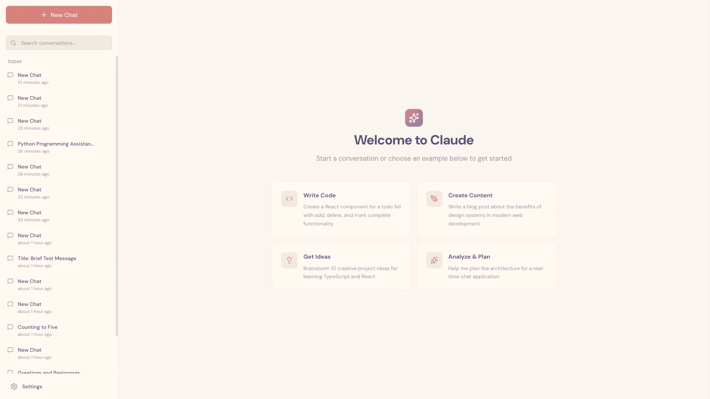

# 适用于长期运行智能体的高效控制框架

来源：https://www.anthropic.com/engineering/effective-harnesses-for-long-running-agents

---

随着AI智能体能力不断增强，开发者越来越多地要求它们承担需要数小时甚至数天才能完成的复杂任务。然而，如何让智能体在多个上下文窗口中保持持续进展，仍然是一个悬而未决的问题。

长期运行智能体的核心挑战在于：它们必须在离散的会话中工作，而每个新会话开始时都没有先前工作的记忆。想象一个由轮班工程师组成的软件项目，每位新工程师到岗时都对上一班次的工作毫无记忆。由于上下文窗口有限，且大多数复杂项目无法在单个窗口内完成，智能体需要一种方法来弥合不同编码会话之间的断层。

我们开发了一套双重解决方案，使[Claude智能体SDK](https://platform.claude.com/docs/en/agent-sdk/overview)能够在多个上下文窗口中高效工作：一个**初始化智能体**负责在首次运行时设置环境，以及一个**编码智能体**负责在每个会话中实现渐进式进展，同时为下一个会话留下清晰的工作成果。您可以在随附的[快速入门指南](https://github.com/anthropics/claude-quickstarts/tree/main/autonomous-coding)中找到代码示例。

## 长期运行智能体问题

Claude智能体SDK是一个功能强大、用途广泛的智能体控制框架，擅长编码以及其他需要模型使用工具来收集上下文、规划和执行的任务。它具有上下文管理功能，例如压缩机制，使智能体能够在任务中工作而不会耗尽上下文窗口。理论上，在这种设置下，智能体应该能够无限期地持续进行有效工作。

然而，仅靠压缩处理是不够的。即使采用前沿的编码模型（如Opus 4.5）在Claude Agent SDK中跨多个上下文窗口循环运行，如果仅提供高层级提示（例如"构建一个[claude.ai](http://claude.ai/redirect/website.v1.3cdc4b97-ef3f-4c35-9dc1-438c366a6058)的克隆应用"），仍然无法构建出生产级质量的Web应用。

Claude的失败主要体现在两种模式上。首先，智能体倾向于一次性完成过多任务——本质上试图"一蹴而就"地构建整个应用。这常常导致模型在实施过程中耗尽上下文容量，使得后续会话不得不从半成品功能且缺乏文档的状态开始。智能体不得不猜测先前的工作进展，并耗费大量时间尝试让基础应用重新运行。即使采用压缩技术，这种情况仍会发生，因为压缩后的指令并不总能完美清晰地传递给下一个智能体。

第二种失败模式往往出现在项目后期。当部分功能已经构建完成后，后续的智能体实例会环顾现有成果，误认为任务已经完成并提前终止工作。

这便将问题分解为两个部分。首先，我们需要建立初始环境，为特定提示要求的所有功能奠定基础，使智能体能够按步骤、按功能逐步推进工作。其次，我们应该提示每个智能体在实现目标的过程中采取渐进式推进策略，并在每次会话结束时保持环境的"清洁状态"。所谓"清洁状态"，是指代码达到可合并至主分支的标准：不存在重大缺陷，代码结构有序且文档完善，开发者能够直接开始新功能开发，而无需先清理无关的混乱代码。

在内部实验过程中，我们通过双管齐下的方案解决了这些问题：

1. **初始化代理**：首个代理会话采用专门设计的提示词，要求模型建立初始环境：包括一个`init.sh`脚本、用于记录代理操作日志的claude-progress.txt文件，以及展示新增文件的初始git提交记录。
2. **编程代理**：所有后续会话均要求模型进行渐进式开发，并留下结构化更新记录。

此方法的核心突破在于：通过claude-progress.txt文件与git历史记录的配合，使代理能在全新的上下文窗口中快速掌握工作状态。这些实践灵感来源于高效软件工程师的日常工作经验。

## 环境管理

在更新的[Claude 4提示工程指南](https://docs.claude.com/en/docs/build-with-claude/prompt-engineering/claude-4-best-practices#multi-context-window-workflows)中，我们分享了多上下文窗口工作流的最佳实践，包括采用"为首个上下文窗口设计特殊提示词"的框架结构。这种"特殊提示词"要求初始化代理建立包含所有必要上下文的环境，以供后续编程代理高效工作。以下我们将深入解析该环境的关键组成部分。

### 功能清单

为解决代理一次性完成应用开发或过早判定项目完工的问题，我们提示初始化代理根据用户初始指令编写详细的功能需求文件。以[claude.ai](http://claude.ai/redirect/website.v1.3cdc4b97-ef3f-4c35-9dc1-438c366a6058)克隆项目为例，这意味着需要列出200多项功能需求，例如"用户可开启新对话窗口，输入查询内容，按回车键后即可查看AI响应"。所有功能初始状态均标记为"未实现"，以便后续编程代理能清晰把握完整功能的全貌。

{
    "category": "功能测试",
    "description": "新建聊天按钮可创建全新对话",
    "steps": [
      "进入主界面",
      "点击'新建聊天'按钮",
      "验证是否创建新对话",
      "检查聊天区域是否显示欢迎状态",
      "验证侧边栏是否出现该对话"
    ],
    "passes": false
  }

我们指示编码代理仅通过修改passes字段的状态来编辑此文件，并使用措辞强硬的指令，例如“不可删除或编辑测试用例，否则可能导致功能缺失或存在缺陷”。经过多次实验，我们最终决定采用JSON格式，因为相比Markdown文件，模型更不容易对JSON文件进行不当修改或覆盖。

### 渐进式推进

在搭建好这个初始环境框架后，我们要求迭代版本的编码代理每次仅专注于一个功能。这种渐进式方法对于解决代理倾向于一次性处理过多任务的问题至关重要。

即使采用渐进式工作模式，仍需确保模型在完成代码修改后保持环境整洁。通过实验我们发现，最有效的方式是要求模型使用描述性提交信息将进度提交至git，并在进度文件中撰写进展摘要。这使得模型能够利用git回退错误的代码变更，并恢复代码库的正常工作状态。

这些方法还提升了效率，因为代理无需猜测先前发生的情况，也不必花费时间尝试让基础应用重新运行。

### 测试环节

我们观察到的最后一个主要失败模式是Claude倾向于在未充分测试的情况下将功能标记为完成。若缺乏明确提示，Claude通常会进行代码修改，甚至通过单元测试或针对开发服务器的`curl`命令进行测试，但往往未能识别功能端到端运行的实际失效情况。

在构建网络应用时，一旦明确提示Claude使用浏览器自动化工具并像真实用户那样进行测试，它通常能出色地完成端到端的功能验证。

Claude通过Puppeteer MCP服务器测试claude.ai克隆项目时拍摄的截图。

为Claude提供这类测试工具显著提升了其表现，因为智能体能够发现并修复仅从代码层面难以察觉的缺陷。

但某些问题依然存在，例如Claude的视觉识别能力和浏览器自动化工具的局限性，导致难以发现所有类型的错误。举例来说，Claude无法通过Puppeteer MCP看到浏览器原生警告弹窗，因此依赖此类弹窗的功能往往更容易出现故障。

## 快速进入状态

基于以上配置，每个编程智能体都会按提示执行以下步骤来熟悉环境——其中有些步骤看似基础却非常实用：

  1. _运行`pwd`命令确认当前工作目录。您只能编辑该目录下的文件。_
  2. _查阅git日志和进度文件，了解近期工作内容。_
  3. _阅读功能清单文件，选择尚未完成的最高优先级功能进行开发。_

这种方法为Claude的每次会话节省了计算资源，因为它无需反复摸索测试方法。同时建议初始化智能体编写可启动开发服务器的init.sh脚本，并在开发新功能前执行基础的端到端测试。

以claude.ai克隆项目为例，这意味着智能体总会先启动本地开发服务器，然后通过Puppeteer MCP执行以下操作：新建对话、发送消息、接收回复。这套流程确保Claude能快速检测应用是否处于异常状态，并及时修复既有缺陷。如果智能体直接开始开发新功能，反而可能使问题复杂化。

综上所述，一个典型的会话通常以以下助手消息开始：

    [助手] 我将首先了解当前项目状态，明确工作方向。
    [工具调用] <bash - pwd>
    [工具调用] <read - claude-progress.txt>
    [工具调用] <read - feature_list.json>
    [助手] 让我查看git日志以了解近期工作内容。
    [工具调用] <bash - git log --oneline -20>
    [助手] 现在检查是否存在用于重启服务器的init.sh脚本。
    <启动开发服务器>
    [助手] 很好！现在让我进入应用程序并验证一些基础功能是否正常运行。
    <测试基础功能>
    [助手] 根据验证测试结果，我可以确认基础功能运行良好。核心聊天功能、主题切换、对话加载和错误处理均运作正常。现在让我更全面地审阅tests.json文件，以明确下一步需要实现的功能。
    <开始新功能开发>

代理故障模式与解决方案

**问题**| **初始化代理行为**| **编码代理行为**
---|---|---
Claude过早宣布整个项目已完成。| 建立功能清单文件：根据输入规范，创建包含端到端功能描述的结构化JSON文件。| 在会话开始时读取功能清单文件。选择单个功能开始开发。
Claude使环境处于存在缺陷或进度未记录的状态。| 初始化git仓库并编写进度记录文件。| 通过读取进度记录文件和git提交日志开始会话，并对开发服务器运行基础测试以发现未记录的缺陷。通过提交git记录和更新进度结束会话。
Claude过早标记功能为已完成。| 建立功能清单文件。| 对所有功能进行自我验证。仅经过仔细测试后才将功能标记为“通过”。
Claude需要花费时间研究如何运行应用程序。| 编写可运行开发服务器的`init.sh`脚本。| 通过读取`init.sh`脚本开始会话。

总结长期运行AI智能体的四种常见故障模式及解决方案。

## 未来工作

本研究展示了一种在长期运行智能体框架中实现模型跨多个上下文窗口持续取得进展的可行解决方案。然而，仍存在一些开放性问题。

最值得注意的是，目前尚不清楚单一通用编码智能体是否在所有场景下表现最优，抑或是通过多智能体架构能获得更佳性能。可以合理推测，在软件开发生命周期的子任务中，专业化智能体（如测试智能体、质量保证智能体或代码清理智能体）可能表现更为出色。

此外，本演示主要针对全栈Web应用开发进行优化。未来的研究方向是将这些发现推广至其他领域。这些经验教训很可能部分或全部适用于其他需要长期运行智能体任务的领域，例如科学研究或金融建模。

### 致谢

作者：贾斯汀·杨。特别感谢大卫·赫希、普里特维·拉贾萨克兰、杰里米·哈德菲尔德、娜亚·布斯卡尔、迈克尔·廷利、杰西·穆、杰克·伊顿、马里乌斯·布勒安达拉、玛吉·沃、佩德拉姆·纳维德、纳丁·亚瑟和亚历克斯·诺托夫的贡献。

这项成果凝聚了Anthropic多个团队的集体智慧，正是他们的努力使得Claude能够安全地进行长期自主软件工程开发，特别感谢代码强化学习团队和Claude代码团队。欢迎有意向的候选人通过[anthropic.com/careers](http://anthropic.com/careers)申请加入我们的行列。

### 脚注

1\. 本文将这些称为独立智能体，仅因其初始用户提示不同。其系统提示、工具集及整体智能体框架在其他方面完全一致。
