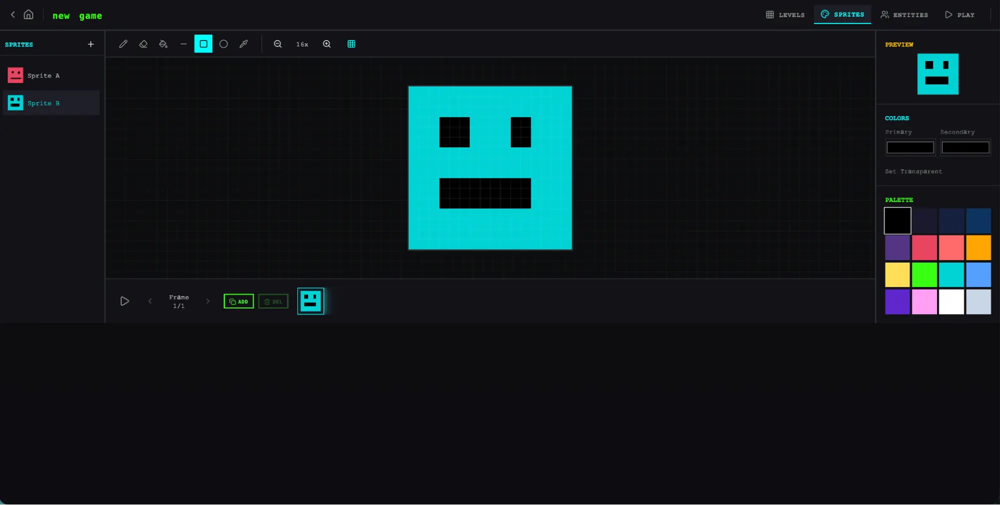
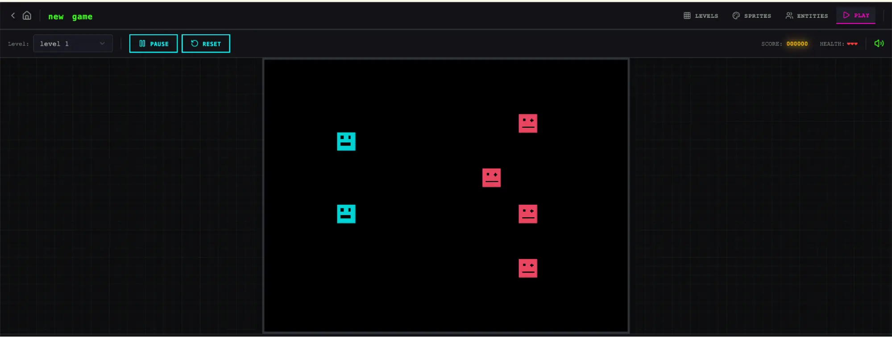
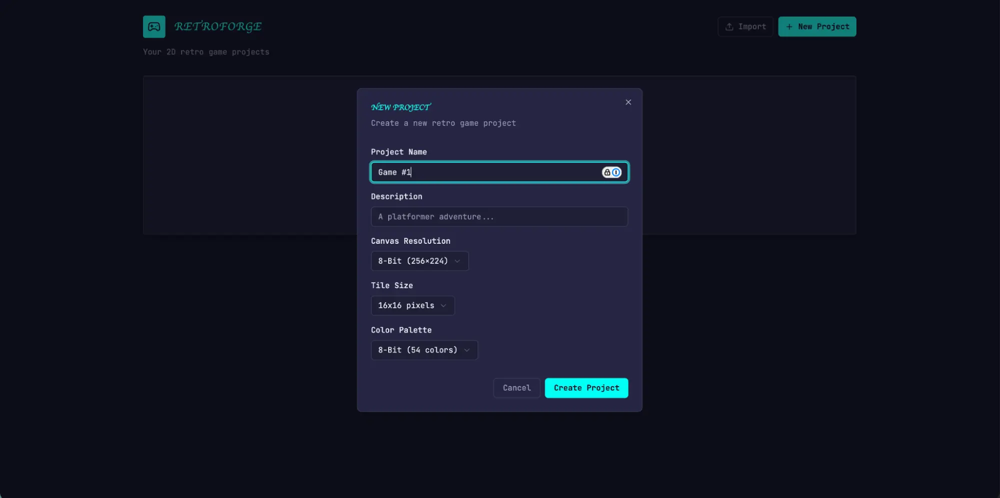
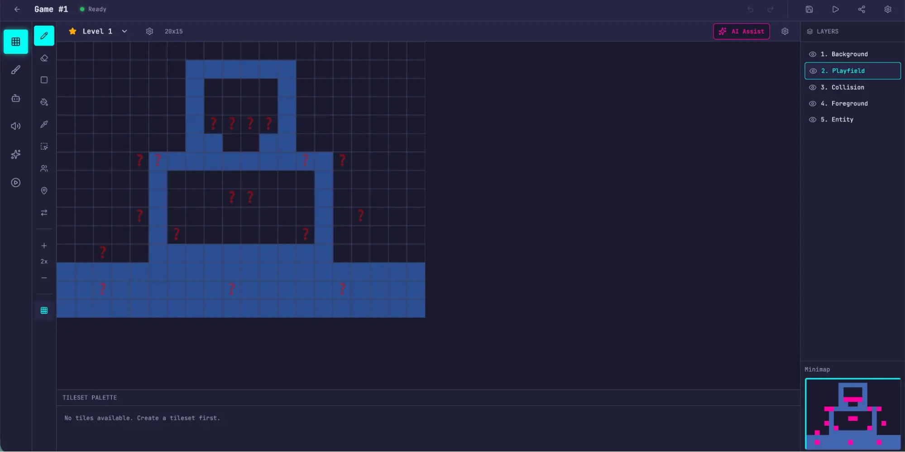
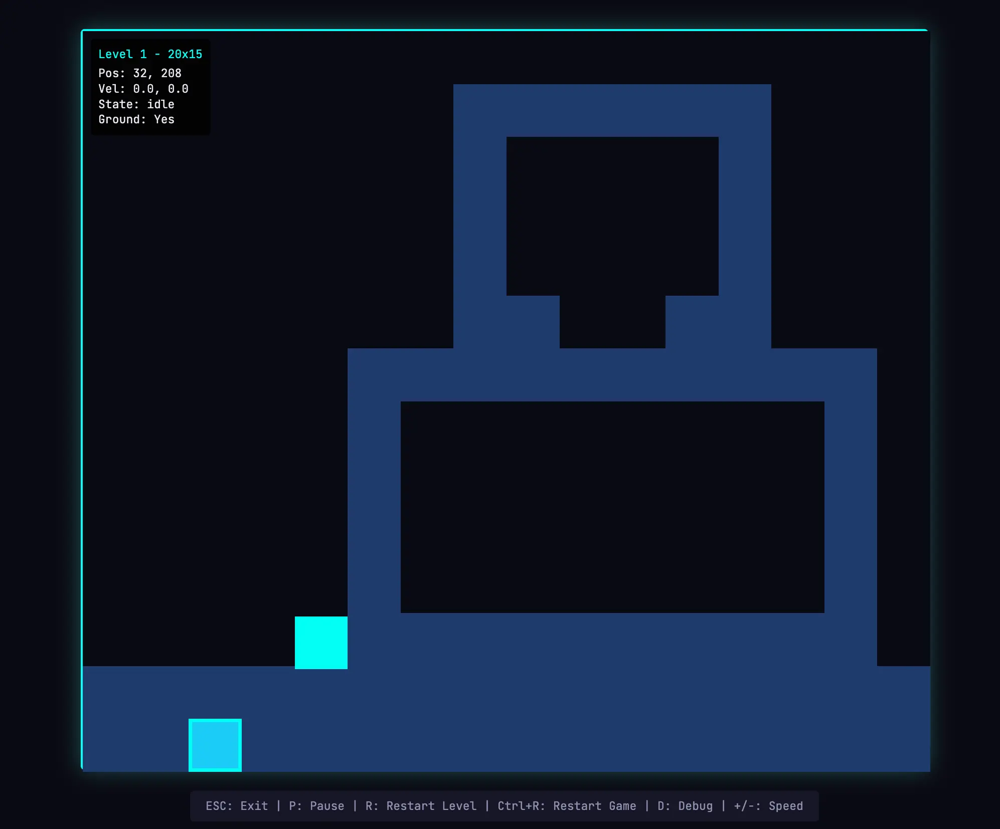

# 面向长时运行应用开发的工具链设计

来源：https://www.anthropic.com/engineering/harness-design-long-running-apps

---

_本文作者 Prithvi Rajasekaran，是我们[实验室团队](https://www.anthropic.com/news/introducing-anthropic-labs)的成员。_

过去几个月，我一直在攻克两个相互关联的难题：如何让Claude生成高质量的前端设计，以及如何使其在无需人工干预的情况下构建完整应用程序。这项工作的源头可追溯至我们早期在[前端设计技能](https://github.com/anthropics/claude-code/blob/main/plugins/frontend-design/skills/frontend-design/SKILL.md)和[长时运行编码智能体工具链](https://www.anthropic.com/engineering/effective-harnesses-for-long-running-agents)上的探索——当时我和同事们通过提示工程与工具链设计，成功将Claude的性能提升至远超基准水平，但两者最终都遇到了瓶颈。

为了取得突破，我探索了新颖的AI工程方法，这些方法在两个截然不同的领域中都适用：一个领域由主观品味定义，另一个则由可验证的正确性和可用性定义。受[生成对抗网络](https://en.wikipedia.org/wiki/Generative_adversarial_network)（GANs）的启发，我设计了一个包含**生成器**和**评估器**智能体的多智能体结构。构建一个能够可靠且具有品味地评估输出的评估器，意味着首先需要制定一套标准，将“这个设计好吗？”这类主观判断转化为具体、可分级的标准。

随后，我将这些技术应用于长期自主编码，并借鉴了早期工具开发工作中的两个经验：将构建过程分解为可管理的部分，以及使用结构化工件在不同会话之间传递上下文。最终成果是一个三智能体架构——规划器、生成器和评估器——能够在长达数小时的自主编码会话中生成丰富的全栈应用程序。

## 为何简单实现难以奏效

我们之前已经证明，工具链设计对长期运行的智能编码代理效能具有显著影响。在早先的[实验](https://www.anthropic.com/engineering/effective-harnesses-for-long-running-agents)中，我们采用初始化代理将产品需求分解为任务清单，再由编码代理逐项实现功能，并通过交接工作产物实现跨会话的上下文传递。更广泛的开发者社区已形成类似共识，例如采用"[拉尔夫·威格姆](https://ghuntley.com/ralph/)"方法，通过钩子或脚本使代理保持持续迭代循环。

但某些问题依然顽固存在。面对更复杂的任务时，代理仍会随时间推移逐渐偏离正轨。在剖析该问题时，我们观察到代理执行此类任务时存在两种常见故障模式。

首先是模型在长任务中随着上下文窗口填满容易丧失连贯性（参见我们关于[上下文工程](https://www.anthropic.com/engineering/effective-context-engineering-for-ai-agents)的论述）。部分模型还会表现出"上下文焦虑"，即当接近其认知的上下文容量极限时，会过早地结束工作。通过上下文重置——完全清空上下文窗口并启动新代理，同时配合结构化交接机制来传递前序代理状态与后续步骤——可同时解决这两类问题。

这与压缩不同，压缩是通过就地总结对话的早期部分，使同一智能体能够在缩短的历史记录中继续工作。虽然压缩保持了连续性，但并未给智能体提供一个全新的起点，这意味着上下文焦虑可能仍然存在。重置提供了一个全新的起点，代价是交接工件需要包含足够的状态，以便下一个智能体能够清晰地接手工作。在我们早期的测试中，我们发现Claude Sonnet 4.5表现出强烈的上下文焦虑，仅靠压缩不足以支持强大的长任务性能，因此上下文重置成为系统设计的关键。这解决了核心问题，但增加了每次系统运行的编排复杂性、令牌开销和延迟。

第二个问题是我们之前未曾提及的，即自我评估。当要求智能体评估自己完成的工作时，它们倾向于自信地赞扬成果——即使对人类观察者而言，其质量明显平庸。这一问题在主观性任务（如设计）中尤为突出，因为这类任务没有类似可验证软件测试的二元检查标准。布局是感觉精致还是普通，是一种主观判断，而智能体在评估自身工作时总是倾向于给出积极评价。

然而，即便是在那些确实存在可验证结果的任务上，智能体有时仍会表现出判断力不足，从而影响其任务完成效果。将执行工作的智能体与评估工作的智能体分离开来，被证明是解决这一问题的有效手段。这种分离本身并不能立即消除评估中的宽容倾向；毕竟评估者本身仍是一个倾向于对LLM生成内容持宽容态度的语言模型。但调整一个独立的评估模型，使其持怀疑态度，远比让生成模型自我批判更为可行。一旦有了外部反馈，生成模型就有了具体可迭代改进的依据。

## 前端设计：让主观质量可分级

我从前端设计开始实验，因为自我评估问题在这里最为明显。在没有干预的情况下，Claude通常倾向于采用安全、可预测的布局，这些布局在技术上功能完备，但视觉上平淡无奇。

我构建前端设计工具时，基于两个核心洞见。首先，虽然审美无法完全简化为分数——个人品味始终存在差异——但通过编码设计原则与偏好的评分标准，美学表现可以得到系统性提升。"这个设计美吗？"这个问题很难保持评判一致性，但"这个设计是否符合我们的优秀设计原则？"则为Claude提供了具体的评分依据。其次，通过将前端生成与前端评估分离，我们能够建立驱动生成器持续优化输出的反馈循环。

基于这些思考，我撰写了四项评分标准，并将其同时嵌入生成器与评估器智能体的提示指令中：

*   **设计质量：** 设计是否呈现为有机整体而非零散部件？优秀作品应使色彩、字体、布局、图像等细节融合统一，营造独特氛围与品牌个性。
*   **原创性：** 是否存在定制化设计决策？或仅是模板布局、组件库默认设置与AI生成图案的堆砌？人类设计师应能辨识出有意识的创作选择。直接套用现成组件——或出现AI生成典型特征（如白色卡片上的紫色渐变）——均不符合要求。
*   **工艺水准：** 技术执行层面：字体层级、间距一致性、色彩协调性、对比度比例。此项侧重基础能力而非创意能力。多数合理实现方案可自然达标；未通过则意味着基础架构存在缺陷。
*   **功能性：** 独立于美学的可用性。用户能否理解界面功能、快速定位主要操作、无需猜测即可完成任务流程？

我特别强调设计质量与原创性，将其置于工艺水准与功能性之上。克劳德模型在工艺与功能方面本就表现稳定，因其所需的技术能力属于模型固有优势。但在设计与原创维度，该模型往往止步于平庸产出。评审标准明确排斥高度同质化的“AI流水线”模式，通过加大设计与原创性的权重，促使模型在美学层面进行更大胆的探索。

我通过少量示例配合详细的评分细则对评估器进行了校准。这确保了评估器的判断与我的偏好保持一致，并减少了迭代过程中的评分漂移。

整个循环构建于[Claude Agent SDK](https://platform.claude.com/docs/en/agent-sdk/overview)之上，使得流程编排保持简洁明了。生成器代理首先根据用户提示创建HTML/CSS/JS前端界面。我为评估器配置了Playwright MCP工具，使其能够在评分前直接与实时页面交互，逐项评估标准并撰写详细评审意见。实际操作中，评估器会自主浏览页面，通过截图功能仔细研究实现细节后再生成评估报告。这些反馈信息将作为下一轮迭代的输入传回生成器。每轮生成过程会进行5到15次迭代，每次迭代通常都会推动生成器朝着更具特色的方向发展，以响应评估器的批评建议。由于评估器需要主动浏览页面而非对静态截图评分，每个循环周期都需要实际耗时。完整流程可能长达四小时。我还指导生成器在每次评估后做出战略决策：若评分趋势良好则延续当前方向进行优化，若当前方案效果不佳则彻底转向全新的美学风格。

在多次运行中，评估者的判断随着迭代次数增加而改善，随后趋于稳定，但仍存在提升空间。部分生成结果逐步微调改进，而另一些则在迭代间发生了剧烈的美学转向。

评估标准的措辞以我未能完全预料的方式引导了生成器。包含诸如"最佳设计应达到博物馆级品质"这类表述，将设计推向特定的视觉趋同，这表明与标准相关的提示语直接塑造了输出结果的特性。

虽然评分总体上随迭代提升，但变化模式并非总是清晰的线性关系。后期的实现版本整体更优，但我经常发现某些中间迭代版本比最终版本更符合个人偏好。实现复杂度也往往随着轮次增加而上升——生成器会根据评估者的反馈尝试更具雄心的解决方案。即使在首次迭代中，输出结果也明显优于完全无提示的基线水平，这说明评估标准及其相关表述本身就能引导模型偏离通用默认值，无需评估者反馈即可实现初步优化。

在一个引人注目的例子中，我引导模型为一家荷兰艺术博物馆创建网站。经过九次迭代后，它为一个虚构的博物馆设计出了一个简洁、深色主题的着陆页。该页面视觉上很精致，但基本符合我的预期。然而，在第十轮迭代中，它完全抛弃了之前的思路，将网站重新构想为一种空间体验：一个用CSS透视渲染的、带有棋盘格地板的3D房间，艺术品以自由形式悬挂在墙上，画廊房间之间的导航通过门道实现，而非滚动或点击。这种创造性的飞跃是我在单次生成中前所未见的。

## 扩展到全栈编码

基于这些发现，我将这种受GAN启发的模式应用于全栈开发。生成器-评估器循环自然地映射到软件开发生命周期中，其中代码审查和QA（质量保证）扮演着与设计评估器相同的结构性角色。

### 架构

在我们早期的[长期运行框架](https://www.anthropic.com/engineering/effective-harnesses-for-long-running-agents)中，我们通过初始化智能体、按功能逐个处理的编码智能体以及会话间的上下文重置，解决了跨多会话的连贯编码问题。上下文重置曾是关键突破点：该框架使用Sonnet 4.5模型，该模型存在前文提到的"上下文焦虑"倾向。构建一个能在上下文重置后稳定工作的框架，是保持模型任务专注度的关键。而Opus 4.5模型已基本自行消除了这种行为，因此我得以在此框架中完全取消上下文重置。整个构建过程中，智能体以单一连续会话模式运行，由[Claude智能体SDK](https://platform.claude.com/docs/en/agent-sdk/overview)的自动压缩机制处理上下文增长问题。

基于原始框架的基础，我为此项工作构建了一个三智能体系统，每个智能体都针对我在先前运行中观察到的特定缺陷。该系统包含以下智能体角色：

**规划者：** 我们之前长期运行的框架要求用户预先提供详细的产品规格。我希望自动化这一步骤，因此创建了一个规划代理，它能够接收一个简单的1-4句提示，并将其扩展为完整的产品规格。我要求它在范围设定上保持雄心，并专注于产品背景和高层次技术设计，而非详细的技术实现。之所以强调这一点，是因为担心如果规划者试图预先指定细粒度的技术细节并出现错误，规格中的错误会级联影响到下游的实现。更明智的做法似乎是约束代理需要交付的成果，并让它们在工作中自行探索实现路径。我还要求规划者在产品规格中寻找融入AI功能的机会。（具体示例请参见文末附录。）

**生成者：** 早期框架中一次处理一个功能的方法在范围管理方面效果良好。我在此应用了类似的模式，指示生成者以冲刺方式工作，每次从规格中选取一个功能进行实现。每个冲刺都使用React、Vite、FastAPI和SQLite（后来改用PostgreSQL）技术栈来构建应用，并指示生成者在每个冲刺结束时进行自我评估，然后移交给质量保证环节。该流程还使用Git进行版本控制。

**评估器：** 早期框架的应用往往看起来令人印象深刻，但在实际使用时仍存在真实缺陷。为了捕捉这些问题，评估器利用Playwright MCP工具，像真实用户一样点击运行中的应用程序，测试用户界面功能、API端点及数据库状态。随后，它依据发现的缺陷以及一套基于前端实验建模的标准（此处调整为涵盖产品深度、功能完整性、视觉设计和代码质量）对每个冲刺阶段进行评分。每项标准均设有硬性阈值，若任意一项未达标，该冲刺即判定失败，生成器会收到关于具体问题的详细反馈。

在每个冲刺开始前，生成器与评估器会协商一份冲刺契约：在编写任何代码之前，就当前工作模块的"完成"标准达成共识。设立这一环节是因为产品规格书有意保持高层级描述，而我需要有一个步骤来弥合用户故事与可测试实现之间的差距。生成器提出它将构建的内容及验证成功的方法，评估器则审查该提案以确保生成器正在构建正确的内容。双方会反复迭代直至达成一致。

通信通过文件进行：一个智能体写入文件，另一个智能体读取文件并作出响应，响应内容可以写在同一文件中，也可以创建新文件供前一个智能体依次读取。生成器会依据双方确认的协议进行构建，再将成果移交至质量保证环节。这种方式确保了工作严格遵循规范，同时避免了过早过度细化实施方案。

### 运行测试框架

在此框架的首个版本中，我使用了Claude Opus 4.5模型，通过用户提示同时运行完整框架与单智能体系统进行对比。选择Opus 4.5是因为开始实验时，这是我们最优秀的代码生成模型。

我编写了以下提示词来生成复古视频游戏制作工具：

> _创建一款2D复古游戏制作工具，需包含关卡编辑器、精灵编辑器、实体行为系统及可运行的测试模式。_

下表展示了测试框架类型、运行时长及总成本：

**框架类型**| **运行时长**| **成本**
---|---|---
单智能体| 20分钟| 9美元
完整框架| 6小时| 200美元

完整框架的成本高出20倍以上，但输出质量的差异立竿见影。

我原本期望获得这样的交互界面：能够构建关卡及其组件（精灵、实体、瓦片布局），然后点击运行即可实际游玩该关卡。我首先打开了单智能体运行的输出结果，初始应用程序看起来符合这些预期。

然而，随着我不断点击操作，问题开始浮现。布局浪费了大量空间，固定高度的面板导致视窗大部分区域空置。工作流程僵化不灵活。尝试填充关卡时，系统提示我先创建精灵和实体，但用户界面中没有任何指引表明这一操作顺序。更重要的是，游戏本身存在故障。我创建的实体虽然显示在屏幕上，却对任何输入操作毫无反应。深入代码排查后发现，实体定义与游戏运行时的连接机制已损坏，且界面没有任何错误提示。

启动界面 精灵编辑器 游戏运行
单人测试框架生成的应用程序初始界面

在单人测试框架构建的精灵编辑器中创建精灵

尝试运行自建关卡但未能成功

在评估了独立运行后，我将注意力转向了协同运行。这次运行从相同的单句提示开始，但规划步骤将该提示扩展为横跨十个冲刺周期的16项功能规格。其范围远超独立运行的尝试。除了核心编辑器和游戏模式外，规格还要求包含精灵动画系统、行为模板、音效与音乐、AI辅助精灵生成器与关卡设计器，以及可分享链接的游戏导出功能。我向规划器开放了我们的[前端设计技能](https://github.com/anthropics/claude-code/blob/main/plugins/frontend-design/skills/frontend-design/SKILL.md)，规划器读取并运用该技能为应用程序创建了视觉设计语言，作为规格的一部分。每个冲刺阶段，生成器与评估器通过协商制定契约，明确该冲刺的具体实施细节，以及用于验证完成度的可测试行为。

与独立运行相比，这款应用立刻展现出更高的完成度和流畅性。画布充分利用了视口空间，面板尺寸设计合理，界面保持了与设计规范一致的视觉识别体系。不过独立运行版本中某些笨拙之处依然存在——工作流程仍未明确提示用户应先创建精灵和实体再填充关卡内容，我仍需通过反复摸索才能理解这一逻辑。这反映出基础模型在产品直觉层面的缺失，而非开发框架本应解决的问题，但确实为框架内的定向迭代指明了优化方向。

随着深入使用各编辑器，新版本相较于独立运行的优势愈发明显。精灵编辑器功能更为丰富完善，工具面板更简洁，颜色选择器更高效，缩放控制也更具实用性。

由于我要求规划器将AI功能融入设计规范，该应用还内置了Claude集成模块，支持通过提示词生成游戏的各个组成部分。这显著提升了工作流效率。

启动界面 精灵编辑器AI游戏设计AI游戏设计 游戏玩法

初始界面：在使用完整框架构建的应用中创建新游戏

精灵编辑器呈现出更清爽直观的操作体验

利用内置AI功能生成关卡

利用内置AI功能生成关卡

体验我生成的游戏

最显著的差异体现在游玩模式中。我能够实际操控角色实体进行游戏。物理系统尚存瑕疵——角色跳上平台时竟与平台模型重叠，这显然有违直觉——但核心功能已然实现，这是独立开发时未能达成的。在简单探索后，我确实遇到了AI构建游戏关卡的局限性：一堵无法逾越的高墙使我陷入困境。这表明该框架仍需通过常识性优化与边界情况处理来完善应用。

查阅运行日志可知，评估器始终确保执行过程符合技术规范。每个冲刺阶段，它都会逐条核验冲刺合约的测试标准，并通过Playwright对运行中的应用进行检测，任何偏离预期行为的问题都会被记录为缺陷。这些合约条款极为细致——仅冲刺阶段3就包含27条针对关卡编辑器的标准——且评估器的反馈具体明确，无需额外排查即可直接处理。下表展示了评估器识别出的若干典型问题：

**合同标准**| **评估结果**
---|---
矩形填充工具允许通过点击拖动用选定图块填充矩形区域| **失败** — 工具仅在拖拽起点/终点放置图块，未填充整个区域。`fillRectangle`函数存在但未在鼠标释放时正确触发。
用户可选择并删除已放置的实体生成点| **失败** — `LevelEditor.tsx:892`处的删除按键处理器要求同时设置`selection`和`selectedEntityId`，但点击实体仅设置`selectedEntityId`。判断条件应改为`selection || (selectedEntityId && activeLayer === 'entity')`。
用户可通过API重新排序动画帧| **失败** — `PUT /frames/reorder`路由定义在`/{frame_id}`路由之后。FastAPI将`reorder`匹配为帧ID整数并返回422错误："无法将字符串解析为整数。"

让评估器达到这一水平需要付出努力。Claude在初始状态下是一个表现不佳的QA代理。在早期测试中，我曾目睹它识别出合理的问题，随后却自我说服这些问题无关紧要，并最终批准了工作。它还倾向于进行表面测试，而非深入探究边界情况，因此更细微的漏洞常常被遗漏。调整循环包括阅读评估器的日志，找出其判断与我的判断存在分歧的案例，并更新QA提示以解决这些问题。经过几轮这样的开发循环后，评估器的评分方式才达到我认为合理的水平。即便如此，测试框架的输出仍显示出模型QA能力的局限性：微小的布局问题、部分交互体验不够直观，以及评估器未充分测试的深层嵌套功能中未被发现的漏洞。显然，通过进一步调整还有更多验证空间可以挖掘。但与单次运行相比——当时应用程序的核心功能根本无法工作——提升效果显而易见。

###
对测试框架的迭代

第一套约束系统的测试结果令人鼓舞，但也存在体积臃肿、运行缓慢且成本高昂的问题。合乎逻辑的下一步是寻找简化约束系统的方法，同时不降低其性能。这既是常识使然，也遵循了一个更普遍的原则：约束系统中的每个组件都隐含着对模型自身能力不足的假设，而这些假设值得进行压力测试——既因为它们可能本身就不正确，也因为随着模型不断进步，这些假设会迅速过时。我们的博客文章《构建高效智能体》将核心理念概括为"寻找尽可能简单的解决方案，仅在必要时增加复杂性"，对于任何维护智能体约束系统的人来说，这已成为一种持续出现的模式。

在我首次尝试简化时，我大幅削减了约束系统的组件，并尝试了一些创新的新思路，但未能复现原始系统的性能。同时，我也难以分辨约束系统设计中哪些部分真正起关键作用，以及它们以何种方式发挥作用。基于这次经验，我转向了更为系统化的方法：每次只移除一个组件，并评估其对最终结果的影响。

在进行这些迭代周期的同时，我们还发布了Opus 4.6版本，这为降低工具链复杂度提供了进一步动力。我们有充分理由预期4.6版本所需的辅助框架会比4.5版本更少。根据我们的[发布博客](https://www.anthropic.com/news/claude-opus-4-6)所述："[Opus 4.6]能更周密地规划任务，更持久地维持智能体作业，在大型代码库中运行更可靠，并具备更出色的代码审查和调试能力以自我纠错。"该版本在长上下文检索方面也有显著提升。这些正是我们构建工具链旨在增强的所有能力。

### 移除冲刺结构

我首先彻底移除了冲刺结构。原本的冲刺机制有助于将工作分解为模型可连贯处理的模块。鉴于Opus 4.6的改进，我们有充分理由相信模型无需此类分解就能原生处理任务。

我保留了规划器和评估器，因为二者持续发挥着显著价值。若没有规划器，生成器会出现规划不足的问题：面对原始提示时，它会直接开始构建而不预先规划工作范围，最终产出的应用程序功能丰富度将不及规划器参与的版本。

随着冲刺结构的移除，我将评估器调整为在运行结束时进行单次评估，而非每个冲刺阶段都进行评分。由于模型能力大幅提升，评估器在某些运行中的重要性发生了变化——其效用取决于任务相对于模型独立可靠完成能力的位置。在4.5版本中，这个边界非常接近：我们的构建任务恰好处于生成器能独立良好完成的临界点，评估器在此过程中发现了大量实质性问题。到了4.6版本，模型的原始能力得到增强，边界随之向外扩展。许多原本需要评估器核查才能连贯实现的任务，现在已进入生成器能独立妥善处理的范畴；对于边界内的任务，评估器反而成了不必要的开销。但对于那些仍处于生成器能力边界的构建环节，评估器依然能提供实质性提升。

实际应用中的启示在于：评估器并非简单的"启用/禁用"二元选择。当任务超出当前模型独立可靠完成的范围时，评估器带来的价值足以抵消其成本。

在结构简化的同时，我还增加了提示机制，以改进工具链如何将AI功能构建到每个应用中——具体来说，就是让生成器构建出能够通过工具驱动应用自身功能的智能体。这需要真正的迭代过程，因为相关知识较新，Claude的训练数据对此覆盖有限。但经过充分调优后，生成器已能正确构建智能体。

### 升级版工具链的测试结果

为了测试升级后的工具链，我使用以下提示词生成了一个数字音频工作站（DAW）——这是一种用于作曲、录音和混音的音乐制作程序：

> _使用Web Audio API在浏览器中构建功能完整的数字音频工作站。_

运行过程仍然耗时且成本高昂，大约花费4小时，令牌成本为124美元。

大部分时间用于构建阶段，该阶段持续运行超过两小时且逻辑连贯，无需像Opus 4.5版本那样进行任务拆分。

**智能体与阶段**| **耗时**| **成本**
---|---|---
规划器| 4.7分钟| 0.46美元
构建（第一轮）| 2小时7分钟| 71.08美元
质量检测（第一轮）| 8.8分钟| 3.24美元
构建（第二轮）| 1小时2分钟| 36.89美元
质量检测（第二轮）| 6.8分钟| 3.09美元
构建（第三轮）| 10.9分钟| 5.88美元
质量检测（第三轮）| 9.6分钟| 4.06美元
**V2工具链总计**| **3小时50分钟**| **124.70美元**

与之前的测试框架类似，规划器将单行提示扩展为完整规范。从日志中可以看出，生成模型在应用规划、智能体设计、智能体连接及测试环节都表现良好，之后才移交给质量保证环节。

尽管如此，质量保证智能体仍然发现了实际缺陷。在其首轮反馈中，它指出：

> 这款应用整体出色，设计还原度高，智能体架构稳固，后端表现良好。主要缺陷在于功能完整性——虽然应用界面令人印象深刻且人工智能集成运行顺畅，但多个核心数字音频工作站功能仅停留在展示层面，缺乏交互深度：时间轴上的音频片段无法拖拽移动、缺少乐器界面面板（合成器旋钮、鼓垫控件）、也没有可视化效果编辑器（均衡器曲线、压缩器仪表）。这些并非边缘功能，而是构成数字音频工作站可用性的核心交互要素，且规范文档已明确要求实现这些功能。

在第二轮反馈中，它再次捕捉到若干功能缺失：

> 遗留问题：
> \- 音频录制功能仍为桩模块（按钮可切换但未实现麦克风采集）
> \- 未实现音频片段边缘拖拽调整尺寸及片段分割功能
> \- 效果可视化仅采用数值滑块，未实现图形化界面（缺少均衡器曲线）

当完全依赖自主运行时，生成模型仍容易遗漏细节或采用桩模块替代完整功能，而质量保证环节通过捕捉这些"最后一公里"问题，持续为生成模型的修正提供价值。

根据提示，我原本期待的是一个能让我创作旋律、和声与鼓点节奏，将它们编排成歌曲，并在此过程中获得集成智能体辅助的程序。下面的视频展示了最终成果。

这款应用远非专业的音乐制作软件，智能体的歌曲创作能力显然还有很大的提升空间。此外，由于Claude实际上无法"听见"声音，这使得基于音乐品味的质量反馈循环效果大打折扣。

但最终的应用具备了功能性音乐制作程序的所有核心模块：在浏览器中运行的编曲界面、混音器和播放控制器。更重要的是，我完全通过提示指令就完成了一段简短歌曲小样的创作：智能体设定了节奏与调性，谱写了旋律线，构建了鼓点轨道，调整了混音器电平，并添加了混响效果。歌曲创作的核心基础构件已悉数就位，智能体能够自主驱动这些模块，运用工具完成从开端到结尾的简易音乐制作流程。或许可以说它尚未达到精准完美的境界——但正在朝着这个方向稳步迈进。

## 下一步是什么

随着模型性能的持续提升，我们可以大致预期它们将能够处理更长时间、更复杂的任务。在某些情况下，这意味着围绕模型构建的辅助框架的重要性会随时间递减，开发者可以等待新一代模型问世，让某些问题自行解决。另一方面，模型越强大，就越有空间开发能够实现超越模型基础能力的复杂任务的辅助系统。

基于这样的认识，从这项工作中我们可以总结出几点值得借鉴的经验：始终建议对正在构建的模型进行实验性测试，通过实际问题的运行轨迹来解读其表现，并调整参数以达到预期效果。在处理更复杂的任务时，有时可以通过任务分解并为每个环节配备专门智能体来提升处理空间。当新模型发布时，通常建议重新审视现有辅助框架，剔除那些不再对性能起关键作用的组件，并添加新模块以实现以往难以达成的更强功能。

通过这项工作，我确信：随着模型进步，有价值的辅助系统组合空间并不会缩小，而是会发生迁移。对于人工智能工程师而言，持续探索新颖的组合方式将成为值得关注的研究方向。

##
致谢

特别感谢Mike Krieger、Michael Agaby、Justin Young、Jeremy Hadfield、David Hershey、Julius Tarng、Xiaoyi Zhang、Barry Zhang、Orowa Sidker、Michael Tingley、Ibrahim Madha、Martina Long和Canyon Robbins对本工作的贡献。

同时感谢Jake Eaton、Alyssa Leonard和Stef Sequeira在文章构思过程中提供的帮助。

##
附录

规划代理生成的示例方案。

    RetroForge - 2D复古游戏制作器

    概述
    RetroForge是一个基于网络的创意工作室，专为设计和构建2D复古风格视频游戏而生。它融合了经典8位和16位游戏美学的怀旧魅力与现代直观的编辑工具，让从业余爱好者到独立开发者的每个人都能在不编写传统代码的情况下实现游戏创意。

    该平台提供四大集成创意模块：基于图块的关卡编辑器用于设计游戏世界，像素艺术精灵编辑器用于制作视觉资源，可视化实体行为系统用于定义游戏逻辑，以及即时可玩测试模式用于实时游戏测试。通过在整个创作过程中融入AI辅助（由Claude驱动），RetroForge加速了创作流程——帮助用户通过自然语言交互生成精灵、设计关卡和配置行为。

RetroForge 面向热爱复古游戏美学但追求现代便捷的创作者。无论是复刻童年记忆中的平台跳跃、角色扮演或动作游戏，还是在复古框架中打造全新体验，用户都能快速构建原型、可视化迭代，并与他人分享创作成果。

功能亮点
1. 项目仪表盘与管理
项目仪表盘是RetroForge所有创意工作的核心基地。用户需要清晰有序的方式来管理游戏项目——创建新项目、返回进行中的作品，并能直观掌握每个项目的内容概览。

用户场景需求：作为用户，我希望能够：

- 通过命名与描述创建新游戏项目，以便开始设计游戏
- 查看以可视化卡片展示的所有现有项目（包含项目名称、最后修改日期及缩略预览图），从而快速定位并继续工作
- 打开任意项目进入完整游戏编辑器工作区，以便开展游戏制作
- 通过确认对话框删除不再需要的项目，防止误操作，保持工作区整洁
- 复制现有项目作为新游戏起点，以便复用先前成果

项目数据模型：每个项目包含：

项目元数据（名称、描述、创建/修改时间戳）  
画布设置（分辨率：例如256x224、320x240或160x144）  
图块尺寸配置（8x8、16x16或32x32像素）  
调色板选择  
所有关联的精灵、图块集、关卡和实体定义  

...  

复制
