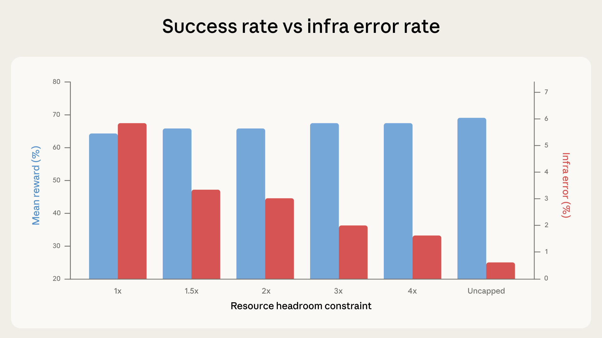

# 量化智能体编码评估中的基础设施噪声

来源：https://www.anthropic.com/engineering/infrastructure-noise

---

SWE-bench和Terminal-Bench等智能体编码基准测试常被用于比较前沿模型的软件工程能力——排行榜上的顶尖名次往往仅相差几个百分点。这些分数通常被视为模型相对能力的精确度量，并越来越多地影响着模型部署的决策。然而，我们发现仅基础设施配置的差异就可能产生超过这些边际的差距。在内部实验中，Terminal-Bench 2.0上资源最充足与最匮乏的设置之间的差距达到了6个百分点（p < 0.01）。

静态基准测试直接评估模型的输出——运行时环境不会影响结果。智能体编码评估则不同：模型被置于一个完整的环境中，在此编写程序、运行测试、安装依赖项并进行多轮迭代。运行时不再是被动的容器，而是问题解决过程中不可或缺的组成部分。拥有不同资源预算和时间限制的两个智能体实际上并非在进行相同的测试。

评估开发者已开始考虑这一点。例如，Terminal-Bench 2.0在其最新的2.0版本中按任务指定了推荐的CPU和RAM配置。然而，指定资源并不等同于一致地执行这些配置。此外，我们发现执行方法可能会改变基准测试最终实际衡量的内容。

## 问题溯源

我们在Google Kubernetes Engine集群上运行Terminal-Bench 2.0。在校准设置时，我们注意到得分与基准测试的官方排行榜不符，且基础设施错误率异常高：多达6%的任务因Pod错误而失败，其中大多数错误与模型解决问题的能力无关。

分数差异的根源在于执行机制。我们的Kubernetes实现将每项任务的资源规格同时视为下限和硬性上限：每个容器都保证获得指定资源，但一旦超出就会立即被终止。容器运行时通过两个独立参数来执行资源限制：一是保证分配量——预先保留的资源，二是容器被终止的硬性上限。当这两个值设为相同时，瞬时峰值将毫无缓冲空间：短暂的内存波动可能导致容器被OOM终止，而原本它本应能成功运行。考虑到这一点，Terminal-Bench排行榜采用了不同的沙箱提供商，其实现方式更为宽松，允许临时超额分配而不终止容器，以优先保障基础设施的稳定性。

这一发现引出了一个更宏观的问题：资源配置对评估分数的影响究竟有多大？

为量化框架的影响，我们在六种资源配置下运行了Terminal-Bench 2.0，范围从严格执行每项任务规格（1倍资源）——即同时作为下限和上限，到完全不设上限。其他所有条件保持不变：相同的Claude模型、相同的测试框架、相同的任务集。

在我们的实验中，成功率随着资源缓冲空间的增加而提升。这主要得益于基础设施错误率在每个阶段呈单调下降趋势，从严格执行时的5.8%降至无上限时的0.5%。从严格执行到3倍缓冲空间（5.8%至2.1%）的降幅具有统计学显著性（p < 0.001）。缓冲空间越大，因超额分配而被终止的容器就越少。

在1倍到3倍资源区间，成功率分数在误差范围内波动（p=0.40）。大多数在1倍资源下崩溃的任务即使给予更多资源也注定会失败——这是我们在数据中观察到的现象。智能体在探索过程中触达资源限制墙而被强制中断，但其探索路径本身从未指向正确解决方案。

然而从3倍资源左右开始，这一趋势发生转变：成功率的攀升速度开始超越基础设施错误率的下降速度。

在资源从3倍提升至无上限的过程中，基础设施错误率额外下降1.6个百分点，而任务成功率则跃升近4个百分点。这些额外资源使智能体能够尝试仅在大规模资源分配下才可行的策略，例如引入大型依赖项、启动高开销子进程以及运行内存密集型测试套件。在无资源限制条件下，相比基准1倍资源的总成功率提升达到6个百分点（p < 0.01）。在临界案例中，诸如`rstan-to-pystan`和`compile-compcert`这类任务在获得内存余量后，成功率显著提升。

## 这对评估指标的影响

在约3倍Terminal-Bench标准配置范围内，额外资源主要解决基础设施可靠性问题，特别是瞬态资源峰值。Terminal-Bench维护者使用的沙箱服务已在后台隐式执行此类优化；这使得评估过程更稳定，但并未降低任务难度。

然而超过3倍资源阈值后，额外资源开始主动帮助智能体解决此前无法攻克的问题，这表明资源限制实际上可能改变评估指标的测量本质。严格限制会无意中奖励极高效率的策略，而宽松限制则更具容错性，更擅长利用全部可用资源的智能体将获得优势。

在严格约束下，能快速编写精简高效代码的智能体表现更佳；在宽松环境下，擅长用重型工具暴力破解方案的智能体则更具优势。这两种能力都值得测试，但若在未明确资源配置的情况下将其合并为单一评分，则难以辨析其中的差异——也难以判断其在实际场景中的泛化能力。

在`bn-fit-modify`这个需要拟合贝叶斯网络的Terminal-Bench任务中，某些模型的第一步操作是安装标准Python数据科学工具链：`pandas`、`networkx`、`scikit-learn`及其所有依赖包。在资源充足的情况下，这种做法可行。但在严格限制下，智能体尚未编写任何解决方案代码，容器就会在安装过程中耗尽内存。其实存在更精简的策略（仅使用标准库从头实现数学运算），部分模型确实会默认采用这种方法，但其他模型则不会。不同模型具有不同的默认处理方式，而资源配置决定了哪些方式恰好能够成功。

我们在不同版本的Anthropic模型上都复现了这一核心发现。影响方向保持一致，但程度存在差异。虽然相同趋势似乎在Claude以外的模型上也成立，但我们尚未对此进行严格验证。

我们还通过SWE-bench的交叉实验，测试了这种模式在Terminal-Bench之外的评估中是否成立。我们在227个问题上进行了测试（每个问题采样10次），将可用内存总量调整至基准值的1到5倍。虽然影响幅度较小，但相同效应依然存在：得分仍随内存增加呈单调上升趋势，但5倍内存仅比1倍内存高出1.54个百分点。由于SWE-bench任务对资源需求较低，预期影响较小是合理的，但这同样表明资源配置在该场景中并非中性因素。

## 其他变异来源

资源配置并非唯一的隐藏变量。在某些配置条件下，时间限制也开始产生影响。

原则上，评估设置的每个环节都可能影响最终得分——从集群健康状态到硬件规格，从并发级别甚至到出口带宽。智能体评估本质上是端到端的系统测试，该系统中的任何组件都可能成为干扰因素。例如，我们通过观察发现，通过率会随着一天中的时段波动，这很可能是因为API延迟会随流量模式和突发事故而变化。我们尚未对此效应进行正式量化，但它揭示了一个更宏观的问题："模型能力"与"基础设施表现"之间的界限，远比单一基准分数所暗示的更为模糊。模型提供商可以通过专用硬件屏蔽其评估基础设施的此类影响，但外部评估者很难做到这一点。

公共基准测试通常旨在衡量纯粹的模型能力，但实际上它们可能将模型能力与基础设施特性混为一谈。有时这可能是可取的，因为它能实现对整个技术栈的端到端测试，但更多时候并非如此。对于计划公开共享的编程评估，在多个时段和多日内运行将有助于平均掉这些噪声。

## 我们的建议

理想情况是在完全相同的硬件条件下运行每次评估——包括运行评估的脚手架和推理堆栈——这将确保全方位的完美可复现性。然而，这并非总是可行的。

考虑到容器运行时实际执行资源限制的方式——通过保证分配额和独立的强制终止阈值——我们建议评估任务应为每个任务指定这两个参数，而非单一固定值。单一精确规格会将保证分配额设为与终止阈值相等，不留任何余量：我们在1倍负载下记录的瞬时内存峰值足以破坏评估的稳定性。将这两个参数分离，既能让容器获得足够的缓冲空间以避免虚假的内存溢出终止，同时仍能强制执行硬性上限防止分数虚高。

两者之间的区间应经过校准，使得最低分与最高分之间的差异落在彼此误差范围内。例如在Terminal-Bench 2.0中，将性能上限设定为每项任务基准规格的三倍后，基础设施导致的误差率降低了约三分之二（从5.8%降至2.1%，p < 0.001），同时分数提升幅度保持适中且完全处于误差范围内（p = 0.40）。这是合理的权衡：基础设施这一干扰因素基本被消除，同时仍保留了有意义的资源压力。具体倍数会因基准测试和任务分布而异，因此应当予以报告，但这种经验性校准原则具有普适性。

## 为何这很重要

这些发现对评估基础设施之外的实际应用具有重要影响。基准测试分数正日益成为决策依据，但这种关注度（及依赖性）的提升并未始终伴随着运行与报告方式的相应严谨性。就现状而言，排行榜上2分的领先优势可能反映真实能力差异，也可能仅因某次评估使用了更强硬件、甚至恰好在系统负载较低的时段运行，抑或是两者共同作用的结果。若未公布（或标准化）运行配置，外界很难辨别差异来源，除非相关方不遗余力地在完全相同的条件下复现客观结果。

对Anthropic这类研究机构而言，这意味着应将智能体评估的资源配置视为核心实验变量，需像对待提示词格式或采样温度参数那样，以同等严谨态度进行记录与控制。对基准测试维护者而言，发布推荐资源配置（如Terminal-Bench 2.0所做）能发挥重要作用，而明确执行方法则可弥补我们发现的缺陷。对于所有参考基准测试结果的用户，核心启示在于：智能体评估中微小的分数差异所包含的不确定性，往往超出报告数字本身的精度——尤其当某些干扰因素本身就难以控制时。

在资源方法标准化之前，我们的数据表明，排行榜上低于3个百分点的差异值得怀疑，除非评估配置得到记录和匹配。在Terminal-Bench中，中等资源配置范围内观察到的差异略低于2个百分点。朴素的二项式置信区间本身已覆盖1-2个百分点；我们在此记录的基础设施混杂因素叠加于此之上，而非包含其中。在分配范围的极端情况下，差异可达6个百分点。

几个百分点的领先可能意味着真实的能力差距——也可能只是使用了更强大的虚拟机。

### 致谢

本文由Gian Segato撰写。特别感谢Nicholas Carlini、Jeremy Hadfield、Mike Merrill和Alex Shaw的贡献。这项工作反映了多个团队在编码智能体评估方面的集体努力。欢迎感兴趣的候选人通过[anthropic.com/careers](http://anthropic.com/careers)申请加入。
