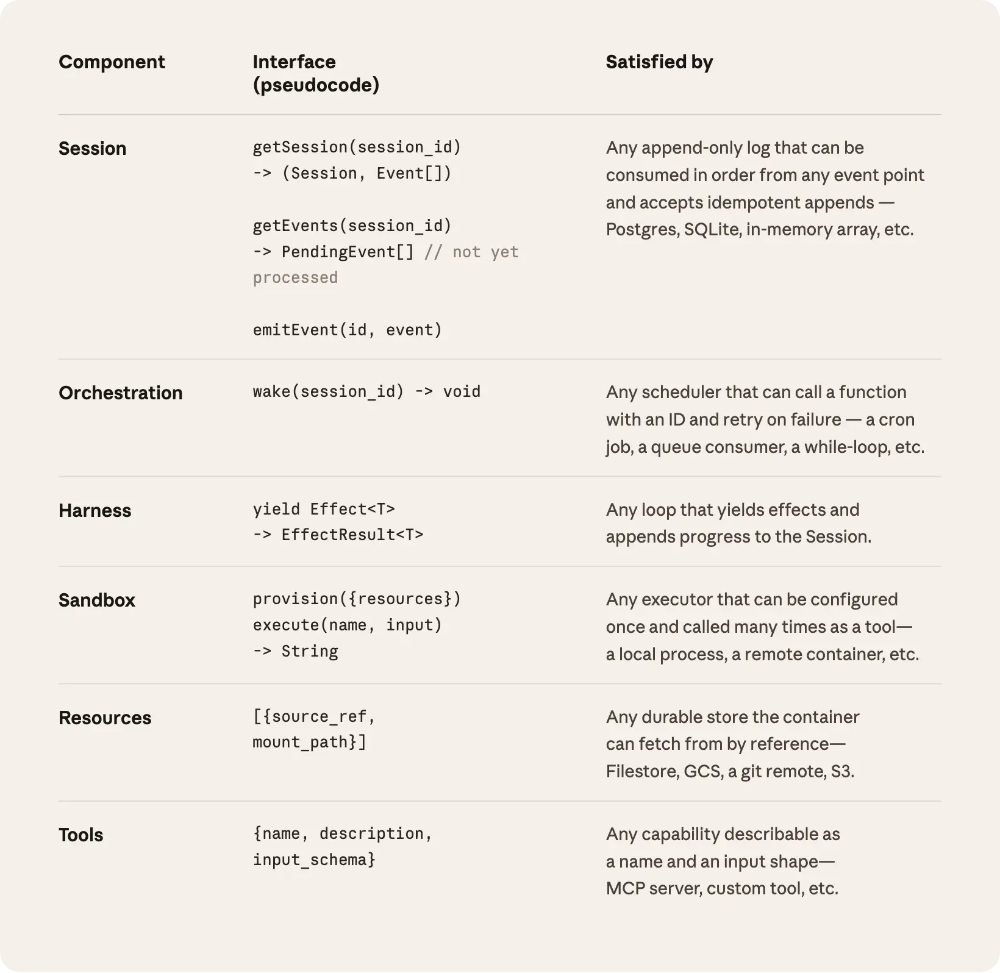

# 规模化托管智能体：将“大脑”与“手”解耦

来源：https://www.anthropic.com/engineering/managed-agents

---

_请通过我们的[文档](https://platform.claude.com/docs/en/managed-agents/overview)开始使用Claude托管智能体。_

工程博客中一个持续探讨的主题是如何[构建高效智能体](https://www.anthropic.com/engineering/building-effective-agents)以及为[长期运行任务](https://www.anthropic.com/engineering/harness-design-long-running-apps)设计[控制框架](https://www.anthropic.com/engineering/effective-harnesses-for-long-running-agents)。这些工作的共同主线在于：控制框架编码了关于Claude自身无法完成之事的假设。然而，这些假设需要被频繁审视，因为它们可能随着模型进步而[逐渐过时](http://www.incompleteideas.net/IncIdeas/BitterLesson.html)。

仅举一例：在[先前工作](https://www.anthropic.com/engineering/harness-design-long-running-apps)中我们发现，Claude Sonnet 4.5在感知到上下文限制临近时会过早结束任务——这种行为有时被称为“上下文焦虑”。我们通过在控制框架中添加上下文重置机制来解决此问题。但当我们在Claude Opus 4.5上使用相同框架时，发现该行为已消失。重置机制变成了冗余负担。

我们预期控制框架将持续演进。因此我们构建了托管智能体：这是Claude平台中的托管服务，通过一组精简接口代表您运行长期智能体——这些接口的设计旨在超越任何具体实现（包括我们当前运行的版本）而持久存在。

构建托管智能体意味着要解决计算机科学中的一个经典问题：如何为“[尚未设想的程序](http://www.catb.org/esr/writings/taoup/html/ch03s01.html)”设计系统。数十年前，操作系统通过将硬件虚拟化为抽象概念——_进程、文件_——解决了这个问题，这些抽象足够通用，能适应尚未出现的程序。抽象层比硬件更持久。`read()`命令无需关心访问的是1970年代的磁盘组还是现代SSD。上层抽象保持稳定，而下层实现可自由变更。

托管式智能体遵循相同的模式。我们对智能体的各个组件进行了虚拟化处理：会话（记录所有事件的仅追加日志）、控制框架（调用Claude并将Claude的工具调用路由至相关基础设施的循环机制）以及沙箱（Claude可运行代码和编辑文件的执行环境）。这使得每个组件的实现可以独立替换而不影响其他部分。我们关注的是这些接口的形态设计，而非其背后运行的具体内容。

## 切勿豢养"宠物"

我们最初将所有智能体组件置于单一容器中，这意味着会话、智能体控制框架和沙箱共享同一环境。这种做法确有优势，例如文件编辑可直接通过系统调用完成，且无需设计服务边界。

但将所有组件耦合进单一容器后，我们遭遇了一个经典的基础设施问题：我们豢养了一只["宠物"](https://cloudscaling.com/blog/cloud-computing/the-history-of-pets-vs-cattle/)。在"宠物与牲畜"的类比中，"宠物"是需要精心照料、不可替代的命名个体，而"牲畜"则是可互换的。在我们的场景中，服务器成了那只"宠物"：若容器故障，会话即丢失；若容器无响应，我们不得不像护理病患般恢复其运行。

修复容器意味着要调试无响应的卡滞会话。我们唯一的观察窗口是WebSocket事件流，但这无法揭示故障根源——控制框架的漏洞、事件流的数据包丢失或容器离线都呈现相同症状。为查明问题，工程师必须进入容器内部开启终端，但由于该容器常存储用户数据，这种做法实质上意味着我们丧失了调试能力。

第二个问题在于控制框架默认Claude处理的所有内容都与其共处同一容器。当客户要求将Claude接入其虚拟私有云时，他们要么需要将自身网络与我们的网络对等连接，要么必须在自有环境中运行我们的控制框架。当我们试图将控制框架接入不同基础设施时，这种内置于框架的预设就成为了障碍。

## 将大脑与双手解耦

我们最终采用的解决方案是将所谓的"大脑"（Claude及其控制程序）与"双手"（执行操作的沙箱和工具）以及"会话"（会话事件日志）进行解耦。每个部分都成为接口，对彼此几乎不做任何假设，且各自都能独立失效或被替换。

**控制程序脱离容器。** 将大脑与双手解耦意味着控制程序不再驻留在容器内部。它调用容器的方式与调用其他工具无异：`execute(名称, 输入) → 字符串`。容器变成了可随时替换的"牲口"。若容器崩溃，控制程序会将其捕获为工具调用错误并反馈给Claude。若Claude决定重试，便可通过标准配方重新初始化新容器：`provision({资源})`。我们不再需要费力修复故障容器。

**从控制程序故障中恢复。** 控制程序本身也变成了"牲口"。由于会话日志独立于控制程序存在，控制程序崩溃时无需保留任何状态。当某个控制程序失效时，可通过`wake(会话ID)`重启新实例，使用`getSession(编号)`取回事件日志，并从最后记录的事件处恢复运行。在智能体循环过程中，控制程序通过`emitEvent(编号, 事件)`向会话写入数据，从而建立持久化的事件记录。

**安全边界。** 在耦合设计中，Claude生成的任何不可信代码都与凭证运行在同一容器内——这意味着提示词注入攻击只需诱使Claude读取自身环境变量即可得手。一旦攻击者获取令牌，就能创建全新的无限制会话并分配任务。虽然限定权限是显而易见的缓解措施，但这本质上是在赌Claude无法利用受限令牌执行操作——而Claude正变得越来越智能。根本性的结构修复方案是确保令牌永远无法从运行Claude生成代码的沙箱中访问。

我们采用了两种模式来确保这一点。认证信息可以与资源捆绑，也可以存储在沙箱外的保险库中。对于Git，我们使用每个仓库的访问令牌在沙箱初始化时克隆仓库，并将其连接到本地git远程。Git的`push`和`pull`操作可以在沙箱内部直接执行，而代理本身从不处理令牌。对于自定义工具，我们支持MCP并将OAuth令牌存储在安全的保险库中。Claude通过专用代理调用MCP工具；该代理接收与会话关联的令牌。代理随后可以从保险库获取相应的凭证并调用外部服务。整个框架始终不会接触任何凭证信息。

## 会话并非Claude的上下文窗口

长期任务常常超出Claude上下文窗口的长度，而解决这一问题的标准方法都涉及不可逆的保留决策。我们在[先前关于上下文工程的研究](https://www.anthropic.com/engineering/effective-context-engineering-for-ai-agents)中探讨过这些技术。例如，压缩技术允许Claude保存其上下文窗口的摘要，记忆工具则让Claude能将上下文写入文件，从而实现跨会话学习。这可以与上下文修剪相结合，选择性地移除旧工具结果或思考块等标记。

但选择性保留或丢弃上下文的不可逆决策可能导致失败。很难预知未来步骤需要哪些标记。如果消息经过压缩步骤转换，框架会从Claude的上下文窗口中移除已压缩的消息，这些消息只有在被存储的情况下才能恢复。先前研究[已探索过](https://arxiv.org/pdf/2512.24601)通过将上下文存储为存在于上下文窗口_之外_的对象来解决此问题的方法。例如，上下文可以是REPL中的一个对象，LLM通过编写代码来过滤或切片它以进行程序化访问。

在托管代理中，会话提供了同样的优势，它作为一个上下文对象存在于Claude的上下文窗口之外。但上下文并非存储在沙箱或REPL中，而是持久保存在会话日志里。接口`getEvents()`允许大脑通过选择事件流的位置切片来查询上下文。该接口使用灵活，大脑可以从上次停止读取的位置继续，回溯到特定时刻之前的几个事件以查看前因后果，或在执行特定操作前重新读取上下文。

任何获取到的事件在传入Claude上下文窗口前，都可在控制框架中进行转换。这些转换可以是控制框架编码的任何操作，包括为实现高提示缓存命中率而进行的上下文组织，以及上下文工程。我们将可恢复的上下文存储（在会话中）与任意的上下文管理（在控制框架中）分离，是因为我们无法预测未来模型需要何种具体的上下文工程技术。这些接口将上下文管理推给了控制框架，仅保证会话的持久性和可查询性。

##
多脑协同，多手联动

**多脑协同。** 将大脑与执行器解耦解决了我们早期客户的一个主要痛点。当团队希望Claude在其自有VPC中操作资源时，唯一的途径是将他们的网络与我们的网络对等连接，因为原本承载控制框架的容器默认所有资源都位于其相邻位置。一旦控制框架移出容器，这种假设便不复存在。这一变更还带来了性能提升。最初将大脑置于容器中时，意味着每个大脑都需要独立的容器。对于每个大脑，在容器配置完成前无法进行任何推理；每个会话都需要预先承担完整的容器设置成本。每个会话——即使是永远不会触及沙箱的会话——都必须克隆代码库、启动进程、从我们的服务器获取待处理事件。

这段等待时间体现在首令牌生成时间（TTFT）上，它衡量了会话从接收任务到生成首个响应令牌之间的等待时长。TTFT是用户最能直接**感知**的延迟。

将"大脑"与"手"解耦意味着容器仅在被需要时，才由大脑通过工具调用`execute(name, input) → string`进行调配。因此，无需立即使用容器的会话便无需等待。一旦编排层从会话日志中提取待处理事件，推理过程即可启动。采用这种架构后，我们的p50 TTFT降低了约60%，p95 TTFT降幅超过90%。扩展到多个大脑只需启动多个无状态执行框架，并在必要时将它们与"手"连接。

**多手协同**。我们还希望实现每个大脑连接多只"手"的能力。实践中，这意味着Claude必须对多个执行环境进行推理，并决定将任务发送至何处——这比在单一终端中操作更具认知挑战。我们最初将大脑置于单一容器中，因为早期模型尚不具备这种能力。随着智能水平提升，单一容器反而成为限制：当该容器故障时，大脑所连接的所有"手"的状态都会丢失。

大脑与手的解耦使每只"手"都成为工具`execute(name, input) → string`：输入名称和参数，返回字符串结果。该接口支持任何自定义工具、MCP服务器及我们自研工具。执行框架无需知晓沙盒环境是容器、手机还是宝可梦模拟器。由于任何"手"都不与特定大脑绑定，大脑之间可以互相传递"手"的使用权。

## 结论

我们面临的挑战由来已久：如何为"尚未设想的程序"设计系统。操作系统通过将硬件虚拟化为足够通用的抽象层，已支撑了数十年来尚未出现的程序。通过"托管智能体"项目，我们致力于设计一个能够兼容未来执行框架、沙盒环境或其他围绕Claude组件的系统。

托管代理是一种元驾驭框架，秉承相同理念，对Claude未来所需的具体驾驭方式不作预设。相反，这是一个具备通用接口的系统，能够兼容多种不同的驾驭框架。例如，Claude代码是我们广泛用于各类任务的优秀驾驭框架。我们也已证明，针对特定任务的代理驾驭框架在垂直领域表现卓越。托管代理可以兼容所有这些框架，并随时间推移与Claude的智能水平保持同步。

元驾驭设计意味着对Claude的交互接口进行标准化：我们预期Claude需要具备操作状态（会话）和执行计算（沙箱）的能力。同时预期Claude需要能够扩展到多"大脑"与多"执行端"的协同运作。我们设计的接口确保这些功能能够长期稳定安全地运行，但对Claude所需"大脑"或"执行端"的数量及部署位置不作任何预设。

## 致谢

本文由Lance Martin、Gabe Cemaj和Michael Cohen共同撰写。感谢Nodir Turakulov和Jeremy Fox就相关议题进行的建设性讨论。特别感谢代理API团队及Jake Eaton所作出的贡献。
