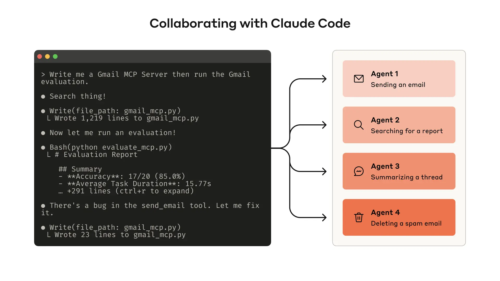
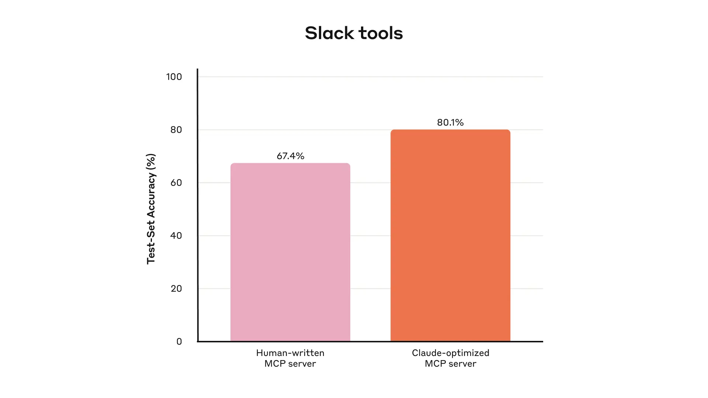
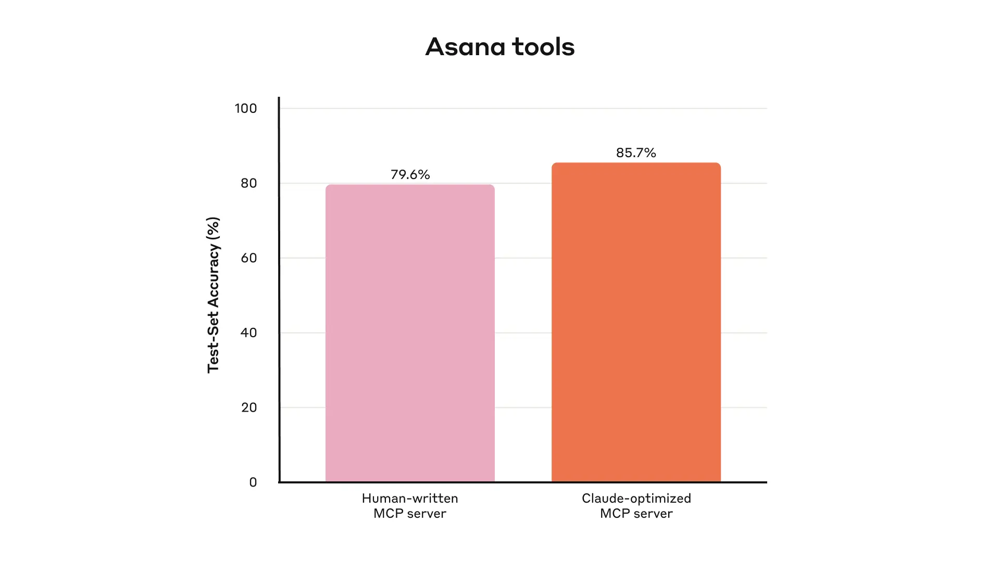
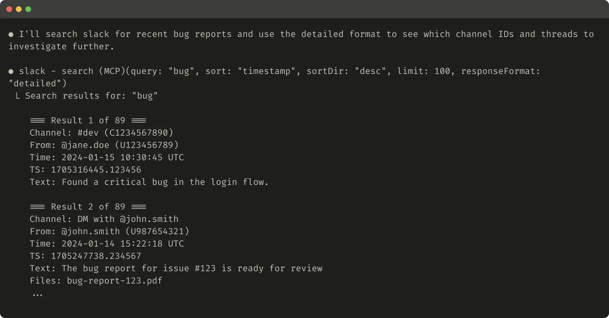
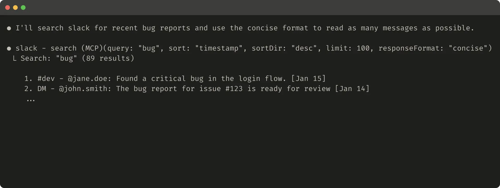
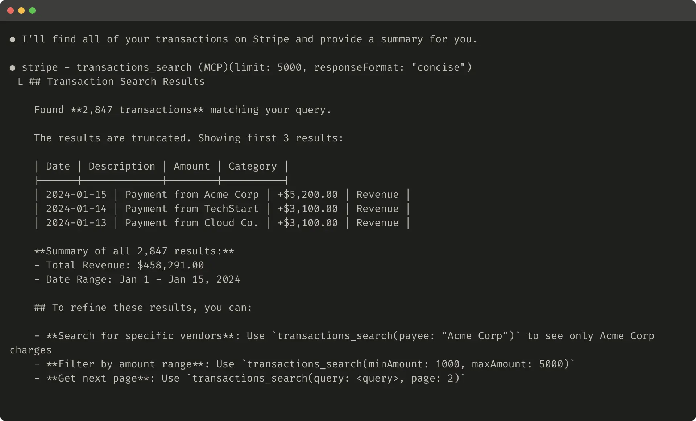
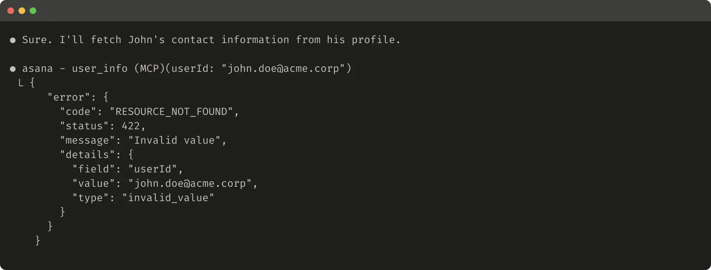
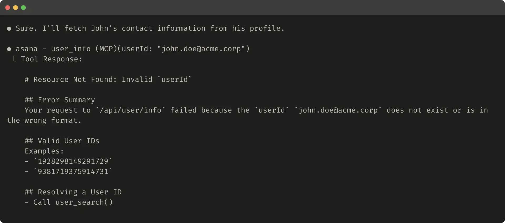

# 借助智能体，为智能体编写高效工具

来源：https://www.anthropic.com/engineering/writing-tools-for-agents

---

[模型上下文协议（MCP）](https://modelcontextprotocol.io/docs/getting-started/intro)能够为LLM智能体配备数百种工具，以解决现实世界中的任务。但我们如何使这些工具发挥最大效能？

在这篇文章中，我们将介绍我们在提升各类智能体AI系统性能方面最有效的技术。

我们首先会涵盖如何：

* 构建和测试你的工具原型
* 与智能体一起创建并运行全面的工具评估
* 与Claude Code等智能体协作，自动提升你的工具性能

最后，我们将总结在此过程中发现的编写高质量工具的关键原则：

* 选择正确的工具来实现（以及不实现）
* 通过命名空间为工具功能定义清晰边界
* 从工具向智能体返回有意义的上下文信息
* 为提升令牌效率优化工具响应
* 对工具描述和规格进行提示工程

构建评估体系可以让你系统地衡量工具的性能。你可以使用Claude Code根据此评估自动优化你的工具。

## 什么是工具？

在计算领域，确定性系统在给定相同输入时每次都会产生相同的输出，而**非确定性**系统——比如智能体——即使在相同的初始条件下也可能生成不同的响应。

当我们传统地编写软件时，我们是在建立确定性系统之间的契约。例如，像`getWeather(“NYC”)`这样的函数调用，每次被调用时都会以完全相同的方式获取纽约市的天气信息。

工具是一种新型软件，它体现了确定性系统与非确定性智能体之间的契约关系。当用户询问"今天我需要带伞吗？"时，智能体可能会调用天气工具、根据常识回答、甚至先提出关于位置的澄清问题。有时，智能体可能会出现幻觉，甚至无法掌握工具的使用方法。

这意味着在为智能体编写软件时，我们需要从根本上重新思考方法：不应像为其他开发者或系统编写函数和API那样来编写工具和[MCP服务器](https://modelcontextprotocol.io/)，而需要专门为智能体进行设计。

我们的目标是通过让智能体运用工具来实施多种成功策略，从而扩大其有效解决各类任务的能力范围。幸运的是，根据我们的经验，对智能体最"符合人体工学"的工具，最终也往往能让人类感到出乎意料的直观易懂。

## 如何编写工具

本节将介绍如何与智能体协作，共同编写并改进提供给它们的工具。首先快速搭建工具原型并进行本地测试，接着运行全面评估以衡量后续改进效果。通过与智能体协同工作，您可以反复进行工具评估与优化的循环，直至智能体在现实任务中展现出卓越性能。

### 构建原型

若不亲自动手实践，很难预判哪些工具会让智能体感到操作顺畅，哪些则不然。请从快速搭建工具原型开始。如果您使用[Claude Code](https://www.anthropic.com/claude-code)编写工具（可能采用单次生成方式），建议为Claude提供工具所依赖的任何软件库、API或SDK（可能包括[MCP SDK](https://modelcontextprotocol.io/docs/sdk)）的文档说明。在官方文档网站上通常可以找到存储于扁平化`llms.txt`文件中的LLM友好型文档（这是我们[API的文档](https://docs.anthropic.com/llms.txt)）。

将你的工具封装在[本地MCP服务器](https://modelcontextprotocol.io/docs/develop/connect-local-servers)或[桌面扩展](https://www.anthropic.com/engineering/desktop-extensions)（DXT）中，可以让你在Claude Code或Claude桌面应用中连接并测试这些工具。

要将本地MCP服务器连接到Claude Code，请运行 `claude mcp add <名称> <命令> [参数...]`。

要将本地MCP服务器或DXT连接到Claude桌面应用，请分别前往 `设置 > 开发者` 或 `设置 > 扩展`。

工具也可以直接传入[Anthropic API](https://docs.anthropic.com/en/docs/agents-and-tools/tool-use/overview)调用中进行程序化测试。

亲自测试工具以发现任何粗糙之处。收集用户反馈，围绕你期望工具支持的用例和提示建立直觉。

### 运行评估

接下来，你需要通过运行评估来衡量Claude使用你工具的效果。首先，基于真实世界用途生成大量评估任务。我们建议与智能体协作，帮助分析结果并确定如何改进工具。在我们的[工具评估指南](https://platform.claude.com/cookbook/tool-evaluation-tool-evaluation)中查看端到端的流程。

我们内部Slack工具的保留测试集性能

**生成评估任务**

借助早期原型，Claude Code可以快速探索你的工具并创建数十个提示和响应对。提示应受真实世界用途启发，并基于真实的数据源和服务（例如内部知识库和微服务）。我们建议避免使用过于简单或表面的“沙盒”环境，这些环境无法以足够的复杂性对你的工具进行压力测试。强大的评估任务可能需要多次工具调用——可能达到数十次。

以下是一些强大任务的示例：

*   安排下周与简会面，讨论我们最新的Acme Corp项目。附上上次项目规划会议的记录，并预订一间会议室。
*   客户ID 9182报告称，他们在一次购买尝试中被重复扣款三次。查找所有相关日志条目，并确认是否有其他客户受到同一问题影响。
*   客户Sarah Chen刚刚提交了取消服务请求。准备一份挽留方案。需确定：(1) 客户离开的原因，(2) 哪种挽留方案最具吸引力，(3) 在提出方案前需注意的风险因素。

以下是一些较简单的任务：

*   安排下周与jane@acme.corp的会议。
*   在支付日志中搜索`purchase_complete`和`customer_id=9182`。
*   查找客户ID 45892的取消服务请求。

每个评估提示都应搭配可验证的响应或结果。验证机制可以简单到直接对比标准答案与采样响应的字符串，也可以复杂到调用Claude进行判断。避免使用过于严格的验证器，以免因格式、标点或合理表述差异而拒绝正确响应。

对于每个提示-响应对，您还可以选择性地指定期望智能体调用哪些工具来完成任务，以评估智能体是否能在测试中准确理解各工具的用途。但由于可能存在多种有效解决路径，请尽量避免过度限定或局限于特定策略。

**执行评估**

我们建议通过直接调用LLM API以编程方式运行评估。采用简单的智能体循环（用`while`循环包裹交替进行的LLM API调用和工具调用）：每个评估任务对应一个循环。每个评估智能体应接收单个任务提示及可用工具集。

在您的评估智能体系统提示中，我们建议指导智能体不仅输出结构化响应块（用于验证），还应输出推理与反馈块。指导智能体在工具调用和响应块**之前**输出这些内容，可能通过触发思维链行为来提升大语言模型的有效智能水平。

若您使用Claude进行评估，可开启[交错思考](https://docs.anthropic.com/en/docs/build-with-claude/extended-thinking#interleaved-thinking)功能以获得现成的类似效果。这将帮助您探查智能体调用或跳过特定工具的原因，并突出显示工具描述与规范中需要改进的具体领域。

除顶层准确率外，我们建议收集其他指标，例如单个工具调用与任务的总运行时长、工具调用总次数、总令牌消耗量以及工具错误数。追踪工具调用有助于揭示智能体采用的常见工作流程，并为工具整合提供优化机会。

我们内部Asana工具的留出测试集表现

****

**结果分析**
智能体是您发现问题的得力助手，能够就矛盾的工具描述、低效的工具实现、令人困惑的工具模式等各方面提供反馈。但请注意，智能体在反馈和响应中**省略**的内容往往比其包含的内容更重要。大语言模型并不总是[言为心声](https://www.anthropic.com/research/tracing-thoughts-language-model)。

请观察智能体在何处陷入困境或产生困惑。仔细阅读评估智能体的推理与反馈（或思维链）以识别粗糙边缘。审阅原始对话记录（包括工具调用与工具响应）以捕捉智能体思维链中未明确描述的行为。解读言外之意：请记住您的评估智能体未必知晓正确答案与策略。

分析你的工具调用指标。大量冗余的工具调用可能意味着需要适当调整分页或令牌限制参数；大量因参数无效导致的工具错误可能表明工具描述需要更清晰或提供更好的示例。当我们推出Claude的[网络搜索工具](https://www.anthropic.com/news/web-search)时，我们发现Claude不必要地在工具的`query`参数后附加`2025`，这导致搜索结果出现偏差并降低了性能（我们通过改进工具描述引导Claude走向正确方向）。

### 与智能体协作

你甚至可以让智能体分析你的结果并为你改进工具。只需将评估智能体的记录串联起来，粘贴到Claude Code中。Claude擅长分析记录并一次性重构大量工具——例如，确保在做出新更改时工具实现和描述保持自洽。

事实上，本文中的大部分建议都来自我们使用Claude Code反复优化内部工具实现的过程。我们的评估建立在内部分工作空间之上，反映了内部工作流程的复杂性，包括真实项目、文档和消息。

我们依赖保留的测试集来确保不会对“训练”评估产生过拟合。这些测试集显示，即使超越“专家”级工具实现所达到的水平，我们仍能提取额外的性能改进——无论这些工具是由研究人员手动编写还是由Claude自身生成。

在下一节中，我们将分享从这一过程中学到的一些经验。

## 编写高效工具的原则

在本节中，我们将所学提炼为几条编写高效工具的指导原则。

### 为智能体选择合适的工具

工具增多并不总能带来更好的结果。我们观察到一个常见误区：许多工具仅仅是对现有软件功能或API端点的简单封装——无论这些工具是否适合智能体使用。这是因为智能体与传统软件存在本质的"功能可供性"差异——即它们对工具潜在操作方式的感知逻辑截然不同。

大语言模型智能体存在有限的"上下文"处理能力（即单次可处理的信息量存在上限），而计算机内存则廉价且充裕。以通讯录联系人搜索任务为例：传统软件可以高效地逐条存储和处理联系人列表，在检查完当前条目后再转向下一条。

然而，若大语言模型智能体使用一个返回"所有联系人"的工具，并需要逐词通读全部内容，就会将宝贵的上下文空间浪费在无关信息上（试想象通过逐页通读的方式在通讯录中搜索联系人——这无异于暴力搜索）。对智能体和人类而言，更优且更自然的做法是首先定位到相关页面（例如按字母索引快速跳转）。

我们建议针对特定高价值工作流构建少量精心设计的工具，这些工具应当与您的评估任务相匹配，并以此为基础逐步扩展。在通讯录案例中，与其开发`list_contacts`（列出联系人）工具，不如选择实现`search_contacts`（搜索联系人）或`message_contact`（联系某人）工具。

工具可以整合多项功能，在单次调用中处理多个离散操作（或API调用）。例如，工具可以在响应中嵌入相关元数据，或将频繁串联的多步骤任务压缩为单次工具调用。

以下是一些具体示例：

*   与其分别实现 `list_users`、`list_events` 和 `create_event` 工具，不如考虑实现一个 `schedule_event` 工具，它能查找可用时段并直接安排活动。
*   与其实现 `read_logs` 工具，不如考虑实现 `search_logs` 工具，它仅返回相关的日志行及部分上下文信息。
*   与其实现 `get_customer_by_id`、`list_transactions` 和 `list_notes` 工具，不如实现 `get_customer_context` 工具，一次性汇总客户近期所有相关信息。

请确保您构建的每个工具都具有明确、独特的功能定位。工具应使智能体能够像人类一样（在获得相同底层资源的前提下）对任务进行分解和解决，同时减少原本可能被中间输出消耗的上下文空间。

过多的工具或功能重叠的工具也可能分散智能体对高效策略的专注度。精心、有选择地规划要构建（或不构建）的工具，往往能带来显著收益。

### 工具命名空间管理

您的AI智能体可能会接入数十个MCP服务器和数百种不同的工具——包括其他开发者创建的工具。当工具功能重叠或用途模糊时，智能体可能难以确定该使用哪个工具。

命名空间管理（将相关工具归入共同前缀下）有助于在大量工具间划定界限；MCP客户端有时会默认采用这种方式。例如，按服务（如 `asana_search`、`jira_search`）和资源类型（如 `asana_projects_search`、`asana_users_search`）进行命名空间划分，能帮助智能体在适当时机选择正确的工具。

我们发现，选择前缀式或后缀式命名空间策略会对工具使用评估产生显著影响。这种影响因大语言模型而异，我们建议您根据自身评估结果选择合适的命名方案。

智能体可能会调用错误的工具、以错误参数调用正确工具、调用工具数量不足，或错误处理工具返回结果。通过选择性实现那些名称能自然反映任务细分功能的工具，你既能减少载入智能体上下文的工具数量与描述说明，又能将智能体计算任务从上下文转移至工具调用本身。这种做法可全面降低智能体犯错风险。

### 从工具返回有意义上下文

同理，工具实现应注意仅向智能体返回高信息价值内容。应当优先考虑上下文相关性而非灵活性，并避免使用底层技术标识符（例如：`uuid`、`256px_image_url`、`mime_type`）。像`name`、`image_url`、`file_type`这类字段更有可能直接指导智能体的后续行动与响应。

相较于晦涩的标识符，智能体在处理自然语言名称、术语或标识符时通常表现更出色。我们发现，仅将任意字母数字组成的UUID解析为语义更明确、可解释性更强的语言表述（甚至采用0起始索引的ID方案），就能通过减少幻觉显著提升Claude在检索任务中的精确度。

某些情况下，智能体可能需要同时处理自然语言与技术标识符输出的灵活性——即便仅用于触发下游工具调用（例如：`search_user(name='jane')` → `send_message(id=12345)`）。你可以通过在工具中设置简单的`response_format`枚举参数来兼顾两者，让智能体控制工具返回`"concise"`（简洁）或`"detailed"`（详细）响应（下图示例）。

你还可以添加更多格式以实现更高灵活性，类似于GraphQL中可精确选择所需信息片段的方式。以下示例展示控制工具响应详略程度的ResponseFormat枚举：

    enum ResponseFormat {
       DETAILED = "detailed",
       CONCISE = "concise"
    }

复制

以下是详细工具响应示例（206个词元）：

这是一个简洁工具响应的示例（72个词元）：

Slack的对话线程和线程回复通过唯一的`thread_ts`标识符进行识别，该标识符是获取线程回复所必需的。`thread_ts`及其他ID（`channel_id`、`user_id`）可通过"详细"工具响应获取，以便支持需要这些ID的后续工具调用。而"简洁"工具响应仅返回线程内容，不包含ID信息。在此示例中，使用"简洁"工具响应可节省约三分之二的词元开销。

甚至工具响应的结构（如XML、JSON或Markdown格式）也会影响评估性能：不存在适用于所有场景的通用解决方案。这是因为大语言模型基于下一词元预测进行训练，往往在处理与其训练数据格式匹配的内容时表现更佳。最优响应结构会因具体任务和智能体类型存在显著差异。我们建议您根据自身评估结果选择最合适的响应结构。

### 为词元效率优化工具响应

优化上下文质量固然重要，但优化工具响应中返回给智能体的上下文_数量_同样关键。

对于可能消耗大量上下文的工具响应，我们建议结合使用分页、范围选择、筛选和/或截断功能，并设置合理的默认参数值。在Claude Code中，我们默认将工具响应限制在25,000个词元以内。虽然预计智能体的有效上下文长度会随时间增长，但对上下文高效工具的需求将持续存在。

若选择截断响应，请务必通过有效指引引导智能体。您可以直接鼓励智能体采用更节省词元的策略，例如在知识检索任务中执行多次精准的小范围搜索，而非单次宽泛搜索。同样地，如果工具调用出现错误（例如在输入验证阶段），您可以通过提示工程优化错误响应，清晰传达具体可行的改进建议，而非返回晦涩的错误代码或追踪信息。

以下是一个工具响应被截断的示例：

以下是一个无益的错误响应示例：

以下是一个有益的错误响应示例：

工具截断和错误响应可以引导智能体采取更节省令牌的工具使用行为（例如使用筛选器或分页功能），或展示正确格式化的工具输入示例。

### 提示工程优化工具描述

现在我们来探讨提升工具效能最有效的方法之一：通过提示工程优化工具描述和规范。由于这些内容会载入智能体的上下文，它们能共同引导智能体采取有效的工具调用行为。

编写工具描述和规范时，请想象您正在向团队新成员介绍这个工具。思考您可能隐含掌握的上下文信息——专业查询格式、小众术语定义、底层资源间关联等——并将其明确表达出来。通过清晰描述（并采用严格数据模型强制约束）预期输入和输出，避免歧义。特别要注意输入参数应具备明确无误的命名：例如用`user_id`替代`user`作为参数名。

通过评估机制，您可以更可靠地衡量提示工程带来的影响。即使是对工具描述的微小改进，也可能产生显著效果。在我们对工具描述进行精准优化后，Claude Sonnet 3.5在[SWE-bench Verified](https://www.anthropic.com/engineering/swe-bench-sonnet)评估中取得了业界领先的性能，错误率大幅降低，任务完成度显著提升。

您可以在我们的[开发者指南](https://docs.anthropic.com/en/docs/agents-and-tools/tool-use/implement-tool-use#best-practices-for-tool-definitions)中找到工具定义的其他最佳实践。如果您正在为Claude构建工具，我们也建议阅读关于工具如何动态加载到Claude[系统提示](https://docs.anthropic.com/en/docs/agents-and-tools/tool-use/implement-tool-use#tool-use-system-prompt)的相关内容。最后，如果您正在为MCP服务器编写工具，[工具注解](https://modelcontextprotocol.io/specification/2025-06-18/server/tools)有助于说明哪些工具需要开放世界访问权限或会进行破坏性更改。

## 展望未来

要为智能体构建有效的工具，我们需要将软件开发实践从可预测的确定性模式重新定位到非确定性模式。

通过本文描述的迭代式、评估驱动流程，我们发现了造就成功工具的一致模式：有效的工具需要经过深思熟虑的清晰定义，明智地运用智能体上下文，能够以多样化工作流组合使用，并使智能体能够直观地解决现实世界任务。

展望未来，我们预计智能体与世界交互的具体机制将持续演进——从MCP协议的更新到底层大语言模型本身的升级。通过采用系统化、评估驱动的方法来改进智能体工具，我们可以确保随着智能体能力不断增强，它们所使用的工具也将同步进化。

## 致谢

本文由Ken Aizawa撰写，并得到以下同事的宝贵贡献：研究团队（Barry Zhang, Zachary Witten, Daniel Jiang, Sami Al-Sheikh, Matt Bell, Maggie Vo）、MCP团队（Theodora Chu, John Welsh, David Soria Parra, Adam Jones）、产品工程团队（Santiago Seira）、市场团队（Molly Vorwerck）、设计团队（Drew Roper）以及应用人工智能团队（Christian Ryan, Alexander Bricken）。

1超越底层大语言模型本身的训练。

[想要了解更多？探索课程](https://anthropic.skilljar.com/)
