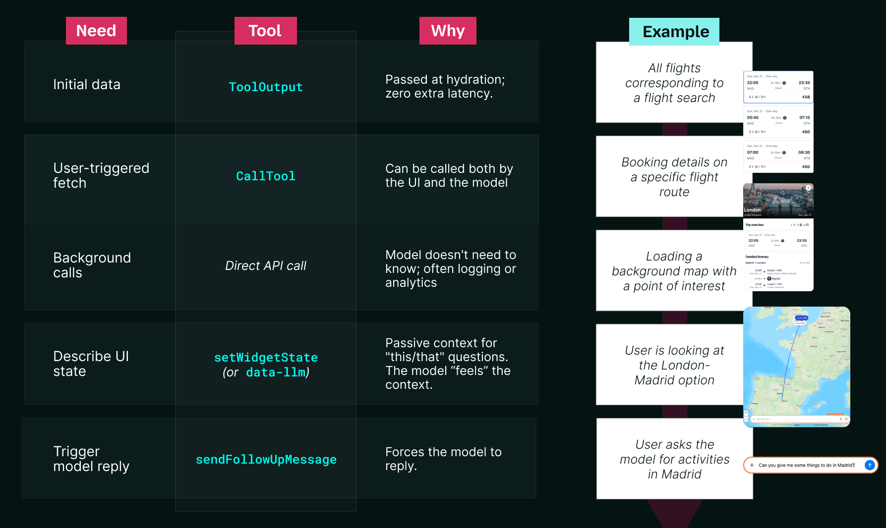
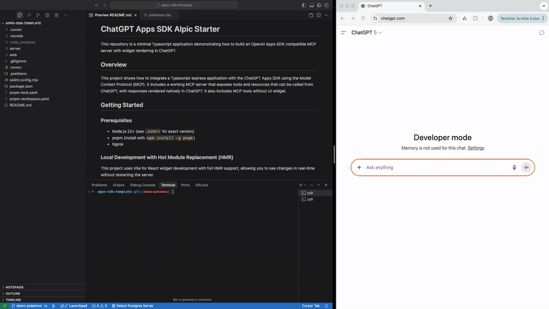

# 构建ChatGPT应用的15条经验总结

来源：https://developers.openai.com/blog/15-lessons-building-chatgpt-apps

---

在[Alpic](https://alpic.ai)，我们相信下一代产品和服务将围绕**AI优先体验**构建——用户与模型协作的交互界面，而非传统的、预设的UI工作流程。

当OpenAI发布**应用SDK**时，我们立即着手进行开发。在三个月的时间里，我们为内部使用及B2B、B2C领域的客户（如**旅游、零售和SaaS行业**）构建了二十多个ChatGPT应用。

我们很早就发现：**构建ChatGPT应用与构建传统网页或移动应用有着本质区别**。在网页环境中行之有效的模式（即时数据获取、UI驱动的状态、显式用户配置等）在智能体环境中往往失效，甚至会对体验产生负面影响。

本文提炼了我们在构建真实场景ChatGPT应用过程中总结的**15条核心经验**，并介绍了我们如何将这些经验融入开源框架[**Skybridge**](https://github.com/alpic-ai/skybridge)以及[**Codex技能模块**](https://github.com/alpic-ai/skybridge/tree/main/skills/chatgpt-app-builder)，以帮助开发者更高效地进行创意构思、开发、测试和部署应用。

## 三体协同难题

传统网页应用很简单：只有**用户**和**界面**两个要素。而在ChatGPT应用中，系统引入了第三个要素：**模型**。

构建ChatGPT应用最棘手的挑战之一，就是管理这三个要素之间的信息流转。如果用户点击组件中的“选择”按钮，界面会视觉更新，但作为对话核心的模型却无法感知这一变化——除非你显式传递上下文信息。此时若用户提问：“_给我更多关于这个产品的详细信息_”，模型完全不知道用户实际指向的内容。

我们称之为**情境不对称**——每个主体对系统都只有部分了解，没有谁能掌握全貌。构建优秀的ChatGPT应用，关键在于保持所有信息同步，而在于决定_哪些_信息应该共享、_何时_共享，以及_谁_需要知晓这些信息。能否解决这个问题，决定了应用是笨拙生硬还是流畅智能。

### 1. 并非所有情境都需要共享

我们最初的本能反应是“把所有信息同步到所有地方”，结果这成了我们最早犯的错误之一。

实践中，ChatGPT应用的不同部分往往需要对同一状态持有_刻意区分_的视角。原因在于：

*   **性能考量：** UI组件通常需要比模型多得多的数据，例如在旅行预订应用中，这可能包括图片、价格变体、预加载选项等。将所有数据都发送给模型会增加令牌使用量、延迟和认知干扰。
*   **逻辑设计：** 某些信息必须基于设计保持不对称。在我们早期的一款《山谷谋杀案》推理游戏中，模型需要知道凶手是谁才能正确扮演角色，而UI和用户则不能知晓。在《时间到》这类游戏中，情况则相反：UI向用户显示秘密词汇，而模型必须对此一无所知。

我们得到的教训不是“永远同步一切”，而是：**明确决定谁需要知道什么**。我们通过不同的_工具输出_字段将其规范化：

| 字段 | 用途 | 对谁可见 |
| :--- | :--- | :--- |
| `structuredContent` | 供组件和模型使用的类型化数据 | 组件和模型（通过`toolOutput`和`callTool`函数） |
| `_meta` | 响应元数据 | 仅组件可见，对模型隐藏 |

例如，在《时间到》游戏中，我们仅通过`_meta`字段将秘密词汇传递给组件，让模型根据用户的提示来猜测词汇。

### 2. 延迟加载不适用于AI应用

由于来自Web开发背景，我们默认采用了延迟加载：用户点击时再获取数据；按需加载细节；优先优化初始负载最小化。

在ChatGPT中，范式是相反的：工具调用意味着延迟，由于安全沙箱和模型推理，通常需要几秒钟。

在实践中，我们学会了积极前置加载：尽可能多地将数据发送到初始工具响应中，并通过 _window.openai.toolOutput_ 来激活小部件。这几乎总是带来更快、响应更迅速的用户体验。

当然，如果小部件可以安全地从公共API端点获取数据，并且不需要与模型共享信息，那么在小部件内部使用经典的XHR调用总是可行的。但大多数时候，你希望模型能够自主调用工具，以保持对话式的体验。

### 3\. 模型需要可见性

当用户与小部件交互（例如，在列表中选择特定产品）然后在聊天中提问时，会出现一个微妙但关键的问题。如果模型不知道用户指的是UI的哪一部分，它将无法正确回答。

为此，我们使用了 `window.openai.setWidgetState(state)`，它允许你存储特定的状态数据，这些数据会在下一次用户与模型交互时添加到模型的上下文中。

随着应用程序复杂度的增加，我们发现我们在很多地方添加了 `setWidgetState`，以便模型能够跟踪导航。因此，我们决定引入一种声明式的方式来描述UI上下文。我们不再在每次交互时强制更新模型，而是直接将 `data-llm` 属性附加到组件上：

    

为了实现这一点，我们构建了一个Vite插件，它会抓取这些属性并自动更新widgetState。从模型的角度来看，它只需在适当的时间接收相关的UI上下文，而无需开发人员手动同步每次交互。

你可以在我们创建的[开源框架](https://github.com/alpic-ai/skybridge)中找到这个Vite插件（以及我们在本文中分享的许多其他技巧），该框架旨在与社区分享我们的经验。

### 4\. 不同交互需要不同的API

ChatGPT应用涉及小部件、服务器与模型之间的多种交互路径。这些路径不可互换：每条路径都旨在支持不同类型的交互。

构建ChatGPT应用的核心经验之一，是明确这些通信路径，并审慎界定每种机制对应体验的哪一部分。

该路径的映射关系如下图所示：

这些经验奠定了ChatGPT应用的基础：上下文如何共享、模型如何获得可见性、不同交互如何在系统中传递。下一节将基于此基础，重点探讨其对UI设计的启示。

## 为AI重塑用户界面

ChatGPT应用是一个全新的环境，因此我们迅速学会了摒弃对用户界面的固有认知，充分利用新功能。本节涵盖了我们为创建高效应用所需学习（及重新审视）的界面设计理念。

### 5\. 用户界面必须适配多种显示模式及其限制

ChatGPT应用并不局限于单一布局。根据调用方式和时机，同一小部件可能以三种不同的显示模式呈现。

应用可以**内嵌**在对话中显示，以**画中画（PiP）** 模式悬浮于对话上方，或在需要更多空间时切换至**全屏**模式。虽然画中画和全屏模式能实现更丰富的界面，但它们也引入了小部件无法控制的UI叠加层。必须考虑设备特定的安全区域（例如移动端常驻的关闭按钮），以避免内容被裁剪并优化交互体验。

经过实践，我们总结出关于显示模式及其适用场景的模式规律：

| 呈现方式 | 适用场景 |
|---|---|
| **内嵌模式** | 默认显示方式。小组件保留在对话历史记录中。 | 适用于快速交互 |
| **全屏模式** | 小组件占据整个屏幕，聊天栏位于底部。 | 若小组件功能复杂且需要大量空间（例如地图应用） |
| **画中画模式** | 尺寸与内嵌模式相同，但小组件始终悬浮在对话界面之上 | 若小组件在内容生成后仍需在后续对话中保持相关状态 |

### 6. 嵌入式环境中保持界面一致性至关重要

早期我们遇到的一个不确定性问题是：ChatGPT 应用应当拥有多大的视觉设计自由度？作为用户接触的新界面，它需要在自身应用内部以及与周边 ChatGPT 生态系统之间保持熟悉感和一致性。与独立产品不同，小组件存在于现有界面内部，任何视觉不一致都会立即凸显出来。

幸运的是，[OpenAI 应用 SDK 界面组件库](https://github.com/openai/apps-sdk-ui)为我们提供了明确的基准。

该组件库基于 Tailwind CSS 构建，提供开箱即用的组件、图标和设计标记，完美契合 ChatGPT 的设计体系。使用这套工具使我们能够快速推进开发，同时确保小组件与周边界面保持原生感和视觉一致性——即使在构建自定义组件时（例如我们的 Mapbox 集成功能）也是如此。

### 7. 语言优先的筛选机制

传统仪表板通常依赖布满复选框和范围滑块侧边栏。在智能体界面设计中，这往往是一种倒退。当用户能够直接用自然语言表达意图时（例如“欧洲地区预算 200 美元以下的阳光度假目的地”），强制他们操作多个界面控件反而增加使用阻力。用户理应能够直接表达需求。

因此我们决定在大多数应用中采用“无筛选控件”的设计思路。我们不再提供带有筛选排序选项的侧边栏，而是向模型提供工具参数的**取值列表（LOV）**。

这使得模型能够直接接收用户消息作为输入，避免其“猜测”可用选项。换言之，它实现了自然语言到后端API需求的直接映射。当用户输入“晴朗”时，模型会知道调用工具并设置weather=“sunny”。

### 8\. 文件能开启更丰富的交互体验

我们在构建复杂应用过程中总结出一个重要经验：文件不应被视为次要输入。在ChatGPT应用中，文件能够开启全新的交互模式。体验流程不必从表单或筛选器开始，而是可以从用户已有的内容直接切入。

例如在电商应用中，用户可以在聊天窗口上传商品照片，由模型自动识别后，直接在组件内无缝衔接商品匹配或发现流程。

这一功能通过文件在系统双端的流通得以实现。在模型端，工具可通过`openai/fileParams`直接处理聊天中上传的文件，使模型能够解析图像或其他用户提供的资源。在用户界面端，组件也可通过`window.openai.uploadFile`和`window.openai.getFileDownloadUrl`直接操作文件，既可在交互流程中请求文件上传，也能生成可供用户下载复用的文件。

## 投入生产环境

当应用从本地开发转向生产环境时，安全、配置和工具链等方面将面临全新考量。第三组经验正是围绕这些议题展开。

### 9\. CSP成为新时代的CORS

出于安全考虑，OpenAI在双重嵌套的iframe中渲染应用。内容安全策略（CSP）是iframe隔离的原生机制，该架构会严格执行CSP限制，常表现为典型的“本地运行正常，生产环境崩溃”现象。

与传统网页开发中宽松策略可能被允许的情况不同，应用SDK要求开发者进行精准配置。

在应用清单中，这意味着需要为每类交互审慎声明允许访问的域名：

字段| 用途| 示例| 常见错误
---|---|---|---
**connectDomains**|  API 与 XHR 请求| <https://api.weather.com>| 忘记区分测试环境 API 与生产环境。
**resourceDomains**|  图片、字体、脚本资源| <https://cdn.jsdelivr.net>| 使用通用 CDN（如 delivr.net）却未将其加入白名单
**frameDomains**|  嵌入 iframe 内容| <https://www.youtube.com>| 嵌入 YouTube 视频或 Mapbox 实例时未将其加入白名单。
**redirectDomains**|  无警告跳转的外部链接| <https://app.alpic.ai>| 遗漏结账页面或 OAuth 回调域名。

将 CSP 配置作为首要考量事项，在开发早期就妥善处理，为我们后期节省了大量生产环境调试时间。

### 10\. 微小组件标志的巨大影响

除了 CSP 之外，一小部分组件级设置决定了控件在组件、模型和宿主环境之间的共享方式。这些标志容易被忽视，但它们定义了导航、工具访问和发布的关键边界。

#### 宿主与导航边界

  * **`widgetDomain`** 是提交所必需的。它定义了全屏模式下“在 <应用> 中打开”按钮指向的默认位置，并参与来源白名单机制，因为组件会在 `<widgetDomain>.web-sandbox.oaiusercontent.com` 域名下渲染。我们使用 `setOpenInAppUrl` 根据上下文将用户引导至相应路径。

#### 模型与工具边界

  * **工具注解** 必须遵循发布规范。诸如 `readOnly`、`destructiveHint` 和 `openWorldHint` 等标志是必需的，并在提交时进行验证。
  * **工具可见性** 至关重要：不应被模型调用的工具必须明确标记为私有。

#### 组件执行边界

  * **`widgetAccessible`** 控制组件是否可以使用 `callTool` 自行调用工具。

这些设置单独来看都很微小，但共同决定了应用发布后是否能正确运行。

## 为快速迭代而优化

Apps SDK 正在快速发展，我们很兴奋能与其共同成长。为了支持流畅高效的开发流程，我们决定开发自己的开源框架并与社区分享。以下是我们总结的一些经验，旨在帮助开发者避免我们在初期遇到的一些开发体验问题。

### 11. 快速迭代需要热重载

我们首先解决的问题之一是迭代速度。由于长TTL资源缓存与使用JSON-RPC转发资源的结合，使得Vite或Next.js中常见的标准热模块重载无法直接适用于ChatGPT Apps。

在花费大量时间深入理解Vite内部机制后，我们开发了一个Vite插件，实现了在ChatGPT内部直接对小组件进行实时重载。该插件会拦截发往MCP服务器的资源请求，并将实时更新注入到ChatGPT的iframe中。看到IDE中的修改能即时在ChatGPT中呈现，极大地缩短了我们的反馈周期。

### 12. 并非所有测试都需在ChatGPT中进行

在ChatGPT上进行测试是黄金标准，但在初期迭代阶段，使用本地模拟器能帮助你更快推进，尤其是当你正在处理需要在开发者模式下重新加载应用的工具定义时。

为了加速早期迭代，我们构建了一个轻量级本地模拟器，模拟ChatGPT宿主环境，并配备了调试工具和针对应用的日志功能。这使得我们能在毫秒级别内迭代React状态和布局，而将真实的ChatGPT测试留用于验证模型交互和边界情况。

### 13. 移动端测试需要明确支持

移动端测试带来了另一个挑战：虽然通过隧道连接本地服务器是在ChatGPT中进行测试的必要条件，但Vite默认使用localhost，导致同一URL无法从其他设备访问。

我们通过扩展Vite插件来支持隧道端口上的域名转发，从而解决了这一问题，使得在iOS和Android设备上的测试不再受阻，并将移动端验证纳入我们的常规工作流程。

### 14. 熟悉的抽象（如React钩子）能加速前端开发

Apps SDK 提供了强大的功能，但主要通过底层的 JavaScript API 暴露。作为长期使用 React 的开发者，我们希望更贴近已掌握的概念。

因此，我们引入了一些对 React 友好的抽象——例如 `useCallTool`、`useWidgetState` 和 `useLocale` 这样的钩子，以及基于 Zustand 构建的、用于复杂数据流的更高级状态管理工具 `createStore`。重新引入熟悉的前端模式减少了样板代码，使小部件开发更接近现代 Web 工作流程。

## 将经验转化为 Codex 技能

### 15\. 将经验转化为可复用的工具

随着这些模式在多个应用中逐渐显现，我们清楚地意识到，反复重新发现它们正在拖慢我们的进度。为了让 ChatGPT 应用开发更快、更可预测，我们决定将这些经验直接编码到工具中，不仅为我们自己，也为整个社区。

这催生了两项互补的工作：

  1. **[Skybridge 框架](https://github.com/alpic-ai/skybridge)：** 一个开源的 React 框架，将本文描述的许多模式打包成可复用的构建块，包括我们的钩子（`useCallTool`、`useToolInfo`）、开发工具（HMR 和本地模拟器）以及 data-llm 属性。
  2. **chatgpt-apps-builder [Codex 技能](https://github.com/alpic-ai/skybridge/tree/main/skills/chatgpt-app-builder)：** 在框架之上，我们构建了一个专门的 Codex 技能，以支持完整的应用生命周期：
     * **构思：** 头脑风暴如何让应用具备“智能体”特性，而不仅仅是 Web 移植。
     * **代码生成：** 同时编写 React 前端和 MCP 服务器后端，并预配置所有正确的用户体验和用户界面模式。
     * **本地测试：** 启动开发服务器，并将本地应用连接到 ChatGPT，通过热重载进行实时迭代。
     * **质量保证与发布：** 根据 OpenAI 的提交指南运行结构化检查，包括内容安全策略验证、安全区域考虑和生产测试。
     * **应用部署：** 协助完成发布和迭代应用所需的最终步骤。

要安装并使用该技能，只需运行以下命令：

npx skills add alpic-ai/skybridge

您的浏览器不支持视频标签。

## 结论

构建ChatGPT应用需要重新思考上下文如何流动、界面如何响应，以及用户与模型如何协同工作。本文中的许多经验教训，都源于传统网页模式与智能体系统现实之间的差异。

通过分享这些经验，并将其融入我们的开源框架和Codex技能中，我们希望帮助团队减少重复发现相同问题的时间，将更多精力投入到探索这种新型交互模式所开启的可能性上。最引人注目的ChatGPT应用不会是对现有产品的简单移植，而是围绕这种全新的AI优先体验精心设计的交互体验。
