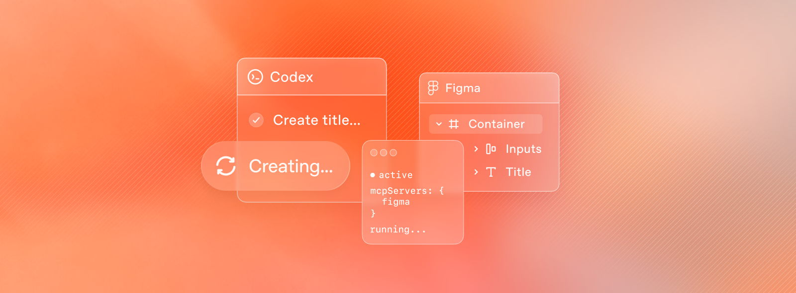

使用 Codex 和 Figma 构建前端 UI

Use Codex and Figma to bring real, running interfaces into Figma, refine them, and bring changes back to Codex.

作者：Yarden Katz，Figma 产品经理

从今天开始，你可以使用 Figma MCP 服务器从 Codex 生成 Figma 设计文件。MCP 服务器旨在支持双向移动，将工作中的 UI 带入 Figma 画布并轻松返回代码，这样你就可以在你的最佳想法上构建，而不仅仅是你的第一个想法。

Codex 桌面应用程序专为代理编码而构建。它提供了一个专注的界面，用于跨项目并行管理多个代理、跟踪进度而不丢失上下文以及集成外部工具。这种流畅性让人感觉很熟悉。在 Figma 中，团队的移动同样简单。画布专为探索和迭代而设计。这是一个最好的想法有空间成形的空间。通过将 Figma 画布连接到 Codex，探索精神直接延伸到开发工作流程中——为用户构建从原型到生产应用程序的一切解锁了一种强大的新方式。

从设计开始应用

Figma MCP 服务器的核心用例之一是从 Figma 文件检索上下文并将该上下文用于代码生成。Figma MCP 服务器可以从 Figma Design、Make 和 FigJam 文件捕获信息，并将其作为构建过程的一部分传递给 Codex。

要开始，请打开你计划从中构建应用程序的 Figma 文件。通过右键单击并选择"复制为"和"复制到所选内容的链接"来选择框架。

这些选择 URL 直接链接到 Figma 画布上的框架或节点。它们可以是单个元素或组件集合，但本质上它是代理将用于代码生成的源数据。选择可以来自 Figma Design、Make 或 FigJam 文件。获得 URL 后，打开 Codex 并选择新项目或现有项目。从这里你可以用这样的提示来指导 Codex：

help me implement this Figma design in code, use my existing design system components as much as possible.

这样的提示会指示代理从 Figma MCP 服务器调用 get_design_context 工具。该工具帮助从 Figma 文件提取关键设计信息，如布局、样式和组件信息，然后将该上下文提供给 Codex 用于代码生成。

除了提取设计信息外，Figma MCP 服务器还有许多其他有用的工具；有关完整列表，请务必查看我们的文档。

从代码到画布

在代码中迭代后，你会希望将设计带回画布以比较流程、探索替代方案并验证你的假设。Figma MCP 服务器可以轻松地将这些屏幕带回 Figma，而无需从浏览器手动重新创建。使用 generate_figma_design 工具，你可以将活的、运行的界面在几秒钟内变成完全可编辑的 Figma 框架——将真实的、可工作的 UI 直接带到画布上进行更深入的探索和协作。

首先你需要渲染应用程序的 UI。这可以通过本地或可通过 Web 服务器公开访问来完成。从那里，要求 Codex 帮助你生成新的 Figma 设计文件。

Codex 将引导你完成以下步骤：

决定是创建新的 Figma 文件还是使用现有文件。
确定将文件放在哪个工作区中。
设置应用程序以进行 UI 捕获。
打开应用程序的新浏览器会话。

当应用程序重新加载时，你将在页面顶部看到一个新的工具栏，包含以下选项：

整个屏幕：捕获当前显示的整个屏幕的渲染并将其发送到 Figma 文件。
选择元素：选择页面上要捕获的特定组件或元素
打开文件：打开 Figma 文件以检查你的新设计层

捕获完所有要传输到 Figma 的信息后，你可以选择打开文件或返回 Codex。Codex 将为你提供 Figma 文件 URL。

往返，MCP 的故事

现在你已经构建了应用程序并设置了设计文件，你已准备好进行迭代。在这里，你可以充分利用 Figma 画布提供的功能，包括：

添加设计系统组件
更新样式、字体和颜色到变量
调整布局和添加注释说明
制作各种交互和空状态
在多个变体和探索上协作

完成 UI 完善后，你可以按照这篇博客开头概述的相同步骤，通过 MCP 服务器将这些更改拉回到你的应用程序中。

当代码和画布连接时，你可以在执行和探索之间流畅移动。这种往返过程解锁了 Figma MCP 服务器与 Codex 的真正力量——能够从任何地方开始，在不牺牲速度的情况下制作有意义的、高质量的应用程序体验。

要了解有关 Figma MCP 服务器的更多信息，请查看我们的文档或直接在学习中开始，在 Codex 桌面应用程序中安装 Figma MCP 服务器。
