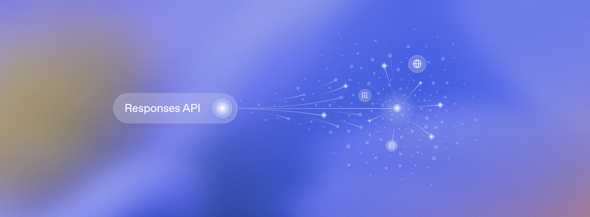

从提示词到产品：Responses API 一周年

Five stories from developers building agentic products with the Responses API in its first year.

作者：Eva Sasson

一年前，我们推出了 Responses API —— 为开发者和企业构建有用且可靠的代理提供了一个基础。通过为模型配备一组托管工具，AI 从聊天助手演变为可以代表你执行操作的系统。如今，Responses API 支持多项工具来驱动代理工作流程，以及一系列专门为构建更强大模型而设计的新功能和原语。

如今，成千上万的开发者正在使用 Responses API 进行构建，以加速客户支持、法律、生命科学、旅游等行业的生产力。在分享了来自这些行业的许多成功案例后，今天我们要庆祝过去一年在 Responses API 上构建的开发者的五个较少被讲述的故事。

检测并修复 AI 代理中的故障

作者：Alexis Gauba 和 Ben Hylak，来自 Raindrop AI

工具：自定义构建工具
模型：GPT-5.2（正在测试 GPT-5.4）

Raindrop 是世界上最具雄心的 AI 公司背后的监控平台，用于捕捉他们的代理在生产中失控的情况。随着代理变得越来越复杂，这些故障变得越来越关键。

如果没有 Responses API，构建这种监控系统会更加困难且可靠性低得多。

该系统使用 Responses API（通过 Vercel AI SDK）运行后台分析，以在不同的模型提供商之间共享工具，并保持其系统在不同环境之间的可移植性。这些工作流程会浮现异常行为。当出现问题时，系统会提醒开发者并协助诊断潜在问题。

该平台专注于三个核心系统：

代理行为监控
故障检测和警报
开发者调查和调试工具

 Together, these systems allow teams to discover, track, and fix issues in AI agents before they impact production systems.

监控架构

This architecture lets teams continuously monitor agent behavior and quickly respond when issues occur.

1. 代理行为监控

The system evaluates agent behavior continuously to determine whether the agent is operating as expected.

开发者可以设置不良结果的条件，当这些条件满足时平台可以发出警报。

2. 故障检测和警报

一旦检测到异常，Raindrop 会通知开发者并提供调查问题所需的相关上下文。

该平台提供的工具包括：

跨代理版本跟踪行为变化
识别哪个提示或系统更改触发了故障
检查推理追踪和工具调用

这让开发者能够快速识别故障根本原因并部署修复。

3. 调查和调试工具

Raindrop 还提供帮助开发者诊断代理工作流中问题的工具。这些功能让团队能够将故障检测与系统改进联系起来。

Raindrop AI 使用 Responses API 为所有长期运行的后台分析工作流提供动力。没有它，实现这些监控系统会更加困难。

复杂数据的深度推理工作流

作者：Eric Provencher，来自 Repo Prompt

使用的工具：Codex 与 App Server + MCP，网络搜索
使用的模型：GPT-5.3 Codex

我们没有让推理模型在规划或审查期间浪费其上下文窗口来导航上下文，而是利用一个单独的代理来预先策划上下文，让我们 的推理模型尽可能多地投入其推理能力来完成任务。

Eric Provencher 构建了一个系统，帮助开发者和研究人员对大量文档、代码库和数据集进行深入分析。

Repo Prompt 专注于上下文工程——自动收集、组织和构建相关信息，以便推理模型能够有效地对其进行分析。

虽然许多代理系统专注于收集数据，但 Eric 的架构将上下文收集与深度推理分开。该系统使用代理工作流来组装相关上下文，然后将策展的信息交给推理模型，推理模型专门专注于分析。

该平台使用 OpenAI Responses API 来编排长期运行的代理工作流和推理任务，包括：

大型代码库分析和架构规划
深度代码审查工作流
大型文档集合的研究分析
医学和科学文档分析

该系统围绕三个核心组件构建：上下文构建代理工作流、深度推理模型（"Oracle"工作流）和迭代研究分析循环。

1. 上下文构建器代理工作流

系统的第一阶段是上下文构建器代理。此工作流分析大型数据存储库，以确定与给定查询相关的信息。

使用 Responses API 的工具和模型推理，代理识别相关文件、文档之间的关系以及关键信息部分。

此阶段的输出是结构化上下文包，它成为推理阶段的输入。

2. "Oracle"深度推理工作流

与上下文构建代理不同，"Oracle"模型（深度推理模型）不执行工具调用或额外的信息检索。相反，它完全专注于分析提供给它的策展上下文。

通过将研究和推理分开，模型可以将其全部推理能力用于理解问题。在许多工作流中，推理阶段可以运行很长时间，分析提供上下文中的复杂关系。

3. 迭代研究和分析循环

系统还支持迭代推理循环。在推理模型产生输出后，另一个代理可以审查结果并确定是否需要额外调查。

如有需要，系统会启动另一轮上下文收集和推理。这个循环支持长期调查，系统可以在其中逐步完善其分析。

迭代工作流

该系统依赖 Responses API 的多项功能：

后台作业：运行可以执行数分钟或数小时的长期推理任务
代理编排：协调上下文收集、推理和验证的代理循环
可观测性：监控和管理正在执行的长期推理工作流

该平台使用 Codex 模型来收集和构建相关上下文，然后将策展的上下文交给更高能力的推理模型进行更深入的分析。这些能力使平台的混合架构能够将代理工作流与深度推理模型相结合。

黑胶唱片收藏者的对话界面

作者：Ash Ryan Arnwine，来自 Collxn

工具：网络搜索和 16 个自定义工具
模型：GPT-5.4、GPT-5 nano

Responses API 感觉它正在帮我完成工作，相比构建完整的检索增强生成系统等其他替代方案。

Ash Ryan Arnwine 构建了"Collxn"（想想：collection），这是一个小型服务但有着宏大的使命：帮助黑胶唱片收藏者重新发现架子上已有的东西，并与他们的唱片互动。

收藏者通常在 Discogs 上追踪大量收藏，有时数千张唱片。Collxn 接入那个收藏库，每天发送一封名为"每日推荐"的电子邮件，聚光灯照亮一张不同的唱片以及关于艺术家的详细信息，帮助收藏者重温他们已经拥有的音乐。

因为翻阅唱片当你能够提问时会更有趣，Collxn 使用 OpenAI Responses API 为聊天界面提供支持，让用户可以真正与他们的唱片对话。

具有工具调用的对话界面

该应用使用 Responses API 提供名为"问问这张"的聊天界面，用户可以在其中询问有关每日推荐中唱片的问题。

该模型配置为访问 Discogs API 工具，以便在回答问题时直接从 Discogs 检索信息。

例如，用户可以问：

这张唱片目前的市场价格是多少？
这位艺术家还发行了哪些其他专辑？
这张压制有多稀有？

问问这张为 Collxn 用户提供了与黑胶唱片的聊天界面。

收藏者可以简单地提问并获得由实时 Discogs 数据与其自身唱片收藏上下文配对生成的答案。

这种方法将静态唱片收藏转变为连接到更广泛音乐生态系统的对话体验。

每日推荐和艺术家新闻

Collxn 还使用 OpenAI Agents SDK 为每日推荐电子邮件中推荐的艺术家生成"最新新闻"部分。

OpenAI Agents SDK 为 Collxn 每日推荐的艺术家新闻部分提供支持。

此功能部署了一个由网络搜索驱动的代理，用于查找有关艺术家的最新文章或更新，并将这些上下文添加到每日电子邮件中。在测试用户中，新闻功能迅速成为产品最受欢迎的部分之一，因为它以动态方式将唱片收藏体验与外部世界连接起来。

最终，Ash 将 Collxn 迁移到 Responses API 以启动"问问这张"。这样做，应用可以支持多步推理的对话工作流以及内置和自定义工具调用。Collxn 的 Responses API 实现除了 16 个用于处理 Discogs API、查询用户 Collxn 账户等自定义工具外，还使用内置的网络搜索工具进行聊天内艺术家新闻搜索。

Responses API 网络搜索工具为 Collxn 的"问问这张"中的实时艺术家新闻查询提供支持。

Responses API 中的有状态对话也使多轮聊天交互更简单、更快速。总体而言，Ash 指出使用 Responses API 简化了架构，相比构建完整的检索增强生成（RAG）系统。

将屏幕录制转换为交互式产品演示

作者：Nick Sorrentino 和 Pawel Wszola，来自 Arcade 团队

工具：计算机使用
模型：GPT-5.2、计算机使用预览

集成 API 驱动的内容生成将发布演示所需的步骤数量减少了 50%，显著提高了发布率和采用率。

Arcade 将大多数团队已经在做的事情——录制屏幕——转化为精制的交互式产品演示。团队无需通过直播向某人演示产品或编写分步文档，而是录制一次工作流程，Arcade 处理其余部分。

在该平台下，分析录制内容并自动生成引导式演练，解释每个步骤发生的事情。

演示生成工作流

在录制会话期间：

用户录制屏幕同时执行工作流程。
在桌面或浏览器中，Arcade 直接捕获结构化交互，例如点击、 typing 和滚动。
在移动设备上，iOS 沙盒阻止应用捕获系统范围的交互，用户改为录制应用的纯屏幕视频。
录制内容发送到 OpenAI Responses API 和计算机使用工具，分析视觉帧并推断发生的交互。
系统将这些推断的操作转换为结构化步骤。
Arcade 生成叙事文本和交互式热点，引导观众完成演示。

这些步骤自动成为用户看到的交互式导览。

然后，结构化操作被传递给 Chat Completions API，生成在演示中出现的标题和热点描述。用户可以使用内置的 AI 编辑工具调整生成的副本，例如缩短或重写文本。

演示创建时间减半

自动化演示叙述显著减少了发布产品导览所需的工作。

集成 API 驱动的工作流后：

发布前的操作中位数减少了 50%
P80 操作数从约 230 减少到约 120
发布率和产品采用率增加

通过消除演示创建过程中的摩擦，Arcade 使团队能够将原始录制更快地转化为精制交互式演示。

在 AI 输出中测量和提高品牌知名度

作者：Tunde Adeyinka 和 Ramon Silva，来自 Hexagon

使用的工具：网络搜索
使用的模型：GPT-5.2 Chat

Tunde Adeyinka 和 Ramon Silva 创立了 Hexagon，以回答零售商的一个新问题：AI 助手如何谈论你的产品？

随着 AI 助手越来越多地影响产品发现，Hexagon 帮助公司监控他们的品牌如何在 AI 生成的答案中出现，并随着时间的推移改进这些结果。

该平台使用 OpenAI Responses API 为三个核心系统提供支持：

1. 响应模拟架构

Hexagon 运行每日模拟管道来测量 AI 助手如何回答产品相关问题。每天系统生成数千个逼真的消费者提示、产品推荐提示和购物查询，然后将它们通过 Responses API 发送。返回的输出被分析以跟踪品牌在 AI 生成答案中的可见性。

零售客户可以看到他们的产品出现的频率以及这些答案如何随时间变化。

2. 多代理内容生成管道

除了分析，Hexagon 还使用 Responses API 生成优化内容，以提高品牌在 AI 答案中的可见性。

该系统采用四代理架构，每个代理执行管道中的专门步骤，并将输出传递到下一阶段，直到生成最终内容并发布。代理通过非确定性循环进行迭代细化，然后再发布。

3. 仪表板和客户工具

该平台还包括"Hexi"，这是一个使用 Responses API 函数调用构建的聊天机器人。通过 Hexi，客户可以对话式地探索分析数据，并以自助方式生成 AI 可见性数据的摘要。Hexagon 通过零售商仪表板显示其分析，跟踪产品如何在 AI 生成的答案中出现。

Hexagon 依赖 Responses API 的多项关键功能来使模拟逼真且跨产品有用：

网络搜索：复制类似于 ChatGPT 的浏览启用响应。
用户位置参数：模拟来自不同地区的查询以测试地理变化。
推理努力：控制响应的深度和复杂性。
最大输出 token：限制长格式输出的响应长度。
上下文持久性：在调用之间维护上下文，实现多代理工作流。

Responses API 提供了更好的响应质量并在多次调用中更强上下文持久性，这对于为 Hexagon 平台提供动力的多步管道至关重要。

总结

一周年之际，Responses API 已成为开发者创建代理软件的核心构建块。

这五个开发者故事展示了实践中的例子：协调工具的多代理系统、检测错误、运行工作流和发布由 AI 驱动的产品。

平台本身正在快速发展——更好的编排和更丰富的工具生态系统，新增了 OpenAI 托管容器与网络和 shell 工具。

更多工具。
更多功能。
更多开发者在构建我们尚未想到的东西。

让我们看看开发者们在第二年会构建什么。
