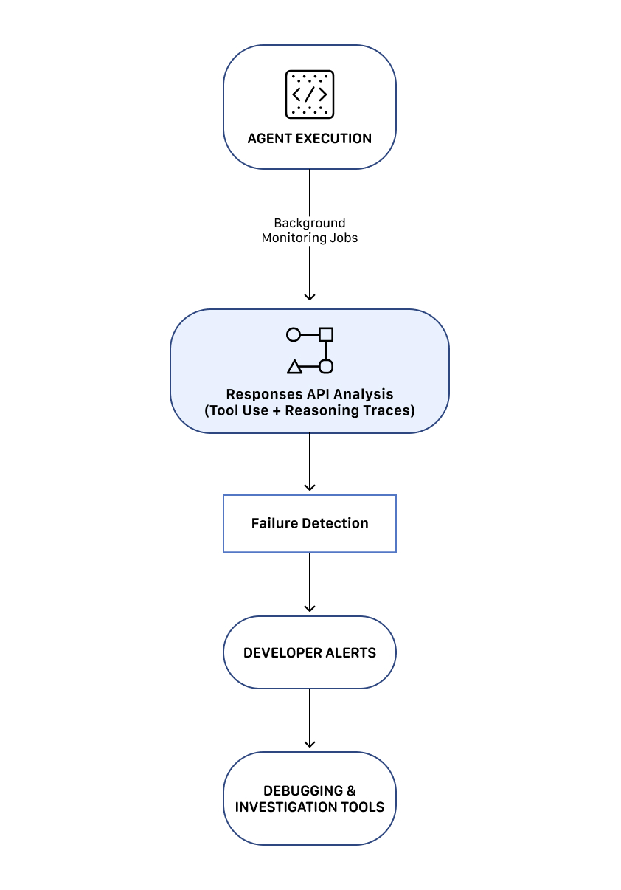
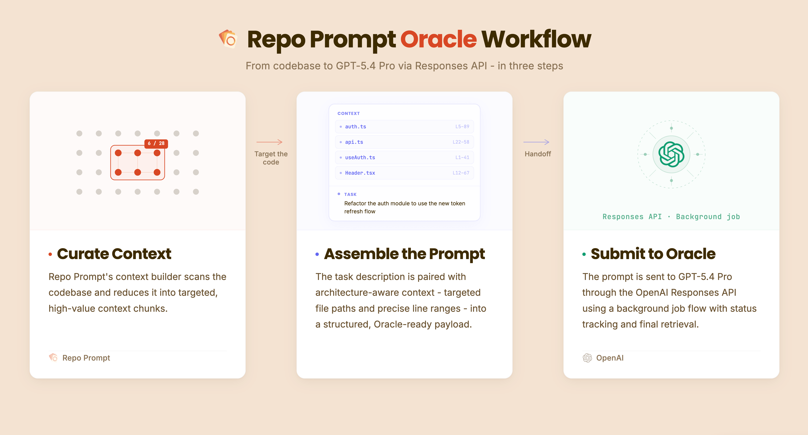
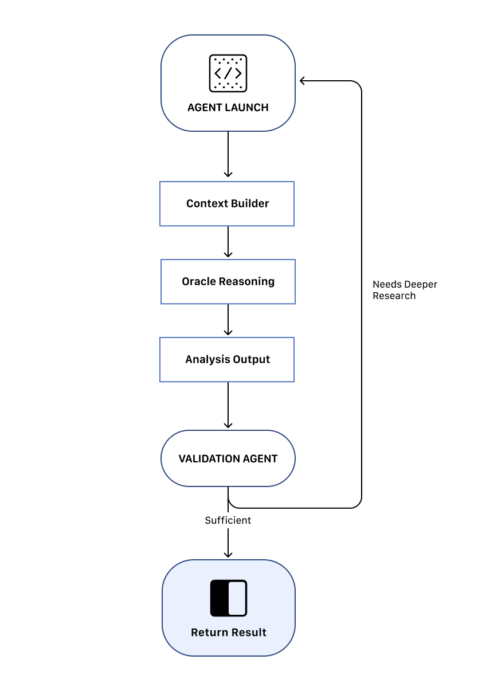
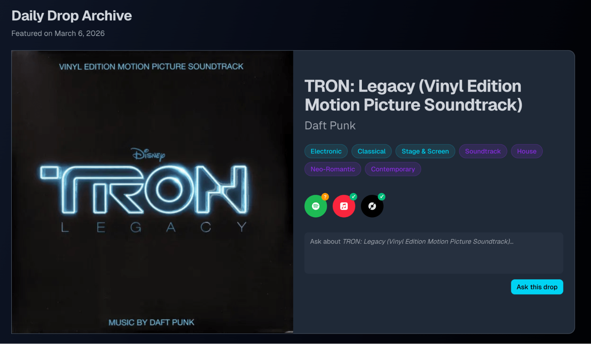
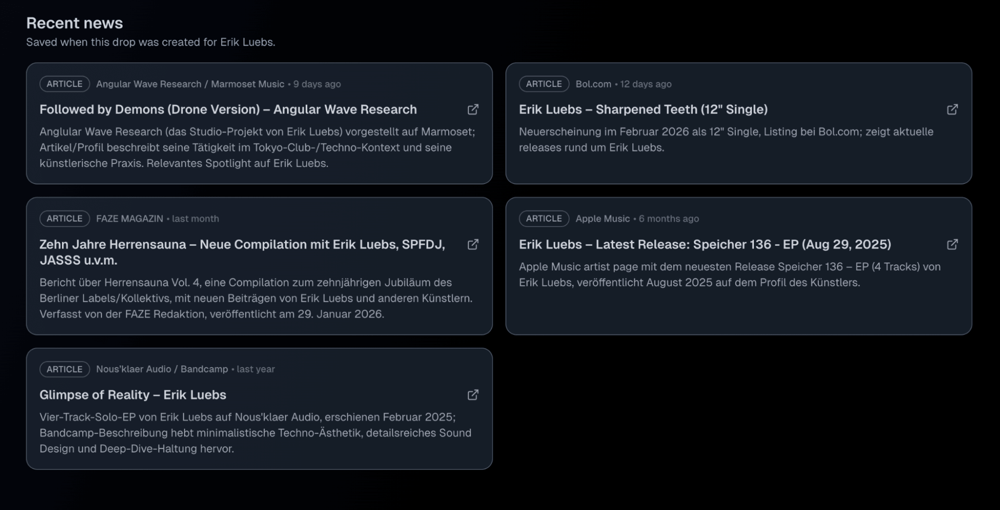
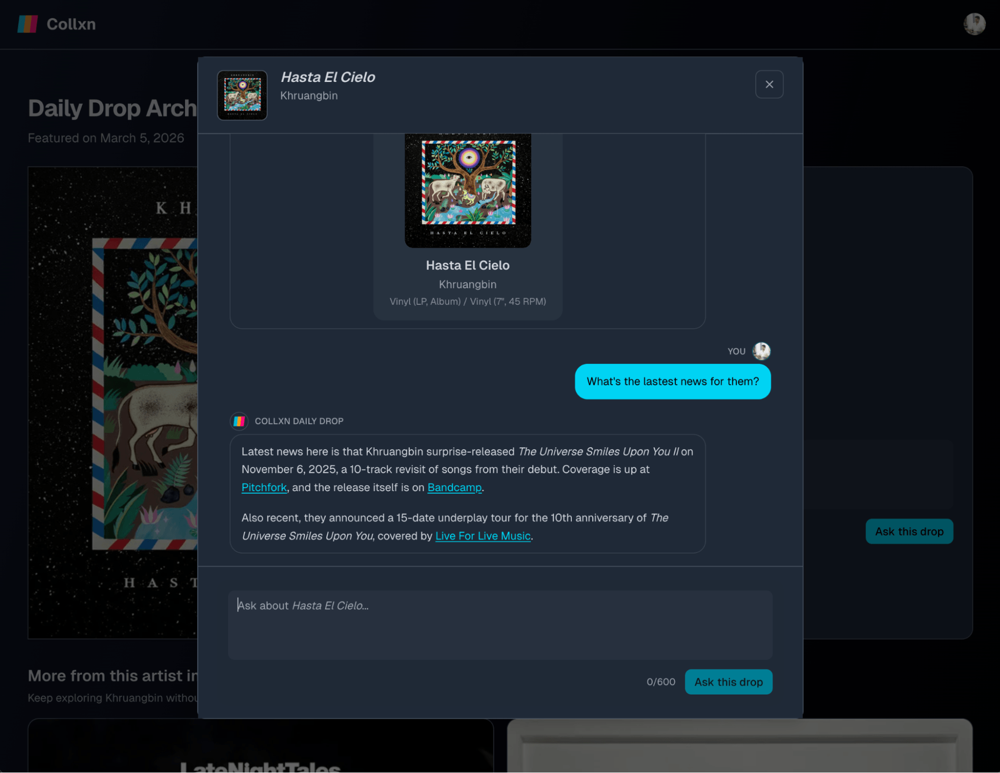
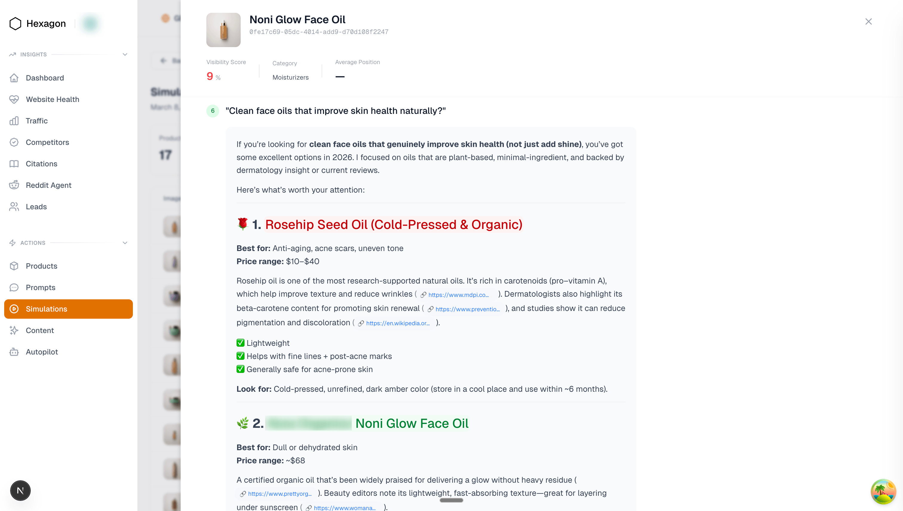
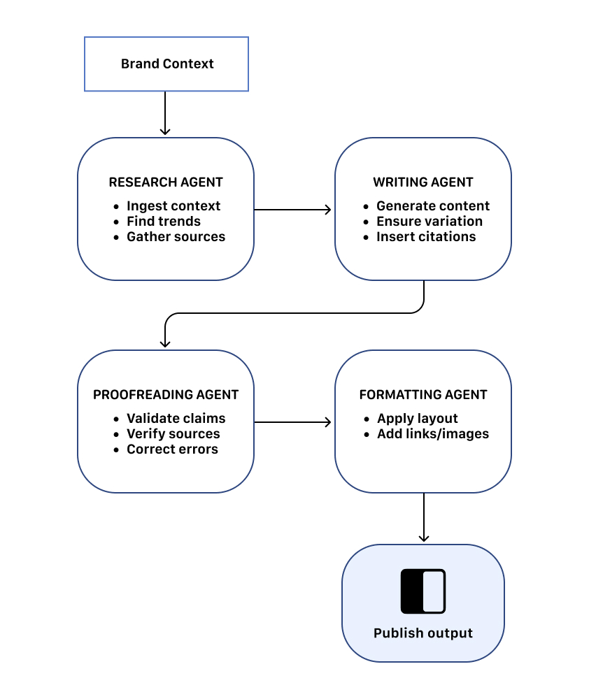
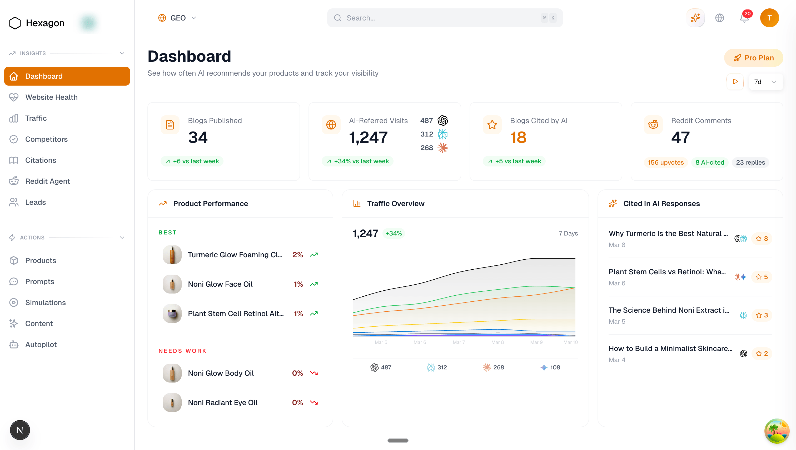

# 从提示到产品：Responses API一周年

来源：https://developers.openai.com/blog/one-year-of-responses

---

一年前，我们推出了[Responses API](/api/reference/responses/overview)——为开发者和企业构建实用可靠智能体的基石。通过为模型配备一系列托管工具，人工智能得以从聊天助手进化为能代表用户执行行动的系统。如今，Responses API已支持多种驱动智能体工作流程的工具，以及一套专为更强大模型构建而设计的新功能与基础组件。

目前已有数千名开发者运用Responses API，在[客户支持](https://openai.com/index/klarna/)、[法律](https://openai.com/index/hebbia/)、[生命科学](https://openai.com/index/gpt-5-amgen/)、[旅游](https://openai.com/index/booking-com/)等行业加速提升生产力。在分享了诸多行业成功案例后，今天我们聚焦五位开发者过去一年基于Responses API构建的鲜为人知的故事。

## 检测与修复AI智能体故障

_作者：Raindrop AI的Alexis Gauba与Ben Hylak_

**使用工具：** 自定义构建工具  
**模型版本：** GPT-5.2（正在测试GPT-5.4）

Raindrop作为全球最具雄心的AI公司的监控平台，专门捕捉生产环境中智能体的异常行为。随着智能体日益复杂，这类故障的影响也愈发关键。

> 若没有Responses API，构建此类监控系统将困难得多，可靠性也会大幅降低。

该系统通过Responses API（借助Vercel AI SDK）运行后台分析，实现跨模型供应商的工具共享，并保持系统在不同环境间的可移植性。这些工作流程能揭示异常行为，当问题发生时，系统会立即向开发者告警并协助诊断根本原因。

您的浏览器不支持视频播放。

该平台聚焦三大核心系统：

  1. 智能体行为监控
  2. 故障检测与告警
  3. 开发者调查与调试工具

这些系统共同助力团队在AI智能体影响生产系统之前，及时发现、追踪并修复问题。

### 监控架构

该架构使团队能持续监控智能体行为，并在问题发生时快速响应。

### 1. 智能体行为监控

系统持续评估智能体行为，判断其是否按预期运行。

开发者可针对非预期结果设置条件，当条件触发时平台将发出告警。

### 2. 故障检测与告警

一旦检测到异常，Raindrop会立即通知开发者并提供调查问题所需的相关上下文。

平台提供以下工具：

  * 追踪跨版本智能体行为变化
  * 识别引发故障的具体提示词或系统变更
  * 检查推理轨迹与工具调用记录

这些功能帮助开发者快速定位故障根源并部署修复方案。

### 3. 调查与调试工具

Raindrop还提供诊断智能体工作流问题的工具。这些功能让团队能将故障检测与系统改进有效衔接。

Raindrop AI 利用 Responses API 驱动所有长时间运行的背景分析工作流。若没有该 API，实现这些监控系统的难度将大幅增加。

## 面向复杂数据的深度推理工作流

_作者：Eric Provencher（来自 [Repo Prompt](https://repoprompt.com)）_

**使用工具：** Codex（配合应用服务器 + MCP）、网络搜索  
**使用模型：** GPT-5.3 Codex  

> 我们不再让推理模型在规划或审查阶段消耗上下文窗口来导航信息，而是通过独立智能体预先整合上下文，使推理模型能将其绝大部分算力专注于解决任务本身。

Eric Provencher 构建了一套系统，帮助开发者和研究者对海量文档、代码库及数据集进行深度分析。

[Repo Prompt](https://repoprompt.com) 专注于上下文工程——通过自动化方式收集、整理并构建相关信息，使推理模型能高效进行分析。

尽管许多智能体系统侧重于数据收集，Eric 的架构将上下文收集与深度推理分离。该系统通过智能体工作流整合相关上下文，再将精心整理的信息交付给专门负责分析的推理模型。

该平台运用 OpenAI Responses API 编排长时间运行的智能体工作流与推理任务，涵盖场景包括：

* 大型代码库分析与架构规划
* 深度代码审查工作流
* 海量文献的研究分析
* 医学与科学文献分析

系统围绕三大核心组件构建：上下文构建智能体工作流、深度推理模型（“先知”工作流）以及迭代式研究分析循环。

### 1. 上下文构建智能体工作流

您的浏览器不支持视频标签。

系统的第一阶段是上下文构建智能体。该工作流通过分析大规模数据仓库，确定与特定查询相关的信息。

借助 Responses API 的工具调用与模型推理能力，智能体可识别相关文件、文档间关联及关键信息片段。

此阶段的输出是结构化上下文包，它将作为下一阶段推理的输入。

### 2. “**先知**”深度推理工作流

与上下文构建智能体不同，“先知”模型（即深度推理模型）不执行工具调用或额外信息检索，而是完全专注于分析已整合的上下文。

通过分离研究与推理环节，该模型能将全部推理能力集中于问题理解。在许多工作流中，推理阶段可持续运行较长时间，深入分析所提供上下文中的复杂关联。

### 3. 迭代式研究分析循环

系统还支持迭代推理循环。当推理模型生成输出后，另一智能体会评估结果并判断是否需要进一步调查。

如有必要，系统将启动新一轮的上下文收集与推理。这种循环机制支持长时间运行的调查研究，使系统能持续优化分析结果。

#### 迭代工作流

该系统深度依赖 Responses API 的以下几项核心能力：

*   后台任务：运行可执行数分钟乃至数小时的长时间推理任务
  *   智能体编排：协调智能体循环以完成上下文收集、推理与验证
  *   可观测性：在长时间推理工作流执行过程中进行监控与管理

该平台使用Codex模型收集并构建相关上下文，随后将整理后的上下文传递给更高性能的推理模型进行深度分析。这些能力支撑着平台将智能体工作流与深度推理模型相结合的混合架构。

## 黑胶唱片收藏家的对话式交互界面

_作者：Ash Ryan Arnwine（来自[Collxn](https://www.collxn.com)）_

**工具：** 网络搜索及16个定制工具  
**模型：** GPT-5.4、GPT-5 nano

> 相较于构建完整的检索增强生成系统等替代方案，Responses API让我感觉它真正减轻了我的工作负担。

Ash Ryan Arnwine 创建的 [“Collxn”](https://www.collxn.com)（意为“收藏”）是一项小而美的服务，却承载着宏大使命：帮助黑胶收藏家重新发现架上已有的唱片，并与他们的收藏产生互动。

收藏家们常在Discogs上管理庞大的唱片库，有时甚至涵盖数千张唱片。Collxn接入这些收藏数据，每日发送名为“每日推荐”的邮件，重点介绍一张特定唱片及其艺术家详情，帮助收藏家重温已拥有的音乐。

由于能够提问会让翻阅唱片的过程更有趣，Collxn运用OpenAI Responses API驱动聊天界面，让用户能与自己的唱片直接对话。

您的浏览器不支持视频播放标签

### 支持工具调用的对话式界面

该应用通过Responses API提供名为“询问此推荐”的聊天界面，用户可对“每日推荐”中的唱片提出问题。

模型配置了访问Discogs API工具的权限，可在回答问题时直接从Discogs获取信息。

例如，用户可以询问：

*   这张唱片当前市场价格是多少？
*   这位艺术家还发行过哪些专辑？
*   这个压制版本有多稀有？

_“询问此推荐”为Collxn用户提供与黑胶唱片的对话界面。_

收藏家只需提出问题，即可获得基于实时Discogs数据与个人唱片收藏上下文生成的答案。

这种方式将静态的唱片收藏转化为连接更广阔音乐生态的对话式体验。

### 每日推荐与艺术家动态

Collxn还运用OpenAI Agents SDK为“每日推荐”邮件中的艺术家生成“近期动态”板块。

_OpenAI Agents SDK驱动着Collxn每日推荐的艺术家动态板块。_

该功能部署了基于网络搜索的智能体，查找艺术家近期相关文章或动态，并将这些信息补充至每日邮件中。在测试用户中，动态功能迅速成为产品最受欢迎的部分之一，因为它以动态方式将唱片收藏体验与外部世界连接起来。

最终，Ash将Collxn迁移至Responses API，从而推出了“Ask This Drop”功能。通过这一调整，应用不仅能够支持对话式工作流中的多步推理，还实现了内置及自定义工具调用。Collxn的Responses API实施方案中，除了利用内置网络搜索工具实现聊天框内的艺人新闻搜索外，还配备了16个自定义工具，用于对接Discogs API、查询用户的Collxn账户等操作。

_Responses API的网络搜索工具为Collxn的“Ask This Drop”提供实时艺人新闻查询功能。_

Responses API的有状态对话特性也让多轮聊天交互的处理变得更简单、更快速。总体而言，Ash指出，与构建完整的检索增强生成（RAG）系统相比，使用Responses API显著简化了架构设计。

## 将屏幕录制转化为交互式产品演示

_由[Arcade](https://www.arcade.software)团队的Nick Sorrentino和Pawel Wszola分享_

**使用工具：** 计算机操作  
**调用模型：** GPT-5.2、computer-use-preview

> 集成API驱动的内容生成将发布演示所需的步骤减少了50%，显著提升了发布效率和用户采纳度。

Arcade将大多数团队已在做的事——录制屏幕——转化为精美的交互式产品演示。团队无需实时演示产品或编写逐步操作文档，只需录制一次工作流程，其余工作皆由Arcade自动完成。

该平台会深度分析录制内容，自动生成引导式分步讲解，阐明每个步骤的操作要点。

您的浏览器不支持视频播放标签。

### 演示生成工作流

录制阶段包含以下步骤：

  1. 用户在执行工作流程时录制屏幕。
  2. 在桌面端或浏览器中，Arcade直接捕获结构化交互操作（如点击、输入、滚动）。
  3. 在移动端，由于iOS沙盒机制限制应用捕获系统级交互，用户改为录制应用界面的纯视频。
  4. 录制内容通过computer-use工具发送至OpenAI Responses API，由AI分析视觉画面并推断发生的交互操作。
  5. 系统将这些推断操作转化为结构化步骤。
  6. Arcade生成叙述文本和交互式热点提示，引导观看者浏览演示。

这些步骤将自动转化为用户可见的交互式引导流程。

结构化操作随后传递至Chat Completions API，生成演示中出现的标题和热点描述。用户可通过内置AI编辑工具调整生成内容，例如缩短或重写文本。

### 演示制作步骤减半

演示叙述的自动化大幅降低了发布产品引导所需的精力。

集成API驱动工作流后：

  * 发布前所需操作步骤的中位数减少50%
  * P80操作数从约230步降至约120步
  * 发布效率和产品采纳度显著提升

通过消除演示制作过程中的摩擦，Arcade帮助团队更快速地将原始录制转化为精美的交互式演示。

## 衡量与提升AI输出中的品牌可见度

_由[Hexagon](https://joinhexagon.com)的Tunde Adeyinka和Ramon Silva分享_

**使用工具：** 网络搜索  
**调用模型：** GPT-5.2 Chat

Tunde Adeyinka与Ramon Silva创立Hexagon，旨在为零售商解答一个全新问题：_AI助手如何谈论你的产品？_

随着AI助手日益影响产品发现过程，Hexagon帮助企业监控其品牌在AI生成答案中的呈现方式，并持续优化这些结果。

该平台基于OpenAI Responses API构建了三大核心系统：

### 1. 响应模拟架构

Hexagon每日运行模拟流程，测量AI助手如何回答产品相关问题。系统每天生成数千条真实的消费者提问、产品推荐提示和购物查询，通过Responses API发送后，对返回结果进行分析以追踪品牌在AI生成答案中的可见度。

零售客户可由此掌握其产品出现的频率，并观察这些答案随时间的变化趋势。

### 2. 多智能体内容生成流程

除分析功能外，Hexagon运用Responses API生成优化内容，提升品牌在AI答案中的可见性。

系统采用四智能体架构，每个智能体负责流程中的特定环节，将输出传递至下一阶段，直至最终内容生成并发布。各智能体通过非确定性循环进行迭代优化，确保发布前内容持续精炼。

### 3. 仪表盘与客户工具

平台还包含基于Responses API函数调用构建的聊天机器人"Hexi"。客户可通过对话式交互探索分析数据，并以自助方式生成AI可见度数据摘要。Hexagon通过零售商仪表盘呈现分析结果，实时追踪产品在AI生成答案中的呈现情况。

Hexagon依托Responses API多项关键能力，确保其产品模拟的真实性与实用性：

  * 网络搜索：复现类似ChatGPT的联网浏览响应模式
  * 用户位置参数：模拟不同地区查询以测试地理差异
  * 推理强度：控制响应深度与复杂度
  * 最大输出标记数：限制长文本响应长度
  * 上下文持久性：跨调用维持上下文，支撑多智能体工作流

> Responses API提供了更优质的响应效果和更强的跨调用上下文持久性，这对驱动Hexagon平台的多步骤流程至关重要。

## 展望未来

上线一年来，[Responses API](/api/reference/responses/overview)已成为开发者构建智能体软件的核心基石。

本文展示的五则开发者案例，具体呈现了多智能体系统在实践中的样貌：协调工具、检测漏洞、运行工作流以及交付AI驱动的产品。

平台本身正在快速演进——通过新增功能如具备网络功能的OpenAI托管容器和[命令行工具](/api/docs/guides/tools-shell)，实现更优的编排能力与[更丰富的工具生态](/api/docs/guides/tools)。

更多工具。
更多可能。
更多开发者正在构建超乎想象的创新。

且看开发者在第二年将创造何等精彩。