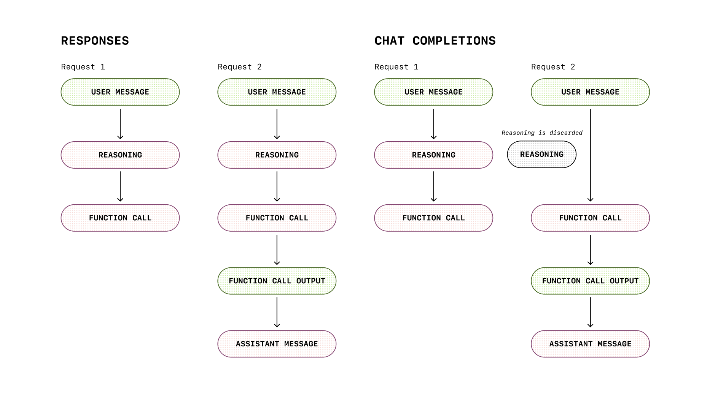

# 我们为何构建Responses API

来源：https://developers.openai.com/blog/responses-api

---

随着GPT-5的问世，我们希望进一步说明集成它的最佳方式——[Responses API](https://platform.openai.com/docs/api-reference/responses)，以及为何Responses专为推理模型和智能体未来量身定制。

每一代OpenAI API都围绕同一个问题构建：**开发者与模型交互的最简洁、最强大方式是什么？**

我们的API设计始终以模型自身工作原理为指导。最初的`/v1/completions`端点虽然简单但受限：用户提供提示，模型仅完成后续内容。通过小样本提示等技术，开发者尝试引导模型输出JSON或回答问题，但这些模型的能力远不及今日水平。

随后迎来RLHF、ChatGPT与后训练时代。模型不再只是续写半成品文本——它们开始像对话伙伴般**响应**。为此我们构建了`/v1/chat/completions`（[据传仅用一个周末完成](https://x.com/athyuttamre/status/1899541474297180664)）。通过引入`system`、`user`、`assistant`等角色，我们提供了快速构建具备自定义指令和上下文的聊天界面的框架。

模型持续进化。很快，它们开始具备视觉、听觉与语音能力。2023年末推出的函数调用成为最受喜爱的功能之一。同期我们发布了Assistants API测试版：这是我们首次尝试构建具备代码解释器和文件搜索等托管工具的完整智能体接口。部分开发者青睐此设计，但由于API设计相对Chat Completions更为受限且难以适配，始终未能大规模普及。

至2024年末，我们明确需要统一方案：既要具备Chat Completions的易用性，又需拥有Assistants的强大功能，同时专为多模态与推理模型设计。于是`/v1/responses`应运而生。

## `/v1/responses`是智能体循环

Chat Completions提供简单的回合制聊天界面，而Responses则提供用于推理与行动的**结构化循环**。这就像与侦探协作：你提供证据，他们展开调查，可能咨询专家（工具），最终汇报结果。侦探在各步骤间保留私人笔记（推理状态），但从不将其交给客户。

这正是推理模型的优势所在：Responses在多个回合间**保持模型的推理状态**。在Chat Completions中，每次调用间的推理过程都会丢失，如同侦探每次离开房间就忘记线索。Responses则保持笔记本持续打开——逐步推理过程能真实延续至下一回合。这在基准测试（TAUBench +5%）以及更高效的缓存利用和延迟优化中均有体现。

Responses还能输出多种内容：不仅是模型的**陈述**，还包括其**行动**。你会获得凭证——工具调用、结构化输出、中间步骤。这如同同时获得最终论文和草稿演算，对调试、审计和构建丰富UI极具价值。

    {
      "message": {
        "role": "assistant",
        "content": "我将使用get_weather工具查询天气情况。",
        "tool_calls": [

"id": "call_88O3ElkW2RrSdRTNeeP1PZkm",
            "type": "function",
            "function": {
              "name": "get_weather",
              "arguments": "{\"location\":\"New York, NY\",\"unit\":\"f\"}"
            }
          }
        ],
        "refusal": null,
        "annotations": []
      }
    }

聊天补全功能每次请求仅生成一条**消息**。消息的结构存在限制：究竟是消息先出现，还是函数调用先发生？

      {
        "id": "rs_6888f6d0606c819aa8205ecee386963f0e683233d39188e7",
        "type": "reasoning",
        "summary": [
          {
            "type": "summary_text",
            "text": "**确定天气响应**\n\n我需要回答用户关于旧金山天气的问题。...."
          },
      },
      {
        "id": "msg_6888f6d83acc819a978b51e772f0a5f40e683233d39188e7",
        "type": "message",
        "status": "completed",
        "content": [
          {
            "type": "output_text",
            "text": "我将查询实时天气服务来获取旧金山的当前状况，同时提供华氏度和摄氏度两种温度单位以符合您的偏好。"
          }
        ],
        "role": "assistant"
      },
      {
        "id": "fc_6888f6d86e28819aaaa1ba69cca766b70e683233d39188e7",
        "type": "function_call",
        "status": "completed",
        "arguments": "{\"location\":\"San Francisco, CA\",\"unit\":\"f\"}",
        "call_id": "call_XOnF4B9DvB8EJVB3JvWnGg83",
        "name": "get_weather"
      },

响应功能会生成一个**多态条目列表**。模型采取的行动顺序清晰可见。作为开发者，您可以自主选择要显示、记录或完全忽略其中哪些内容。

### 通过托管工具提升技术栈

在函数调用技术早期，我们注意到一个关键模式：开发者既利用模型调用API，也通过搜索文档库引入外部数据源——即现在广为人知的RAG技术。但对于刚起步的开发者而言，从零构建检索管道是一项艰巨且成本高昂的任务。通过Assistants功能，我们推出了首批_托管_工具：`file_search`和`code_interpreter`，使模型能够执行RAG并编写代码来解决您提出的问题。在Responses功能中，我们更进一步整合了网络搜索、图像生成和MCP工具。由于工具执行通过代码解释器或MCP等托管工具在服务端完成，您无需将每次调用都回传至自有后端，从而确保更低的延迟和往返成本。

### 安全保留推理过程

那么为何要大费周章地对模型的原始思维链进行封装处理？直接公开思维链并让客户端像处理其他模型输出那样对待它们，不是更简单吗？简而言之，公开原始思维链存在多重风险：例如可能产生幻觉、生成最终响应中不会出现的有害内容，对OpenAI而言还会带来竞争风险。

去年底我们发布o1-preview版本时，首席科学家雅库布·帕霍茨基在博客中写道：

> 我们相信，隐藏的思维链为模型监控提供了独特机遇。假设其具备忠实性与可解读性，隐藏思维链将允许我们"读取模型思维"，理解其推理过程。例如未来我们可能希望通过监控思维链来识别操纵用户的迹象。但实现这一目标的前提是：模型必须能以未经修饰的形式自由表达思想，因此我们不能在思维链上施加任何策略合规性或用户偏好训练。同时，我们也不希望将未校准的思维链直接暴露给用户。

Responses接口通过以下方式解决这些问题：

* 在内部以加密形式保存推理过程，对客户端完全隐藏
* 支持通过`previous_response_id`或推理条目实现安全续接，同时不暴露原始思维链

## 为何`/v1/responses`是最佳开发方案

我们将Responses设计为**具备状态保持、多模态融合与高效运行**的特性：

* **智能体工具调用**：Responses API可轻松强化智能体工作流，集成文件检索、图像生成、代码解释器及MCP等工具
* **默认状态保持**：自动追踪对话与工具状态，显著简化多轮推理工作流。集成GPT-5的Responses在TAUBench测试中相比Chat Completions提升5%性能，这完全得益于持续的推理状态保存
* **原生多模态支持**：文本、图像、音频、函数调用均为一等公民。我们并非在文本API上修补功能，而是从设计之初就构建了完备的多模态架构
* **更低成本，更优性能**：内部基准测试显示缓存利用率比Chat Completions提升40-80%，这意味着更低延迟与更少成本
* **更优设计**：基于Chat Completions和Assistants API的经验积累，我们在ResponsesAPI及SDK中实现了多项体验优化：
  * 语义化流式事件
  * 内部标记的多态支持
  * SDK内置`output_text`辅助函数（无需再使用`choices.[0].message.content`）
  * 更清晰的多模态与推理参数组织

## Chat Completions将何去何从？

Chat Completions不会消失。若当前方案运行良好，可继续使用。但若您需要持续化的推理能力、原生的多模态交互体验，以及无需复杂拼接的智能体循环——Responses将是未来方向。

## 展望未来

正如Chat Completions取代Completions，我们预期Responses将成为开发者使用OpenAI模型的主流方式。它既能保持简洁易用，又能提供强大功能，其灵活性足以应对未来任何范式变革。

这将是未来数年我们持续构建的核心API。