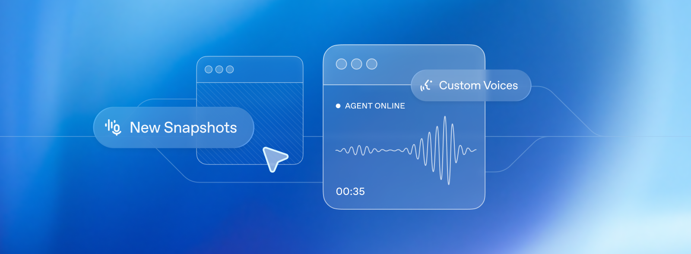

语音开发者的更新

New audio model snapshots and broader access to Custom Voices for production voice apps.

作者：Derek Salama

AI 音频能力开启了一个令人兴奋的用户体验新前沿。今年早些时候，我们发布了几款新的音频模型，包括 gpt-realtime，以及新的 API 功能，使开发者能够构建这些体验。

上周，我们发布了新的音频模型快照，旨在通过提高生产语音工作流程的可靠性和质量来解决构建可靠音频代理的一些常见挑战——从转录和文本转语音到实时、本地语音转语音代理。

这些更新包括：

gpt-4o-mini-transcribe-2025-12-15 用于通过转录或 Realtime API 进行语音转文本
gpt-4o-mini-tts-2025-12-15 用于通过 Speech API 进行文本转语音
gpt-realtime-mini-2025-12-15 用于通过 Realtime API 进行本地、实时语音转语音
gpt-audio-mini-2025-12-15 用于通过 Chat Completions API 进行本地语音转语音

新快照共享一些常见的改进：

音频输入：
真实世界和嘈杂音频的单词错误率更低
在静音或背景噪音期间减少幻觉

音频输出：
更自然、更稳定的语音输出，包括使用自定义语音时

定价与之前的模型快照相同，因此我们建议切换到这些新快照，以相同的價格受益于 improved performance。

如果你正在构建语音代理、客户支持系统或品牌语音体验，这些更新将帮助你使生产部署更可靠。下面我们将分解新的内容以及这些改进如何在真实世界的语音工作流程中表现出来。

语音转语音

我们正在部署新的 Realtime mini 和 Audio mini 模型，这些模型已针对更好的工具调用和指令遵循进行了优化。这些模型减少了 mini 和全尺寸模型之间的智能差距，使一些应用程序能够通过转移到 mini 模型来优化成本。

gpt-realtime-mini-2025-12-15

gpt-realtime-mini 模型 meant to be used with the Realtime API，我们的用于低延迟、本地多模式交互的 API。它支持流式音频输入和输出、处理中断（使用可选的语音活动检测）以及在模型继续说话时在后台进行函数调用等功能。

新的 Realtime mini 快照更适合实时代理，在指令遵循和工具调用方面有明显的提升。在我们的内部语音转语音评估中，与之前的快照相比，我们看到指令遵循准确性提高了 18.6 个百分点，工具调用准确性提高了 12.9 个百分点，同时在 Big Bench Audio 基准上也有提升。

together，这些改进在实时、低延迟设置中带来更可靠的多步交互和更一致的功能执行。

对于代理准确性值得更高成本的场景，gpt-realtime 仍然是我们的最佳性能模型。但当成本和延迟最重要时，gpt-realtime-mini 是一个很好的选择，在真实场景中表现良好。

例如，Genspark 对其进行了压力测试，测试双语翻译和智能意图路由，除了改进的语音质量外，他们发现延迟几乎是即时的，同时在整个快速交流过程中保持意图识别准确。

gpt-audio-mini-2025-12-15

gpt-audio-mini 模型可用于 Chat Completions API，用于不需要实时交互的语音转语音用例。

两个新的快照还具有升级的解码器，可以产生更自然的语音，并在使用自定义语音时更好地保持语音一致性。

文本转语音

我们的最新文本转语音模型 gpt-4o-mini-tts-2025-12-15 实现了准确性的显著提升，与上一代相比，在标准语音基准上的单词错误率大幅降低。在 Common Voice 和 FLEURS 上，我们看到 WER 降低了约 35%，在 Multilingual LibriSpeech 上也有一致的提升。

together，这些结果反映了在广泛语言范围内的发音准确性和稳健性的提高。

与新的 gpt-realtime-mini 快照类似，这个模型听起来更自然，使用自定义语音时表现更好。

语音转文本

最新的转录模型 gpt-4o-mini-transcribe-2025-12-15 在准确性和可靠性方面都有显著提升。在 Common Voice 和 FLEURS 等标准 ASR 基准上（没有语言提示），它比之前的模型提供更低的单词错误率。我们针对真实世界对话设置的行为优化了这个模型，比如短的用户话语和嘈杂的背景。在内部幻觉与噪音评估中，我们播放了真实世界背景噪音和不同说话间隔（包括静音）的音频剪辑，与 Whisper v2 相比，该模型产生的幻觉减少了约 90%，与之前的 GPT-4o-transcribe 模型相比减少了约 70%。

这个模型快照在中文（普通话）、印地语、孟加拉语、日语、印度尼西亚语和意大利语方面特别强大。

自定义语音

自定义语音使组织能够以其独特的品牌声音与客户联系。无论你是在构建客户支持代理还是品牌头像，OpenAI 的自定义语音技术使创建独特、逼真的声音变得容易。

这些新的语音转语音和文本转语音模型为自定义语音解锁了改进，例如更自然的语调、更高的原始样本保真度以及跨方言的准确性提高。

为确保安全使用此技术，自定义语音仅限于符合条件的客户。联系你的客户总监或联系我们的销售团队以了解更多信息。

从原型到生产

语音应用往往在相同的地方失败，主要是在长对话或边缘情况下，如静音，以及语音代理需要精确的工具驱动流程。这些更新专注于这些失败模式——更低的错误率、更少的幻觉、更一致的工具使用、更好的指令遵循。作为奖励，我们改进了输出音频的稳定性，所以你的语音体验可以听起来更自然。

如果你今天正在发布语音体验，我们建议迁移到新的 2025-12-15 快照并重新运行你关键的生产测试用例。早期测试者已确认有明显的改进，而无需更改他们的指令，只需切换到新的快照，但我们建议尝试你自己的用例并根据需要调整提示。
