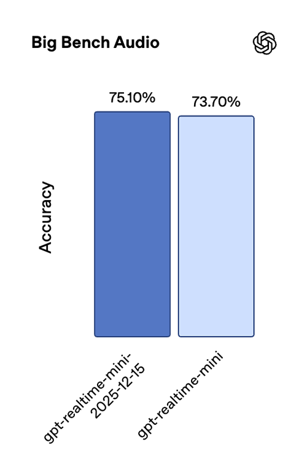
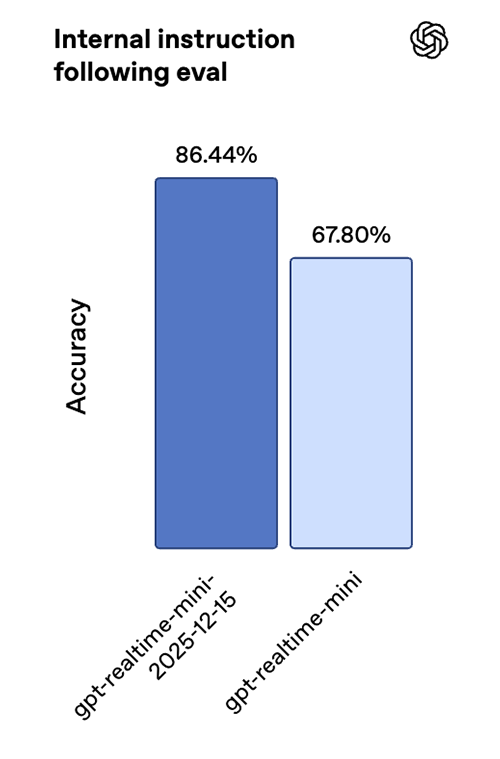
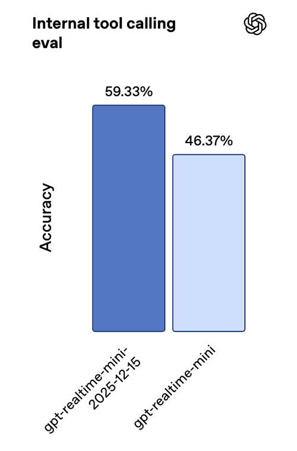
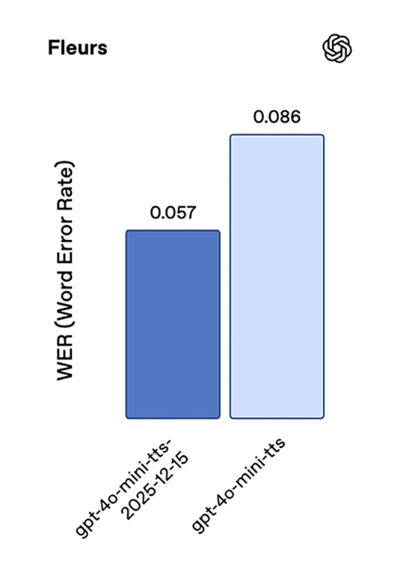
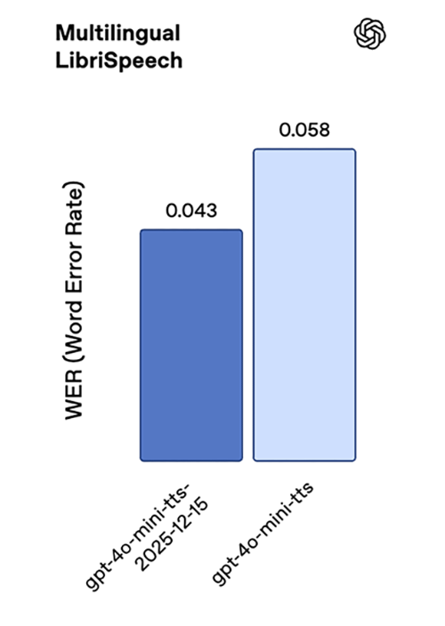
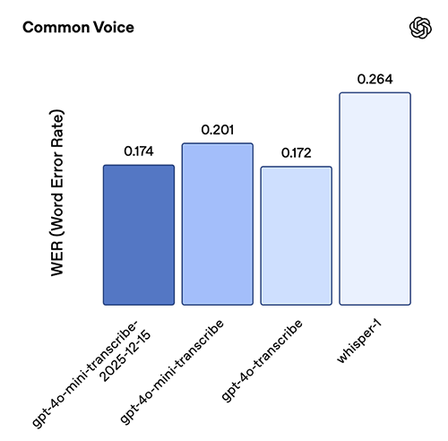
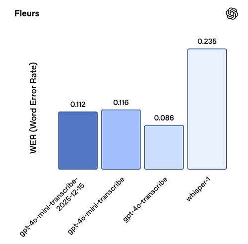
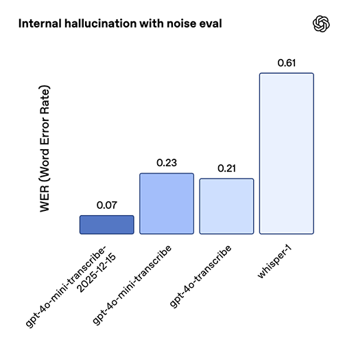

# 面向语音开发者的更新

来源：https://developers.openai.com/blog/updates-audio-models

---

AI音频能力为用户体验开启了一个激动人心的新前沿。今年早些时候，我们发布了多个新的音频模型，包括[`gpt-realtime`](https://platform.openai.com/docs/models/gpt-realtime)，以及[新的API功能](/blog/realtime-api)，使开发者能够构建这些体验。

上周，我们发布了新的音频模型快照，旨在通过提升生产语音工作流程（从转录、文本转语音到实时、原生的语音转语音代理）的可靠性和质量，解决构建可靠音频代理时常见的一些挑战。

这些更新包括：

  * [`gpt-4o-mini-transcribe-2025-12-15`](https://platform.openai.com/docs/models/gpt-4o-mini-transcribe)，用于通过[转录API](https://platform.openai.com/docs/guides/speech-to-text)或[实时API](https://platform.openai.com/docs/guides/realtime-transcription)进行语音转文本
  * [`gpt-4o-mini-tts-2025-12-15`](https://platform.openai.com/docs/models/gpt-4o-mini-tts)，用于通过[语音API](https://platform.openai.com/docs/guides/text-to-speech)进行文本转语音
  * [`gpt-realtime-mini-2025-12-15`](https://platform.openai.com/docs/models/gpt-realtime-mini)，用于通过[实时API](https://platform.openai.com/docs/guides/realtime)进行原生、实时的语音转语音
  * [`gpt-audio-mini-2025-12-15`](https://platform.openai.com/docs/models/gpt-audio-mini)，用于通过[聊天补全API](https://platform.openai.com/docs/api-reference/chat/create)进行原生语音转语音

这些新快照共享一些共同的改进：

**在音频输入方面：**

  * **更低的词错误率**，适用于真实场景和嘈杂音频
  * **更少的幻觉**，在静默或背景噪声情况下

**在音频输出方面：**

  * **更自然、更稳定的语音输出**，包括使用自定义语音时

[定价](https://platform.openai.com/docs/pricing#audio-tokens)与之前的模型快照保持一致，因此我们建议切换到这些新快照，以便以相同的价格获得性能提升。

如果您正在构建语音助手、客服系统或品牌语音体验，这些更新将帮助您提升生产部署的可靠性。接下来，我们将详细介绍新增内容，以及这些改进如何在真实语音工作流程中体现。

## 语音到语音

我们正在部署全新的实时迷你版和音频迷你版模型，这些模型已针对工具调用和指令遵循进行了优化。它们缩小了迷你版与完整版模型之间的智能差距，使部分应用能够通过迁移至迷你版模型来优化成本。

### `gpt-realtime-mini-2025-12-15`

`gpt-realtime-mini` 模型专为配合[实时 API](https://platform.openai.com/docs/guides/realtime) 使用而设计，该 API 支持低延迟、原生多模态交互。它具备音频流输入输出、中断处理（可选语音活动检测）以及模型持续对话时后台函数调用等功能。

新版实时迷你模型快照更适用于实时助手场景，在指令遵循和工具调用方面有明显提升。根据我们内部的语音到语音评估，与上一版本快照相比，新版在指令遵循准确率上提升了 18.6 个百分点，工具调用准确率提升了 12.9 个百分点，同时在 Big Bench Audio 基准测试中也取得了进步。

这些改进共同作用，使得在实时低延迟场景中，多轮交互更加可靠，函数执行也更加稳定。

对于追求极致准确性且能接受较高成本的场景，`gpt-realtime` 仍是我们性能最优的模型。但当成本和延迟成为关键考量时，`gpt-realtime-mini` 是一个绝佳选择，它在实际应用场景中表现优异。

例如，[Genspark](https://www.genspark.ai/) 在双语翻译和智能意图路由方面对其进行了压力测试，除了语音质量得到提升外，他们还发现延迟近乎即时，同时在快速对话中始终保持意图识别的精准性。

### `gpt-audio-mini-2025-12-15`

`gpt-audio-mini` 模型可与 [Chat Completions API](https://platform.openai.com/docs/api-reference/chat/create) 配合使用，适用于无需实时交互的语音到语音应用场景。

这两个新快照还配备了升级版解码器，能生成更自然的语音效果，并在使用自定义语音时更好地保持音色一致性。

## 文本转语音

我们最新的文本转语音模型 `gpt-4o-mini-tts-2025-12-15` 在准确度上实现了显著飞跃，与上一代模型相比，在标准语音基准测试中的词错误率大幅降低。在 Common Voice 和 FLEURS 数据集上，词错误率降低了约 35%，同时在 Multilingual LibriSpeech 上也取得了稳定的提升。

这些结果共同体现了模型在多种语言中发音准确性和鲁棒性的提升。

与新的 `gpt-realtime-mini` 快照类似，该模型的语音听起来更加自然，且在使用自定义语音时表现更佳。

## 语音转文本

最新的转录模型 `gpt-4o-mini-transcribe-2025-12-15` 在准确性和可靠性方面均表现出显著提升。在 Common Voice 和 FLEURS（无语言提示）等标准自动语音识别基准测试中，其词错误率低于以往模型。我们针对真实对话场景（如简短用户发言和嘈杂背景）优化了该模型的行为。在一项内部“噪声环境下的幻觉测试”中，我们播放了包含真实背景噪声和不同说话间隔（包括静默）的音频片段，该模型产生的幻觉比 Whisper v2 减少约 90%，比之前的 GPT-4o-transcribe 模型减少约 70%。

此模型快照在中文（普通话）、印地语、孟加拉语、日语、印尼语和意大利语方面表现尤为出色。

## 定制语音

定制语音功能使组织能够以其独特的品牌声音与客户建立联系。无论是构建客户支持助手还是品牌虚拟形象，OpenAI的定制语音技术都能轻松创建独特而逼真的语音。

这些全新的语音转语音和文本转语音模型为定制语音带来了多项改进：更自然的语调、对原始样本更高的还原度，以及跨方言准确性的提升。

为确保该技术的安全使用，定制语音功能目前仅面向符合条件的客户开放。如需了解更多信息，请联系您的客户主管或[联系我们的销售团队](https://openai.com/contact-sales/)。

## 从原型到生产环境

语音应用往往在相同场景中出现问题，主要集中在长对话、边缘情况（如静音处理）以及需要语音助手精准执行工具驱动流程的场景。本次更新正是针对这些故障模式进行优化——降低错误率、减少幻觉生成、提升工具使用一致性、加强指令遵循能力。此外，我们还改进了输出音频的稳定性，使您的语音体验听起来更加自然。

如果您正在部署语音交互应用，我们建议迁移至新的`2025-12-15`版本快照，并重新运行关键生产测试用例。早期测试者已确认，在不修改指令仅切换新快照的情况下即可获得显著改进，但我们仍建议您根据自身使用场景进行测试，并按需调整提示词配置。
