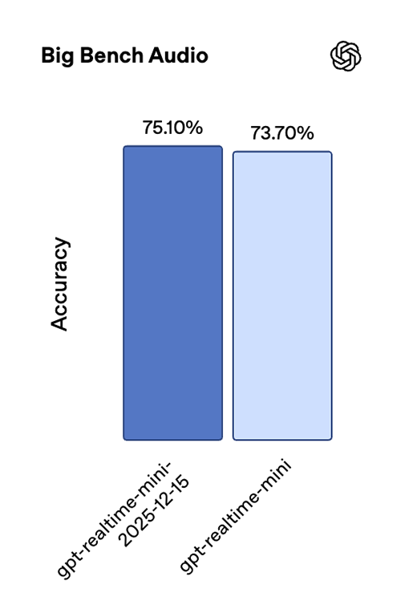
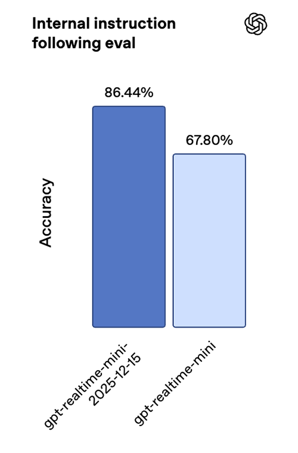
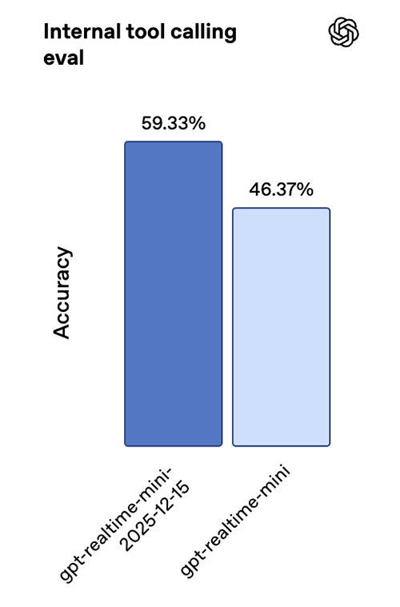
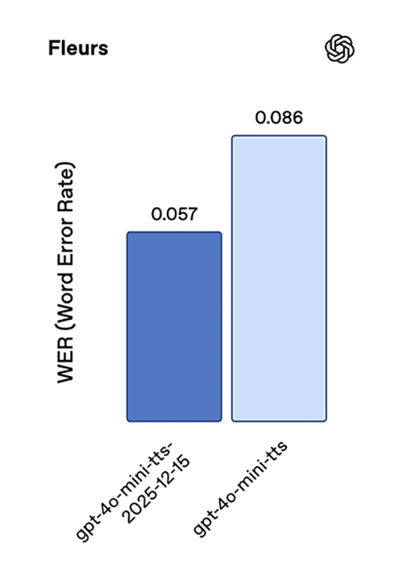
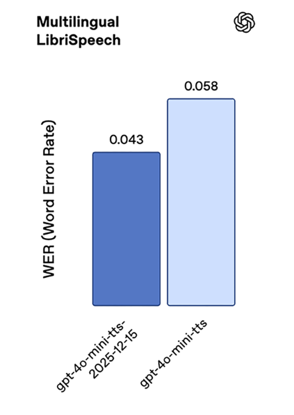
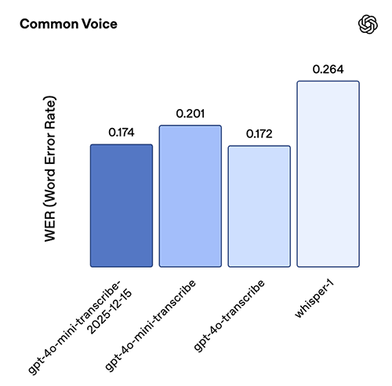
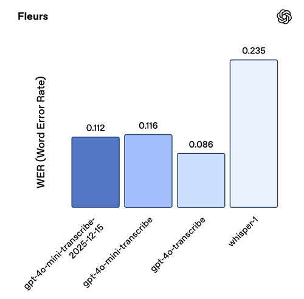
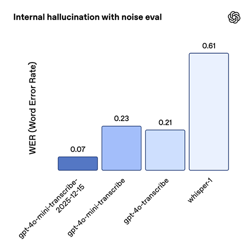

# 面向语音开发者的更新

来源：https://developers.openai.com/blog/updates-audio-models

---

AI音频能力为用户体验开启了激动人心的新前沿。今年早些时候，我们发布了多款新的音频模型，包括[`gpt-realtime`](https://platform.openai.com/docs/models/gpt-realtime)，以及[新的API功能](/blog/realtime-api)，以帮助开发者构建这些体验。

上周，我们发布了新的音频模型快照，旨在通过提升生产级语音工作流程（从语音转文字、文字转语音到实时原生语音对话代理）的可靠性和质量，解决构建可靠音频代理时的一些常见挑战。

这些更新包括：

  * [`gpt-4o-mini-transcribe-2025-12-15`](https://platform.openai.com/docs/models/gpt-4o-mini-transcribe)，用于通过[语音转文字API](https://platform.openai.com/docs/guides/speech-to-text)或[实时API](https://platform.openai.com/docs/guides/realtime-transcription)进行语音转文字
  * [`gpt-4o-mini-tts-2025-12-15`](https://platform.openai.com/docs/models/gpt-4o-mini-tts)，用于通过[语音合成API](https://platform.openai.com/docs/guides/text-to-speech)进行文字转语音
  * [`gpt-realtime-mini-2025-12-15`](https://platform.openai.com/docs/models/gpt-realtime-mini)，用于通过[实时API](https://platform.openai.com/docs/guides/realtime)进行原生实时语音对话
  * [`gpt-audio-mini-2025-12-15`](https://platform.openai.com/docs/models/gpt-audio-mini)，用于通过[聊天补全API](https://platform.openai.com/docs/api-reference/chat/create)进行原生的语音对话

这些新快照共享一些共同的改进：

**在音频输入方面：**

  * **更低的词错误率**，适用于真实场景和嘈杂音频
  * **更少的幻觉**，在静默或背景噪声情况下表现更佳

**在音频输出方面：**

  * **更自然、更稳定的语音输出**，包括使用自定义语音时

[定价](https://platform.openai.com/docs/pricing#audio-tokens)与之前的模型快照保持一致，因此我们建议切换到这些新快照，以便以相同的价格获得更好的性能。

如果您正在构建语音代理、客户支持系统或品牌语音体验，这些更新将帮助您提高生产部署的可靠性。下面，我们将详细介绍这些新内容，以及这些改进如何在真实语音工作流程中体现。

## 语音对话

我们正在部署新的实时迷你版和音频迷你版模型，这些模型已针对更好的工具调用和指令遵循进行了优化。这些模型缩小了迷你版与完整版模型之间的智能差距，使一些应用能够通过迁移到迷你版模型来优化成本。

### `gpt-realtime-mini-2025-12-15`

`gpt-realtime-mini`模型旨在与[实时API](https://platform.openai.com/docs/guides/realtime)配合使用，这是我们用于低延迟、原生多模态交互的API。它支持流式音频输入输出、处理中断（可选语音活动检测）以及在模型持续说话时在后台进行函数调用等功能。

新版实时迷你快照更适合实时智能体应用，在指令遵循和工具调用方面有明显提升。在我们内部的语音到语音评估中，与上一版快照相比，指令遵循准确率提升了18.6个百分点，工具调用准确率提升了12.9个百分点，同时在Big Bench Audio基准测试中也有进步。

这些改进共同带来了更可靠的多轮交互体验，以及在低延迟实时场景下更稳定的功能执行。

对于追求极致智能体精度且能接受较高成本的场景，`gpt-realtime`仍是我们性能最佳的模型。但当成本和延迟成为首要考量时，`gpt-realtime-mini`是绝佳选择，在实际场景中表现优异。

例如，[Genspark](https://www.genspark.ai/)在双语翻译和智能意图路由场景中进行了压力测试，除了语音质量提升外，他们发现延迟近乎即时，且在快速对话中始终保持精准的意图识别。

### `gpt-audio-mini-2025-12-15`

`gpt-audio-mini`模型可通过[Chat Completions API](https://platform.openai.com/docs/api-reference/chat/create)用于非实时交互的语音到语音场景。

两款新快照均搭载升级版解码器，能生成更自然的语音音色，与自定义语音功能结合时也能更好地保持音色一致性。

## 文本转语音

我们最新的文本转语音模型`gpt-4o-mini-tts-2025-12-15`在准确率上实现显著飞跃，相比前代模型在标准语音基准测试中的词错误率大幅降低。在Common Voice和FLEURS测试中，词错误率降低约35%，在Multilingual LibriSpeech测试中也保持稳定提升。

这些成果共同反映了模型在多语言发音准确性和鲁棒性方面的进步。

与新版`gpt-realtime-mini`快照类似，该模型语音更自然，与自定义语音功能的适配性也更优。

## 语音转文本

最新转录模型`gpt-4o-mini-transcribe-2025-12-15`在准确率和可靠性上均有大幅提升。在Common Voice和FLEURS（无语言提示）等标准ASR基准测试中，其词错误率低于以往所有模型。我们针对真实对话场景优化了模型表现，包括短语音输入和嘈杂背景等复杂情况。在内部进行的"噪声环境幻听测试"中（播放含真实环境噪声及不同说话间隔的音频片段），该模型产生的幻听现象比Whisper v2减少约90%，较之前GPT-4o-transcribe模型减少约70%。

该模型快照在中文（普通话）、印地语、孟加拉语、日语、印尼语和意大利语等语言上表现尤为突出。

## 自定义语音

定制语音功能让企业能够以独特的品牌声音与客户建立连接。无论是构建客服助手还是品牌虚拟形象，OpenAI的定制语音技术都能轻松创建独特而逼真的声音。

这些全新的语音转语音与文本转语音模型为定制语音带来显著提升：更自然的语调、更高还原度的原声复刻，以及跨方言场景下更精准的发音表现。

为确保技术安全使用，定制语音功能目前仅对符合条件的客户开放。请联系您的客户总监或[联系销售团队](https://openai.com/contact-sales/)了解更多详情。

## 从原型到生产环境

语音应用往往在相同场景中出现问题，主要集中在长对话、边缘情况（如静音处理）以及需要精确执行工具调用的流程中。本次更新正是针对这些薄弱环节——降低错误率、减少幻觉生成、提升工具调用一致性、优化指令跟随能力。此外，我们还增强了输出音频的稳定性，让语音体验更显自然流畅。

如果您正在部署语音交互应用，我们建议您迁移至新版`2025-12-15`快照版本，并重新运行核心生产测试用例。早期测试者反馈，仅切换新版快照无需修改指令即可获得显著改进，但我们仍建议您根据实际使用场景进行测试，并适时调整提示词配置。