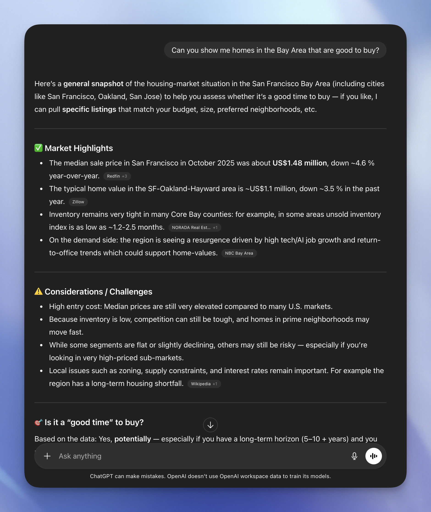

什么是一个好的 ChatGPT 应用

How to build capabilities that make conversations better.

作者：Corey Ching

在 DevDay 上，我们推出了 ChatGPT Apps——一种将你的产品直接带入 ChatGPT 对话的新方式。这篇文章以该发布为基础，为开发者、PM 和设计师提供实用指导，讲述如何选择正确的用例并设计一个在实际上线后真正有用的应用。我们将专注于如何将你产品的优势转化为清晰的、范围明确的的能力，模型可以在许多不同的对话和用户意图中应用。如果你正在寻找技术细节，你可以直接跳转到 Apps SDK 快速入门和开发者文档。

我们将涵盖：

ChatGPT 应用实际是什么（不是什么）
应用可以真正增加价值的三种方式
如何为对话和发现进行设计
如何知道你的应用是否真正有帮助
具体示例和屏幕截图建议

ChatGPT 应用实际是什么

当团队构建他们的第一个 ChatGPT 应用时，出发点往往是："我们已经有产品了。让我们把它带到 ChatGPT 中。"

这通常从获取现有的 Web 或移动体验——屏幕、菜单、流程——然后尝试为聊天重塑它开始。这是一个合理的本能；多年来，"软件"意味着页面、导航和 UI 脚手架。

然而，为 ChatGPT 构建应用是一个不同的环境。用户不是"打开"你的应用并从主页开始。他们正在进行关于某事的对话，模型可以决定何时将应用带入该对话。他们在某个时间点进入。在这个世界上，最好的应用从外部看起来出奇地小。它们不试图重建整个产品。相反，它们允许用户访问一些特定的能力 while using the app in ChatGPT：你的产品做得最好的具体事情，模型可以在任何对话中重用。

在 ChatGPT 之外，你的应用通常是目的地。用户：

点击你的图标
进入你的环境
学习你的导航和 UI 模式

大多数产品决策都从那个假设中产生："我们拥有屏幕。"你可以在布局、入职和信息架构上投入大量精力，因为用户正在投入到你的空间。

在 ChatGPT 内部，你的应用扮演不同的角色：

它是模型可以调用的能力——用于上下文和视觉参与。
它出现在进行中的对话内部。
它是模型可能编排的几个工具之一。

这意味着"价值单位"更少的是你的整体体验，更多的是你可以在正确时刻帮助模型和用户完成的具体事情。

一个实用的定义：

ChatGPT 应用是一组定义明确的工具，可以执行任务、触发交互或访问数据。

这有几个含义：

你不需要移植每个功能。
你不需要完整的导航层次结构。
你确实需要一个清晰、紧凑的 API：一组易于调用和构建的操作。

你可以这样理解：你的 ChatGPT 应用是一个工具包，当用户遇到特定类型的问题时，模型会使用它。工具包定义得越精确，在对话流程中使用起来就越容易。

一旦你将应用视为"模型可以编排的能力"，而不是"我们产品的迷你版本"，设计决策就会变得更清晰。你开始问"在这里我们可以帮助什么？"而不是"用户下一步应该去哪里？"

增加真正价值的三种方式

任何应用想法的一个简单过滤器：

知道：它是否允许用户使用他们在 ChatGPT 中否则无法看到的新上下文或数据？
做：应用是否代表用户执行真实操作？
展示：应用是否以比纯文本更清晰、可操作的 UI 呈现信息？

这适用于"严肃"的生产力应用，也适用于"仅为娱乐"的应用（如游戏）。游戏可能不会帮助某人更快地发布报告，但它仍然做基础模型自己做得不好的事情：维护有状态的游戏逻辑、跟踪进度、执行规则或渲染有趣的游戏世界视图。价值是愉悦和参与，但底层模式是相同的。

1) 新事物要知道

你的应用使新的上下文在 ChatGPT 对话中可用：

实时价格、可用性、库存
内部指标、日志、分析
专业化的、订阅限制的或小众的数据集
用户特定数据（账户、历史、偏好、权利）
传感器数据、实时视频流

在实践中，这通常意味着桥接到数据正确、最新和有权限的系统。应用成为模型在你领域的"眼睛和耳朵"，可以更有权威地回答问题。

2) 新事物要做

你的应用代表用户执行操作：

在内部工具中创建或更新记录
发送消息、工单、批准、通知
安排、预订、订购或配置事物
触发工作流程（部署、升级、同步数据）
玩交互式游戏（应用规则、推进回合、跟踪状态）
在物理世界采取行动（物联网、机器人控制等）

在这里，应用更少作为真相来源，更多作为一双手。它获取用户的意图并将其转化为在你团队已生活的系统中的具体更改——或者在游戏的情况下，转化为游戏状态中的具体更改，使体验感觉一致和公平。这是你可以将应用有意义地转变为代理的地方。

3) 更好的展示方式

应用可以在 ChatGPT 对话中以 GUI 呈现信息，使信息更容易消化或更可操作：

短列表、比较、排名
表格、时间线、图表
角色特定或决策特定的摘要
游戏状态的可视化或结构化视图（棋盘、库存、分数）

当用户正在做出选择或权衡时，这特别有价值。应用可以给模型一种结构化语言：具有列、行、分数和视觉效果的 widget，匹配人们实际决策的方式——或者在游戏中，他们理解自己在世界中"在哪里"的方式。

如果一个应用没有明确地在知道/做/展示中至少一个移动指针，它往往会感觉没有增加超出用户在 ChatGPT 中已经可以做的基础上的价值。用户可能不会明确抱怨，但这是一个错失的机会，无法为用户提供更有意义的价值，无论是工作还是娱乐的应用。

这里你可以看到一个由应用增强的体验示例：

来自 ChatGPT 的示例答案
这个答案是有帮助的，但是用户可能希望使用具有附加能力的应用直接浏览真实房产，而无需更改上下文或离开对话。
使用 Zillow 应用回答

使用 Zillow 应用，用户可以额外搜索实时房产列表、按条件过滤，并查看丰富的房产详情——所有这些都无需离开聊天。

用于丰富发现的全屏模式

这里的价值在于你仍然从模型获得丰富的上下文，以及可以动态响应你意图的丰富应用体验。想要询问特定地区的房屋吗？使用 Zillow 应用，模型调用 Zillow MCP 服务器上的工具并重新渲染 UI 层。

选择能力，而不是移植你的产品

一个常见的第一反应是列出你产品的所有功能，然后问："我们如何将这些引入 ChatGPT？"

在纸上，这听起来很彻底。在实践中，它通常会产生一个大而模糊的表面区域，模型难以导航，用户难以理解。如果你难以用一句话总结应用的作用，模型也会更难理解它。

更有效的路径：

列出核心jobs-to-be-done - 确定用户试图完成的具体任务或结果，你的 product 使其成为可能。这些是你产品存在的首要原因。从这里开始可以让你保持在用户结果而不是功能清单的基础上。

例子：

帮助某人选择房屋。
将想法变成精制的演示文稿。
将意图转化为愉快的发现体验。
将原始数据变成清晰、可共享的报告。

对于每个 job，问：

"如果没有应用，用户在 ChatGPT 对话中不能做什么？"

常见答案：

访问实时或私人数据。
在我们的系统中执行真实操作。
获取用户需要的结构化或视觉输出。

这是你独特价值开始显现的地方。你不再想"我们可以技术性地暴露什么？"而是"我们在哪里特别有帮助？"

将这些差距转化为几个明确命名的操作。例如：

search_properties – 返回候选人房屋的结构化列表。
explain_metric_change – 获取相关数据并总结可能的驱动因素。
generate_campaign_variants – 创建带有元数据的多个广告变体。
create_support_ticket – 打开工单并返回摘要 + 链接。

这些操作是：

足够具体，模型可以自信地选择
足够简单，可以在对话中与其他步骤混合
直接与价值挂钩，而不是与你整个产品地图挂钩

另一种思考方式：如果你团队中的某人问，"我们绝对需要这个应用做得好的三件事是什么？"这些应该几乎一对一地映射到你产品的能力。

例如，ChatGPT 中的 Canva 应用可以生成整个演示文稿草稿，用户可以进入匹配用户对导航幻灯片期望的全屏模式，但更深入的逐幻灯片编辑仍在完整 Canva 编辑器中进行。

为对话和发现进行设计

在你的 MCP 服务器中，你可以定义描述，为模型提供上下文，了解何时调用你的工具，以及具体调用哪个工具调用来执行特定任务。这有助于将用户意图映射到你的工具操作。

a) 模糊意图

帮我弄清楚住在哪里。

一个好的应用响应将：

使用线程中已经存在的任何相关上下文。
最多问一两个澄清问题（如有需要）。
立即产生具体的东西——例如，几个带有简短解释的城市示例。

用户应该感觉进展已经开始，而不是感觉自己被投入到多步入职流程中。如果他们在看到任何有用东西之前必须回答五个问题，许多人只会停止。

让我们看看 Canva 应用如何处理这个问题：

构建完整规模的演示文稿需要上下文。Canva 应用询问后续问题以获取用户想要构建的内容。

b) 具体意图

在西雅图寻找 100 万美元以下、靠近评分良好的小学的 3 居室房屋。

在这里，应用不应该要求用户重复自己。它应该：

解析查询。
调用正确的能力。
返回一组有重点的结果并提供有用的结构。

你仍然可以提供改进（"你更关心通勤还是学校评分？"），但它们应该感觉像可选调整，而不是必需设置。

Canva 示例：

当用户意图变得清晰并要求生成演示文稿时，模型确切地知道何时调用 Canva 以及调用什么能力。

如下图所示，该工具分享了一些选项，并深入探测如果用户想要额外改进。

c) 没有品牌认知

你不能假设用户知道你是谁。

你的第一个有意义的响应应该：

用一行解释你应用的角色（"我获取实时列表和学校评分，以便你可以比较选项。"）
立即提供有用的输出。
提供明确的下一步（"问我按通勤、社区或预算缩小范围。"）

将其视为冷启动问题：你正在介绍你是什么、你为什么有帮助以及如何使用你——所有这些都在一两条消息内完成。

为模型和用户构建

你正在为两个受众设计：

聊天中的人类
决定何时以及如何调用你的应用的模型运行时

大多数团队习惯于考虑第一个。第二个更新鲜。但如果你不能让模型理解你的应用做什么或如何使用它，你面向人类的体验就不会有很多运行的机会。

还有一个同样重要的第三个维度：当模型调用你的应用时，什么用户数据流经你的应用。好的应用设计不仅仅是清晰的能力，还在于在你要求什么以及如何使用它方面保持纪律。

清晰、描述性的操作和参数：使你的应用何时相关以及如何调用它变得明显。使用简单的名称（search_jobs、get_rate_quote、create_ticket）并拼写出哪些参数是必需的 vs. 可选的以及如何格式化它们。歧义是路由的税收。

设计隐私：只要求你真正需要的字段。避免"blob"参数来获取额外上下文。更喜欢最小的、结构化输入，不要使用诸如" just send the whole conversation"的指令。

可预测的、结构化输出：保持模式稳定；包含 ID 和清晰的字段名称。将简短摘要（"三个符合你的预算和通勤时间的选项"）与机器友好的列表配对（[{id, address, price, commute_minutes, school_rating, url}, …]）。这让模型可以自然地交谈，同时保持对数据的精确句柄。

对你不返回的内容要故意：跳过"以防万一"的敏感内部信息。将 token/密钥排除在用户可见路径之外。当不需要完全保真度时，编辑或聚合。

明确你收集了什么以及为什么：只要求做这项工作所需的最小值。当你需要敏感内容（例如账户访问）时，用一句话说明原因。设计操作和模式，使发送的内容和发送地点显而易见。

为生态系统而不是围墙花园设计

在真实的 ChatGPT 会话中，你的应用很少是唯一在玩的。从用户的角度来看，这是一个流程。从你的角度来看，这是一个提醒，你是一个生态系统的一部分，而不是一个密封的产品。

一些实际后果：

保持动作小而专注

search_candidates、score_candidates、send_outreach
而不是一个 run_full_recruiting_pipeline。

使输出易于传递

稳定的 ID、清晰的字段名称、一致的结构。
避免将重要信息仅隐藏在自由格式文本中。

避免长、隧道般的流程

完成你的工作并将控制权交还给对话。
让模型决定下一步应该由哪个工具处理。

如果其他应用（或未来版本的你自己的应用）可以轻松地在你输出基础上构建，你就可以将自己设置为自己受益于生态系统其他地方的改进，而不是与它们竞争。

快速检查清单

你可以在构建之前或之后运行的简短检查清单：

1. 新能力

你的应用是否清楚地知道、做或展示新事物？
目标场景中的用户会注意到它停止工作吗？

2. 专注表面

你是否选择了一小部分能力而不是克隆你整个产品？
这些能力是否以映射到真实 jobs-to-be-done 的方式命名和范围？

3. 第一次交互

你的应用是否优雅地处理模糊和具体的提示？
新用户能否从第一个有意义的响应中理解你的角色？
他们是否在第一轮就看到价值？

4. 模型友好性

操作和参数是否清晰明确？
输出是否足够结构化和一致以链接和重用？

5. 评估

你是否有一组小的、深思熟虑的测试集，包含正面、负面和边缘情况？
你是否有关于应用提供答案与不带应用的 ChatGPT 答案的胜率的一些概念？

6. 生态系统契合

其他应用和用户是否可以合理地在你输出上构建？
你是否乐于成为多应用链中的一个环节，而不是整个旅程？

你不需要在每个维度都完美才能发布。但如果你能对大多数问题回答"是"，你就不只是把你的产品放在 ChatGPT 里面，而是给 ChatGPT 在你的领域真正的杠杆——这就是这些应用开始变得不可或缺的地方。
