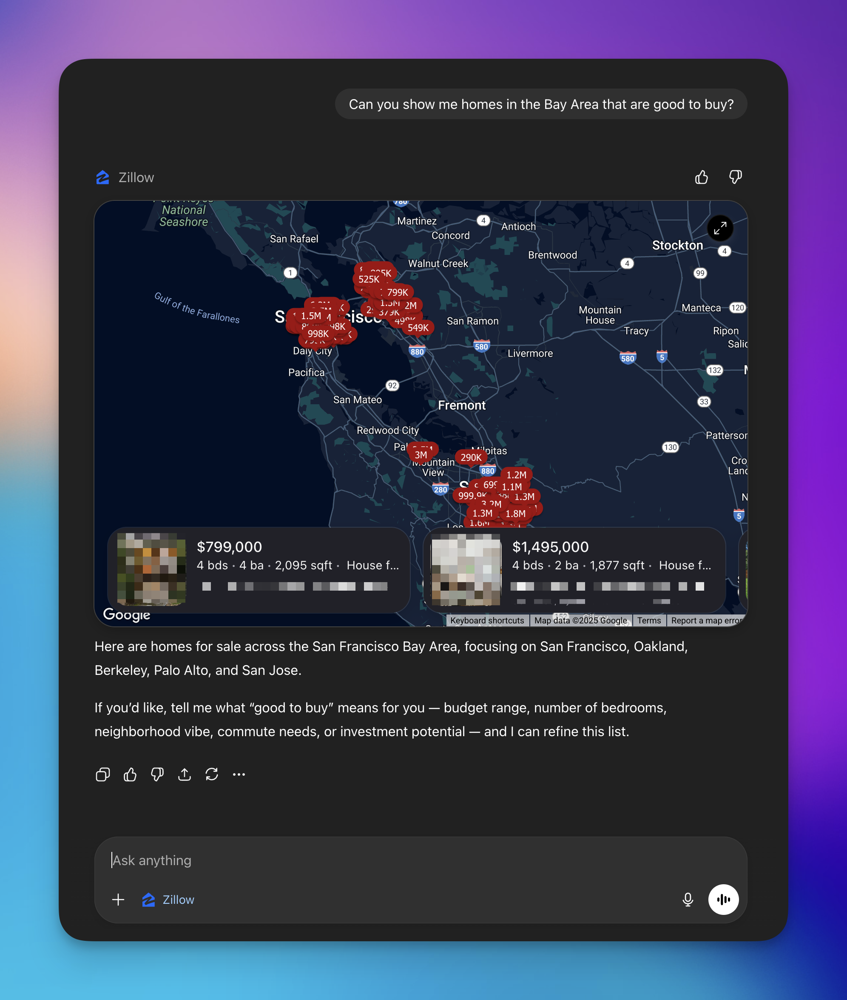
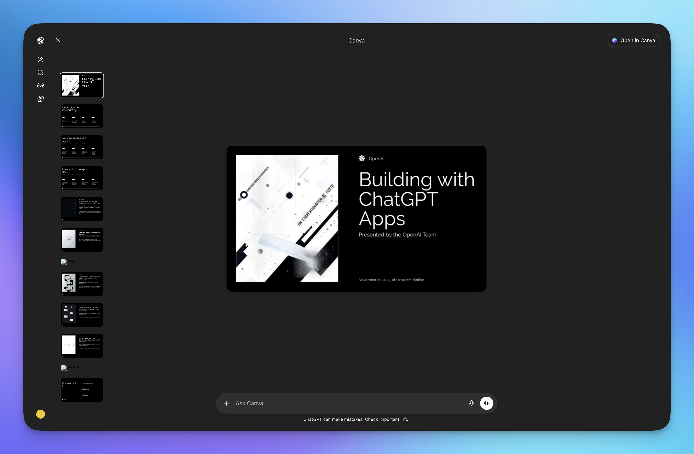
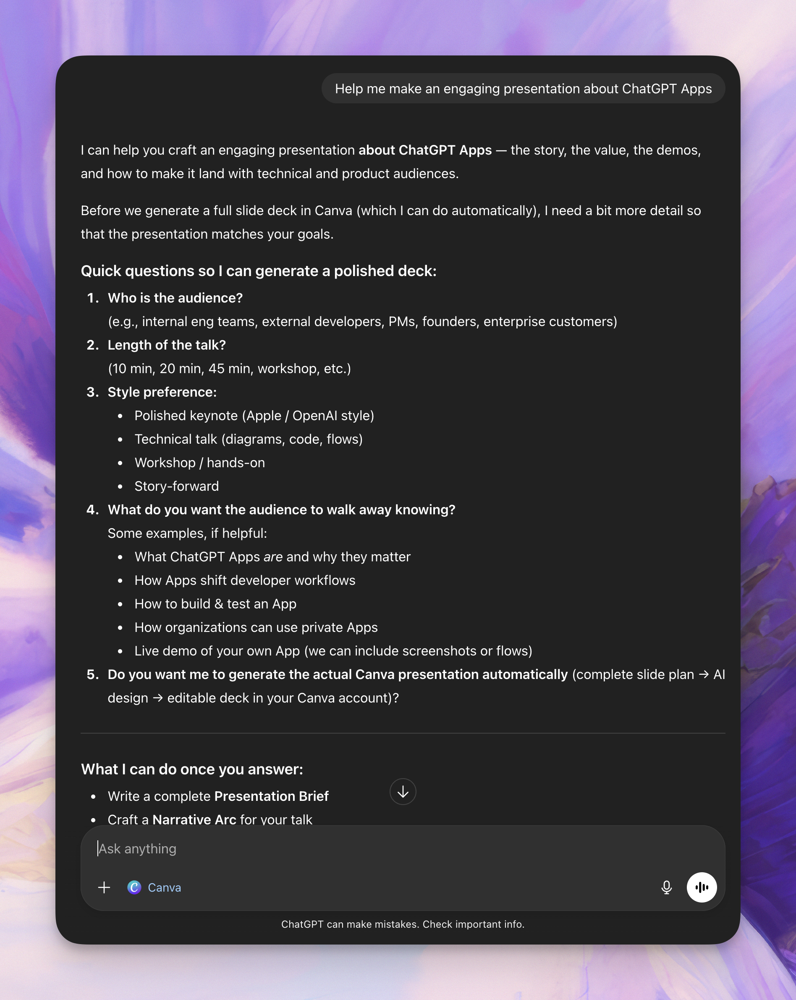
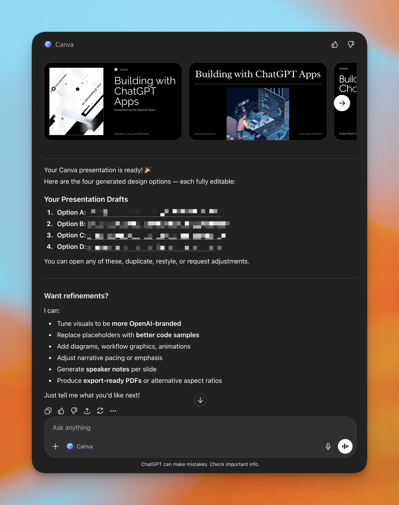

# 如何打造出色的ChatGPT应用

来源：https://developers.openai.com/blog/what-makes-a-great-chatgpt-app

---

在开发者大会上，我们推出了[ChatGPT应用](https://openai.com/index/introducing-apps-in-chatgpt/)——一种将您的产品直接融入ChatGPT对话的新方式。本文基于该发布，为开发者、产品经理和设计师提供实用指导，涵盖如何选择合适的应用场景，并设计出上线后真正有用的应用。我们将重点探讨如何将产品优势转化为清晰、范围明确的能力，使模型能在多种不同对话和用户意图中灵活运用。如果您想了解技术细节，可直接查阅[应用SDK快速入门](https://developers.openai.com/apps-sdk/quickstart)和[开发者文档](https://developers.openai.com/apps-sdk)。

我们将涵盖以下内容：

  * ChatGPT应用的真实定义（及非定义）
  * 应用真正创造价值的三种方式
  * 如何为对话和发现机制进行设计
  * 如何判断您的应用是否真正发挥作用
  * 截图的具体示例与建议

## ChatGPT应用究竟是什么

当团队初次构建ChatGPT应用时，出发点通常是：

 _“我们已有一个产品，现在要把它引入ChatGPT。”_

这通常始于将现有的网页或移动端体验——包括界面、菜单、流程——尝试重塑为聊天形式。这是一种合理的本能反应；多年来，“软件”一直意味着页面、导航和用户界面框架。

然而，为ChatGPT构建应用是一个不同的环境。用户并非“打开”您的应用并从首页开始。他们正在进行某个话题的对话，而模型可以决定何时将应用引入该对话。他们是在某个时间点进入的。在这个世界里，最优秀的应用从外部看往往出人意料地小巧。它们不会试图复刻整个产品，而是让用户在使用ChatGPT中的该应用时，能够调用几个**特定功能**：即您的产品最擅长、且模型能在任何对话中复用的具体能力。

在ChatGPT之外，您的应用通常是用户的最终目的地。用户：

1. 点击您的图标  
2. 进入您的环境  
3. 熟悉导航与界面交互模式  

大多数产品决策都基于一个核心假设：“我们掌控屏幕。”您可以大力投入布局设计、新手指引和信息架构，因为用户正沉浸于您的空间。  

在ChatGPT内部，您的应用扮演着不同的角色：  

* 它是模型可调用的**能力模块**——既用于获取上下文，也用于视觉交互。  
* 它出现在**持续对话的进程中**。  
* 它是模型可能协调运用的多种工具之一。  

这意味着“价值单元”不再侧重于整体体验，而更聚焦于您在恰当时机能帮助模型与用户完成的具体任务。  

一个实用定义：  

**ChatGPT应用是一组定义清晰、能执行任务、触发交互或访问数据的工具集。**  

这带来几点启示：  

* 您无需移植所有功能。  
* 您不需要完整的导航层级。  
* 您**确实需要**一套清晰简洁的API：少量易于调用且便于扩展的操作指令。  

可以这样理解：您的ChatGPT应用是当用户遇到特定类型问题时，模型可调用的工具包。工具包定义得越精确，在对话流中使用起来就越顺畅。  

一旦将应用视为“模型可协调的能力模块”而非“产品的迷你版本”，设计决策就会更清晰。您开始思考“我们能在此提供什么帮助？”，而不是“用户下一步该去哪里？”  

## 创造实际价值的三种方式  

筛选应用创意的简单标准：  

* **认知拓展：** 能否让用户在ChatGPT中接触到原本无法获取的新语境或数据？  
* **行动执行：** 应用能否代表用户执行实际操作？  
* **视觉呈现：** 应用能否通过比纯文本更清晰、更具操作性的界面展示信息？

这适用于**“严肃”**的生产力应用，也适用于游戏这类**“纯娱乐”**应用。游戏或许不能帮人更快完成报告，但它依然能实现基础模型难以独立完成的功能：维护有状态的游戏逻辑、追踪进度、执行规则，或渲染游戏世界中引人入胜的视图。其价值在于带来愉悦与参与感，但底层逻辑是相通的。

### 1) 可获取的新信息

你的应用能在ChatGPT对话中提供全新语境：

  * 实时价格、库存状态、供应情况
  * 内部指标、日志记录、数据分析
  * 专业领域、需订阅访问或小众数据集
  * 用户特定数据（账户信息、历史记录、偏好设置、权限状态）
  * 传感器数据、实时视频流

实践中，这通常意味着接入数据准确、实时且受权限管控的系统。应用成为模型在你所在领域的“耳目”，能以更高可信度回答问题。

### 2) 可执行的新操作

你的应用能代表用户执行操作：

  * 在内部工具中创建或更新记录
  * 发送消息、工单、审批通知
  * 安排日程、预订资源、下单采购或配置系统
  * 触发工作流（部署程序、升级流程、同步数据）
  * 运行互动游戏（执行规则、推进回合、记录状态）
  * 在物理世界执行操作（物联网控制、机器人操控等）

此时应用更像是“执行者”而非“信息源”。它将用户意图转化为团队日常使用系统中的具体变更——对于游戏而言，则转化为游戏状态的具体变化，确保体验连贯且公平。这正是应用向智能代理转型的关键环节。

### 3) 更优的呈现方式

应用可通过ChatGPT对话中的图形界面展示信息，使信息更易理解或更具可操作性：

  * 精选列表、对比视图、排名榜单
  * 数据表格、时间轴线、统计图表
  * 按角色或决策场景定制的摘要
  * 游戏状态的可视化/结构化视图（棋盘布局、物品清单、得分面板）

当用户面临选择或权衡时，这一点尤其宝贵。应用可以为模型提供结构化语言：通过包含列、行、评分和可视化元素的组件，匹配人们实际决策的方式——或在游戏中，匹配他们理解“自己在世界中处于何处”的方式。

如果一个应用未能显著推动 **认知/行动/展示** 中至少一个维度的进展，它往往会显得没有超越用户在ChatGPT中已有能力的新价值。用户可能不会明确抱怨，但这无疑是错失了为用户提供更深层价值的机会——无论应用是用于工作还是娱乐。

以下是一个通过应用增强体验的示例：

_ChatGPT的示例回答_

此回答有一定帮助，但用户可能希望使用具备额外功能的应用，在不切换上下文或离开对话的情况下直接浏览真实房源。

 _使用Zillow应用后的回答_

通过Zillow应用，用户获得了额外能力：搜索实时房源列表、按条件筛选、查看详尽的房源信息——所有这些都无需离开聊天界面。

支持全屏模式以增强探索体验

此处的价值在于：你既获得了模型提供的丰富上下文，又享受了能动态响应意图的增强型应用体验。想查询特定区域的房源吗？通过Zillow应用，模型会调用Zillow MCP服务器上的工具并重新渲染用户界面。

## 精选功能，而非全盘移植产品

常见的初步想法是：罗列产品的所有功能，然后问“如何把这些移植到ChatGPT中？”

理论上这听起来很全面。但实际上，这通常会产生一个庞大而模糊的功能表面，既让模型难以驾驭，也让用户难以理解。如果你很难用一句话概括应用的核心功能，模型也将更难理解它。

更有效的路径是：

1. **列出核心待完成工作 -** 识别用户试图完成的具体任务或目标，这些正是你的产品能够帮助实现的内容。这些是你的产品存在的根本原因。从这里出发，能让你始终以用户成果为导向，而非局限于功能清单。
示例：

     * 帮助某人挑选住房。
     * 将想法转化为精美的演示文稿。
     * 将意图转化为愉悦的探索体验。
     * 将原始数据转化为清晰、可共享的报告。

2. 针对每项工作，提问：

“如果没有应用程序，用户在ChatGPT对话中无法完成什么？”

常见答案：

     * 访问实时或私有数据。
     * 在我们的系统中执行实际操作。
     * 获取用户所需的结构化或可视化输出。

3. 这正是你独特价值的体现之处。你不再思考“我们技术上能开放什么？”，而是转向“我们在哪些方面具有独特帮助性？”

4. 将这些缺口转化为少数几个**命名清晰的操作**。例如：

     * `search_properties` – 返回结构化候选房源列表。
     * `explain_metric_change` – 获取相关数据并总结可能的影响因素。
     * `generate_campaign_variants` – 创建多个附带元数据的广告变体。
     * `create_support_ticket` – 创建支持工单并返回摘要与链接。

这些操作具有以下特点：

  * 足够具体，让模型能够自信选择
  * 足够简单，可与对话中的其他步骤结合使用
  * 直接关联价值，而非绑定于整个产品图谱

另一种思考方式：如果你的团队成员提问“我们必须让这个应用程序出色完成的三件事是什么？”，这些应当与你的产品能力几乎一一对应。

例如，ChatGPT中的Canva应用程序可以生成完整的演示文稿草稿，用户可以进入全屏模式，这符合用户对幻灯片导航的预期，但更深入的逐页编辑仍需在完整的Canva编辑器中完成。

## 为对话与探索而设计

在你的 MCP 服务器中，你可以定义 [`description`](https://developers.openai.com/apps-sdk/reference#component-resource-_meta-fields)，为模型提供调用工具的上下文，特别是执行特定任务时应调用哪些工具。这有助于将用户意图映射到你的工具操作上。

### a) 模糊意图

> 帮我决定该住在哪里。

一个优秀的应用响应应当：

* 利用对话线程中已有的相关上下文。
* 最多提出一两个澄清性问题（如果需要）。
* 快速给出具体内容——例如，列举几个示例城市并附上简短说明。

用户应感受到进展已经开始，而不是被拖入一个多步骤的引导流程。如果他们在看到任何有用信息前必须先回答五个问题，很多人会直接放弃。

让我们看看 **Canva** 应用是如何处理这种情况的：

构建一个完整规模的演示文稿需要上下文。Canva 应用通过追问来引导用户梳理他们想要创建的内容。

### b) 明确意图

> 在西雅图寻找价格低于 120 万美元、靠近高评分小学的三居室住宅。

在这种情况下，应用不应要求用户重复信息。它应当：

* 解析查询。
* 调用正确的功能。
* 返回结构清晰、聚焦的结果集。

你仍然可以提供优化选项（“你更在意通勤距离还是学校评分？”），但这些应感觉像是可选的微调，而非必需的设置步骤。

**Canva 示例：**

当用户意图明确并要求生成演示文稿时，模型能准确知道何时调用 Canva 以及应调用何种功能。

如下图所示，工具不仅提供了几个选项，还会在用户需要进一步优化时深入询问：

### c) 无品牌认知

你不能假设用户知道你是谁。

你的第一个实质性响应应当：

*   用一句话说明你的应用功能（“我实时获取房源信息和学校评分，方便您对比选择。”）
*   立即提供有用的输出结果。
*   给出明确的下步指引（“可让我按通勤时间、社区或预算进一步筛选。”）

这可以看作一个冷启动问题：你需要在一两条消息内介绍清楚**你是什么**、**为何有用**，以及**如何使用**。

## 为模型和用户共同设计

你的设计需要兼顾两类受众：

*   聊天界面中的真实用户
*   决定何时及如何调用你应用的模型运行时系统

大多数团队对第一类受众已有充分考量，而第二类则是较新的设计维度。但如果模型无法理解你的应用功能或调用方式，面向用户的体验就难以获得运行机会。

还有第三维度同样关键：**当模型调用应用时，哪些用户数据会流经你的系统**。优秀的应用设计不仅要求功能清晰，更需在**索取数据的内容**与**使用方式**上保持克制。

*   **清晰描述性操作与参数**：明确展示应用的适用场景及调用方式。采用直白的命名（如`search_jobs`、`get_rate_quote`、`create_ticket`），详细说明必选与可选参数的格式要求。模糊性将增加路由决策的负担。

*   **隐私保护设计**：仅索取必要字段。避免使用收集额外上下文的“数据块”参数。优先采用最小化的结构化输入，切勿使用“直接发送完整对话记录”这类指令。

*   **可预测的结构化输出**：保持输出模式稳定，包含ID与清晰的字段名称。将简短摘要（“为您匹配预算与通勤时间的三项选择”）与机器友好的列表（`[{id, address, price, commute_minutes, school_rating, url}, …]`）相结合，使模型既能自然对话，又能精准处理数据。

*   **审慎控制返回内容**：避免“以防万一”地返回敏感内部信息。确保令牌/密钥不暴露于用户可见路径。在非必要情况下对数据进行脱敏或聚合处理。

*   **明确说明收集内容及原因：** 仅请求完成工作所需的最少信息。当需要敏感数据（如账户访问权限）时，用一句话说明原因。设计操作和数据模式时，应清晰表明哪些数据被发送至何处。

## 为生态系统而设计，而非封闭花园

在真实的ChatGPT会话中，你的应用很少是唯一参与方。模型可能在同一次对话中调用多个应用。

从用户视角看，这是一个连贯的流程。而从你的视角看，这提醒着你：你是生态系统的一部分，而非孤立的产品。

这带来几点实际影响：

*   保持操作**小而聚焦**
    *   例如：`搜索候选人`、`评估候选人`、`发送接洽`
    *   而非设计单一的`执行完整招聘流程`
*   确保输出**易于传递**
    *   使用稳定ID、清晰字段名、统一结构
    *   避免将关键信息仅隐藏在自由文本中
*   避免冗长的隧道式流程
    *   完成你的工作环节后，将控制权交还给对话
    *   让模型决定下一步应由哪个工具处理

如果其他应用（或你应用的未来版本）能轻松基于你的输出进行构建，你就能受益于生态系统中其他环节的改进，而非与之竞争。

## 快速检查清单

一份可在构建前后使用的简短检查清单：

*   **1. 新能力**
    *   你的应用是否明确具备新的认知、执行或展示能力？
    *   目标场景的用户能否明显感知到应用停止工作？
*   **2. 聚焦范围**
    *   你是否选择了一组小而精的能力，而非复制整个产品功能？
    *   这些能力的命名和界定是否清晰对应实际要完成的任务？
*   **3. 首次交互**
    *   你的应用能否妥善处理模糊和具体的提示？
    *   新用户能否从首次有效响应中理解你的角色？
    *   他们是否在第一次交互中就感受到价值？
*   **4. 模型友好性**
    *   操作与参数是否清晰无歧义？
    *   输出结构是否足够稳定统一，便于链式调用和复用？
*   **5. 评估**

* 你是否拥有一个精心设计的小型测试集，包含正面、负面及边界案例？
* 你是否对比过应用提供答案与纯ChatGPT答案的胜率差异？
* **6\. 生态契合度**

    * 其他应用和用户能否基于你的输出进行合理构建？
    * 你是否愿意成为多应用协作链中的一环，而非包揽全流程？

产品发布无需在每项标准上都做到完美。但若你能对大多数问题给出肯定答案，那么你不仅是在将产品接入ChatGPT，更是在赋予ChatGPT于你所在领域的实质影响力——这正是这些应用开始变得不可或缺的关键所在。
